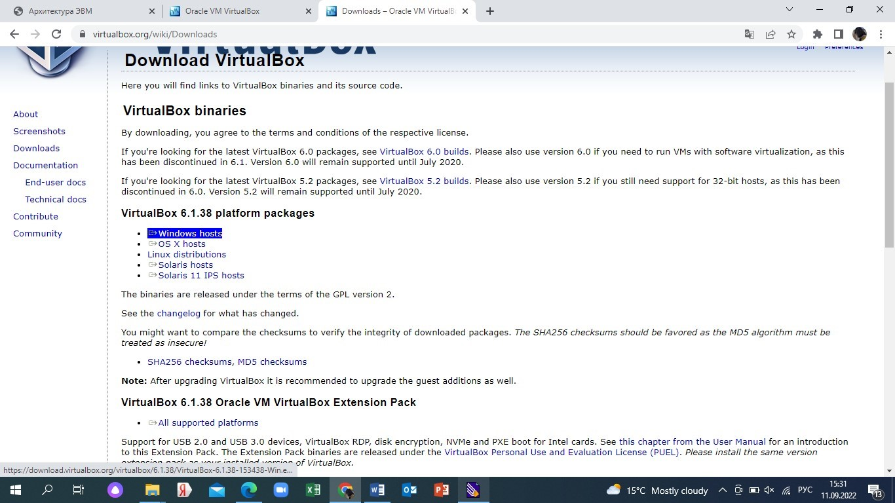
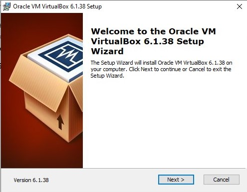
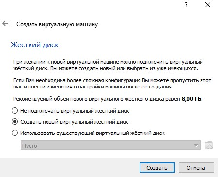
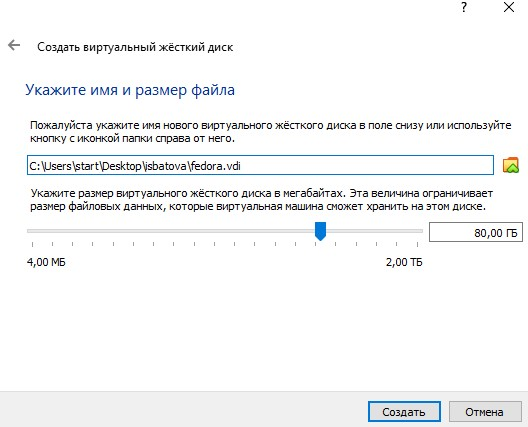
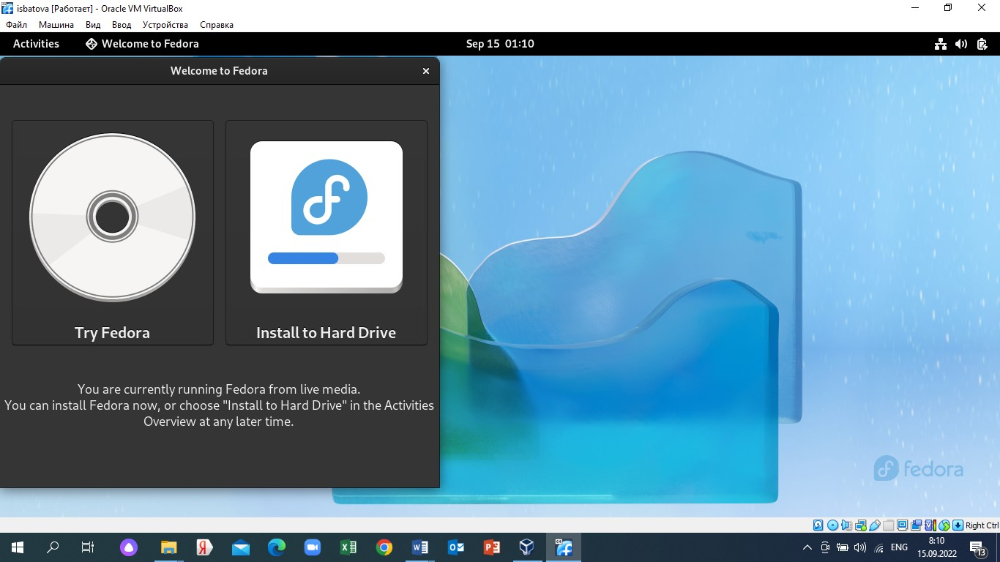
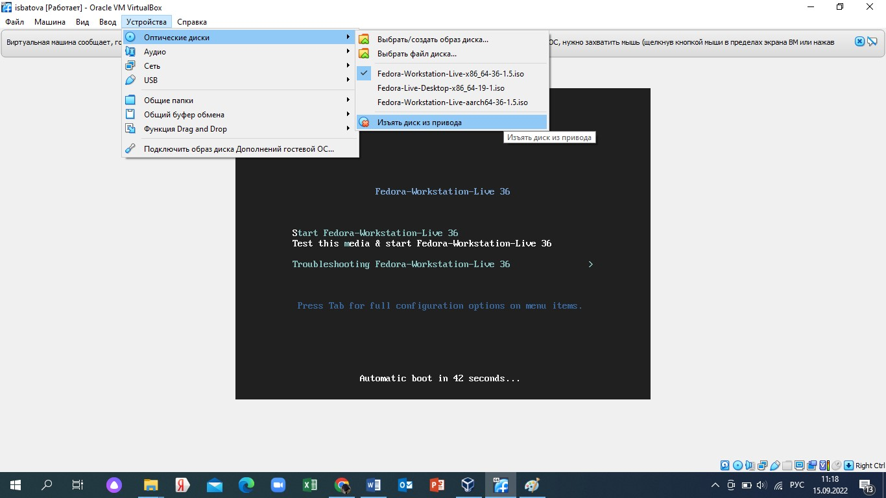
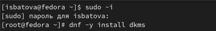
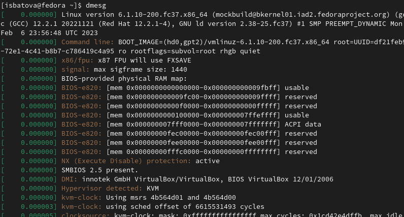

---
## Front matter
lang: ru-RU
title: Отчет по лабораторной работе №1
subtitle: Дисциплина "Операционные системы"
author:
  - Батова Ирина Сергеевна
institute:
  - Российский университет дружбы народов, Москва, Россия
date: 17 февраля 2023

## i18n babel
babel-lang: russian
babel-otherlangs: english

## Formatting pdf
toc: false
toc-title: Содержание
slide_level: 2
aspectratio: 169
section-titles: true
theme: metropolis
header-includes:
 - \metroset{progressbar=frametitle,sectionpage=progressbar,numbering=fraction}
 - '\makeatletter'
 - '\beamer@ignorenonframefalse'
 - '\makeatother'
---

# Вводная часть

## Цель работы

Целью данной работы является приобретение практических навыков установки операционной системы на виртуальную машину, настройки минимально необходимых для дальнейшей работы сервисов.

# Основная часть

## Установка VirtualBox

- Для установки VirtualBox заходим на сайт https://www.virtualbox.org и выбираем на сайте установку для Windows hosts.
- После скачивания выполняем необходимые действия для окончательной установки VirtualBox.

## Установка VirtualBox

## Создание виртуальной машины

- После установки VirtualBox создаем виртуальную машину и задаем для нее все необходимые параметры. 
- При задании имени машины обращаем особое внимание на соглашение о наименовании. 

## Создание виртуальной машины

## Установка ОС на ВМ

- После настройки виртуальной машины скачиваем образ операционной системы Fedora и устанавливаем на нашу машину.

## Установка ОС на ВМ

- После настройки Fedora очень важно перезагрузить машину и изъять диск из привода.

## Настройка после установки

- После окончательной установки, начинаем работать с машиной и настраиваем ее для своего удобства: обновляем пакеты, отключаем SELinux, устанавливаем драйвера и другое необходимое техническое обеспечение.

# Домашнее задание

## Домашнее задание

- В качестве домашнего задания выполнялась команда dmesg, анализировалась последовательность загрузки системы.

# Заключение

## Вывод

В данной работе мной были приобретены практические навыки установки операционной системы на виртуальную машину и настройки минимально необходимых для дальнейшей работы сервисов.
