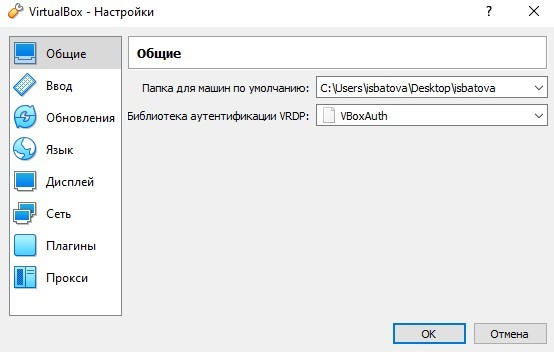
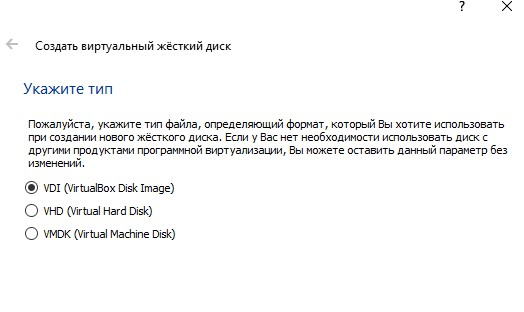
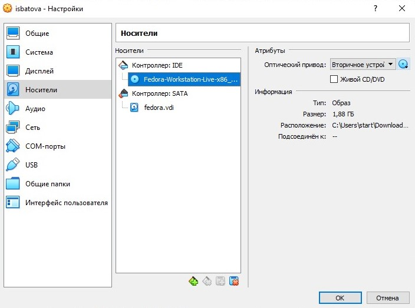
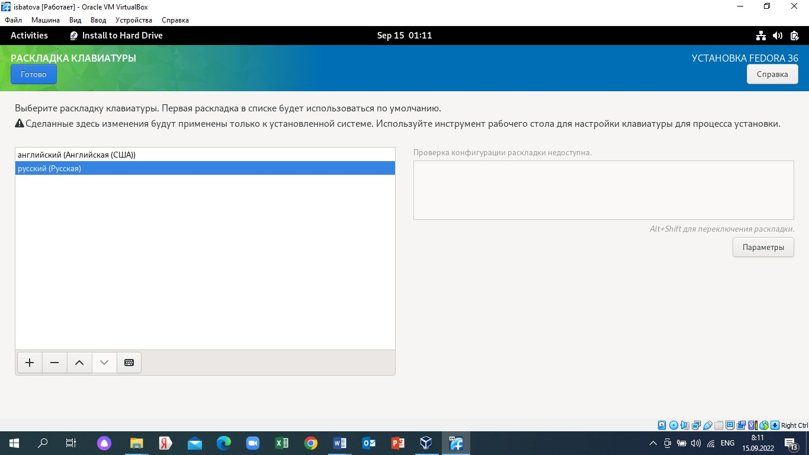
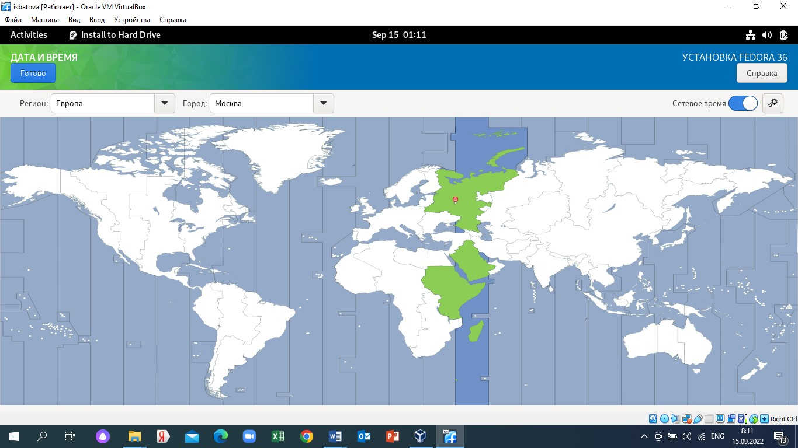

---
## Front matter
title: "Отчёт по лабораторной работе №1"  
output:
     pdf_document:
         latex_engine: xelatex
subtitle: "НММбд-01-222"
author: "Батова Ирина Сергеевна"

## Generic otions
lang: ru-RU
toc-title: "Содержание"

## Bibliography
bibliography: bib/cite.bib
csl: pandoc/csl/gost-r-7-0-5-2008-numeric.csl

## Pdf output format
toc: true # Table of contents
toc-depth: 2
lof: true # List of figures
lot: true # List of tables
fontsize: 12pt
linestretch: 1.5
papersize: a4
documentclass: scrreprt
## I18n polyglossia
polyglossia-lang:
  name: russian
  options:
	- spelling=modern
	- babelshorthands=true
polyglossia-otherlangs:
  name: english
## I18n babel
babel-lang: russian
babel-otherlangs: english
## Fonts
mainfont: PT Serif
romanfont: PT Serif
sansfont: PT Sans
monofont: PT Mono
mainfontoptions: Ligatures=TeX
romanfontoptions: Ligatures=TeX
sansfontoptions: Ligatures=TeX,Scale=MatchLowercase
monofontoptions: Scale=MatchLowercase,Scale=0.9
## Biblatex
biblatex: true
biblio-style: "gost-numeric"
biblatexoptions:
  - parentracker=true
  - backend=biber
  - hyperref=auto
  - language=auto
  - autolang=other*
  - citestyle=gost-numeric
## Pandoc-crossref LaTeX customization
figureTitle: "Рис."
tableTitle: "Таблица"
listingTitle: "Листинг"
lofTitle: "Список иллюстраций"
lotTitle: "Список таблиц"
lolTitle: "Листинги"
## Misc options
indent: true
header-includes:
  - \usepackage{indentfirst}
  - \usepackage{float} # keep figures where there are in the text
  - \floatplacement{figure}{H} # keep figures where there are in the text
---

# Цель работы

Целью данной работы является приобретение практических навыков установки операционной системы на виртуальную машину, настройки минимально необходимых для дальнейшей работы сервисов.

# Выполнение лабораторной работы

Так как работать я буду на своей технике, сначала скачиваем VirtualBox (сайт https://www.virtualbox.org). Выбираем на сайте установку для Windows hosts (рис. @fig:001).

{ #fig:001 width=70% }

Выполняем установку VirtualBox (рис. @fig:002, @fig:003).

{ #fig:002 width=70% }

{ #fig:003 width=70% }

На рабочем столе создаем папку с названием, соответствующим логину в дисплейном классе (isbatova) и переносим туда VirtualBox. Далее необходимо проверить, в нужном ли месте находится VirtualBox. Для этого открываем VirtualBox, нажимаем «Настройки» - «Общие». В пункте «Папке для машин по умолчанию» проверяем, верно ли указан путь до папки: C:/Users/isbatova/Desktop/isbatova (рис. @fig:004).

{ #fig:004 width=70% }

Далее создаем виртуальную машину, для этого нужно нажать в VirtualBox «Машина» - «Создать». Как имя указываем логин в дисплейном классе (isbatova), опять проверяем путь для папки машины. Выбираем тип операционной системы – Linux, версия – Fedora (64-bit) (рис. @fig:005).

{ #fig:005 width=70% }

Далее задаем объем оперативной памяти 2048 МБ (рис. @fig:006).

{ #fig:006 width=70% }

Создаём новый виртуальный жесткий диск (рис. @fig:007), выбираем тип файла (рис. @fig:008), формат хранения – динамический виртуальный жесткий диск (рис. @fig:009).

{ #fig:007 width=70% }

{ #fig:008 width=70% }

{ #fig:009 width=70% }

Далее задаем размер диска (80 ГБ) и его расположение (рис. @fig:0010).

{ #fig:0010 width=70% }

Далее необходимо увеличить доступный объем видеопамяти. Для этого нажимаем «Настройки» - «Дисплей» - «Экран» и вводим значение 128 МБ (рис. @fig:0011).

{ #fig:0011 width=70% }

Для дальнейшей работы в первую очередь нам необходимо скачать образ операционной системы Fedora. На сайте https://getfedora.org/ru/workstation/download/ выбираем вариант «Fedora 36: x86_64 Live ISO-образ» (рис. @fig:0012).

{ #fig:0012 width=70% }

После этого заходим в VirtualBox, нажимаем «Настройки» - «Носители». Добавляем новый оптический диск и выбираем скачанный образ Fedora 36 (рис. @fig:0013, рис. @fig:0014, (рис. @fig:0015).

{ #fig:0013 width=70% }

{ #fig:0014 width=70% }

{ #fig:0015 width=70% }

Далее нам нужно запустить машину – для этого нажимаем на кнопку «Запустить». Ждем, пока загрузится и в открывшемся окне выбираем «Install to Hard Drive» (рис. @fig:0016).

{ #fig:0016 width=70% }

Начинаем настройку Fedora. Устанавливаем русский язык (рис. @fig:0017), английскую и русскую клавиатуру (рис. @fig:0018), часовой пояс Европа/Москва (рис. @fig:0019]). 

{ #fig:0017 width=70% }

{ #fig:0018 width=70% }

{ #fig:0019 width=70% }

Место установки оставляем без изменений (рис. @fig:0020). Начинаем установку (рис. @fig:0021).

{ #fig:0020 width=70% } 

{ #fig:0021 width=70% }

После загрузки нажимаем «Завершить установку». Далее нам нужно перезапустить машину, чтобы продолжить настройку. Для этого в верхнем меню выбираем «Машина» - «Перезапустить» (рис. @fig:0022). Во время перезапуска необходимо изъять образ диска из дисковода. Для этого выбираем «Устройства» - «Изъять диск из привода» (рис. @fig:0023).

{ #fig:0022 width=70% }

{ #fig:0023 width=70% }

После того, как машина перезапустилась, продолжаем настройку (рис. @fig:0024).

{ #fig:0024 width=70% }

Настраиваем машину. Указываем логин (рис. @fig:0025) и пароль (рис. @fig:0026).

{ #fig:0025 width=70% }

{ #fig:0026 width=70% }

Машина готова к работе.

Переключаемся на роль супер-пользователя (рис. @fig:0027).

{ #fig:0027 width=70% }

Обновляем все пакеты (рис. @fig:0028).

{ #fig:0028 width=70% }

Далее устанавливаем программы для удобства работы в консоли (рис. @fig:0029).

{ #fig:0029 width=70% }

После этого устанавливаем программное обеспечение и запускаем таймер (рис. @fig:0030, рис. @fig:0031).

{ #fig:0030 width=70% } 

{ #fig:0031 width=70% }

Далее заходим в файл /etc/selinux/config и заменяем значение на 'permissive', таким образом отключая систему безопасности SELinux (рис. @fig:0032).

{ #fig:0032 width=70% }

После этого перезагружаем машину командой "reboot".

Следующим нашим шагом будет установка драйверов. Для этого запускаем терминальный мультиплексор tmux (рис. @fig:0033).

{ #fig:0033 width=70% }

Вновь переключаемся на роль суперпользователя и устанавливаем пакет DKMS (рис. @fig:0034).

{#fig:0034 width=70%}

После этого вверху нажимаем "Машина" -> "Подключить образ диска дополнений гостевой ОС" (рис. @fig:0035).

{#fig:0035 width=70%}

Далее подмонтируем диск (рис. @fig:0036) и установим драйвера (рис. @fig:0037).

{ #fig:0036 width=70% }

{ #fig:0037 width=70% }

После этого вновь перезагружаем машину с помощью команды "reboot". После входа вновь запускаем терминальный мультиплексор tmux и переключаемся на роль супер-пользователя. Далее вводим команду mc и редактируем файл /etc/X11/xorg.conf.d/00-keyboard.conf (рис. @fig:0038).

{ #fig:0038 width=70% }

После этого вновь перезагружаем машину. Так как имя пользователя и имя хоста удовлетворяют соглашению о наименовании, то ничего не меняем. Также установка программного обеспечения (pandoc и texlive) также были произведены в прошлом семестре.

# Домашнее задание

С помощью команды 'dmesg' мы можем проанализировать последовательность загрузки системы (рис. @fig:0039).

{ #fig:0039 width=70% }

При использовании команды 'dmesg | less' можем просмотреть вывод этой команды, получая отображение каждой новой команды посредством нажатия клавиши "Enter" (рис. @fig:0040).

{ #fig:0040 width=70% }

После этого с помощью команды "dmesg | grep -i 'Linux version'" узнаем версию ядра Linux. Как видно на рисунке, версия ядра у меня 6.1.10-200.fc37.x86_64 (рис. @fig:0041).

{ #fig:0041 width=70% }

Частоту процессора узнаем командой "dmesg | grep -i 'MHz'" (рис. @fig:0042). В данном случае она равна 2611.198.

{ #fig:0042 width=70% }

Далее узнаем модель процессора командой "dmesg | grep -i 'СPU0'" (рис. @fig:0043). Моя модель - 11th Gen Intel(R) Core(TM) i5-11300H @ 3.10GHz.

{ #fig:0043 width=70% }

Далее выясняем объем доступной оперативной памяти командой "dmesg | grep -i 'Memory'" (рис. @fig:0044). В данном случае доступно 1977372K/2096696K.

{ #fig:0044 width=70% }

Далее узнаем тип обнаруженного гипервизора командой "dmesg | grep -i 'Hypervisor detected'" (рис. @fig:0045). В моем случае тип KVM.

{ #fig:0045 width=70% }

Далее выясняем тип файловой системы корневого раздела и последовательность монтирования файловых систем командой "dmesg | grep -i 'Mount'" (рис. @fig:0046). Как видно на рисунке, тип файловой системы корневого раздела EXT-4.

{ #fig:0046 width=70% }

# Вывод

В данной работы мной были приобретены практические навыки установки операционной системы на виртуальную машину и настройки минимально необходимых для дальнейшей работы сервисов.

# Контрольные вопросы

1. Учетная запись пользователя содержит имя пользователя (user name), идентификационный номер пользователя (UID), идентификационный номер группы (GID), пароль (password), полное имя (full name), домашний каталог (home directory) и начальную оболочку (login shell).

2. Для получения справки по команде - 'man [команда]'. Например, команда 'man cd' выдаст информацию о команде 'cd'.

Для перемещения по файловой системе используется команда 'cd [путь]'. Например, команда 'cd ~/work/study' осуществит переход в каталог study.

Для просмотра содержимого каталога используется команда 'ls [путь]'. Например, команда 'ls ~/work/study' выдаст содержимое каталог study. Данная команда может использоваться с разными опциями: 'ls [опция][путь]'.

Для определения объема каталога используется команда 'du [путь]'. Например, команда 'du ~/work/study' выведет объем каталога study. Данная команда может использоваться с разными опциями: 'du [опция][путь]'.

Для создания каталогов используется команда 'mkdir [путь]'. Например, команда 'mkdir ~/work/study' создаст цепочку подкаталогов, то есть в домашнем каталоге будет создан каталог work, а в каталоге work будет создан каталог study. Данная команда может использоваться с разными опциями: 'mkdir [опция][путь]'.

Для удаления каталогов или файлов используется команда 'rmdir[опция][путь]' или 'rm[опция][путь]'. Например, команда 'rm -r ~/work/study' удалит каталоги work и study. Данная команда может использоваться с разными опциями, в данном случае '-r' является опцией.

Для задания определенных прав на файл/каталог используется команда 'сhmod [опция][путь]'.
Например, команда 'chmod a-x text.txt' запретит выполнение файла "text.txt". Данная команда может использоваться с разными опциями, в данном случае 'a-x' является опцией.

Для просмотра истории команд используется команда 'history [опция]'. Например, команда 'history 3' позволит посмотреть последние три команды.

3. Файловая система - это архитектура хранения данных в системе, в оперативной памяти и доступа к конфигурации ядра, инструмент, позволяющий ОС и программам обращаться к нужным файлами и работать с ними. Файловая система устанавливает правила эксплуатации и организацию данных на накопителе, экономя ресурсы операционной системы и программ. Файловая система Linux представляет собой пространства раздела диска, разбитой на блоки фиксированного размера. Всего существует несколько типов файловых систем. Приведем несколько примеров.

  * EXT (а также EXT2, EXT3, EXT4) - первая и стандартная файловая система Linux. Является наиболее стабильной и содержит больше всего функций.
  * XFS - высокопроизводительная 64-битная журналируемая файловая система. Изначально была рассчитана для использования на дисках большого объема.
  * JFS - также 64-битная журналируемая файловая система, созданная IBM. Всего существует два поколения JFS, однако в Linux используется файловая система только второго поколения.
  * ZFS - файловая система, разработанная для систем хранения данных. Главной особенностью этой файловой системы является отказоустойчивость.
  
4. Посмотреть, какие файловые системы подмонтированы в операционную систему, можно посмотреть командой 'findmnt'.

5. Перед остановкой процесса необходимо определить его PID. Для этого используем команды 'ps', которая выведет список активных процессов в системе и информацию о них, и 'grep', которая будет выполнять поиск по результатам команды ps. После определения PID процесса, мы используем команду 'kill' с параметров PID для "убийства" процесса. Помимо этой команды, можно использовать команду 'kilall' для "убийства" всех процессов, имеющих одно и то же имя, это может быть удобно, так как для этого нам не нужно знать PID всех процессов.
