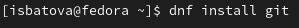
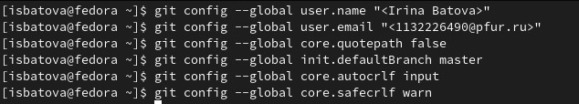
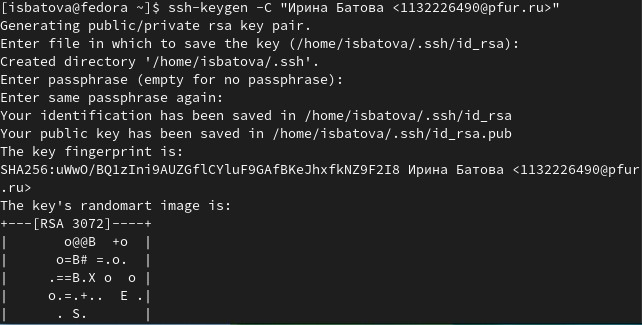
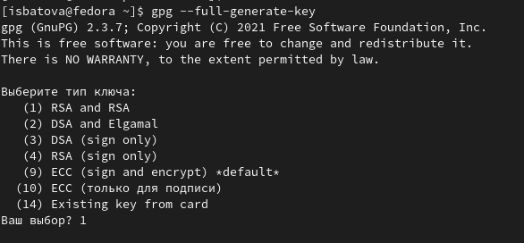
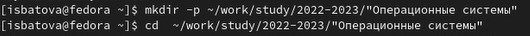
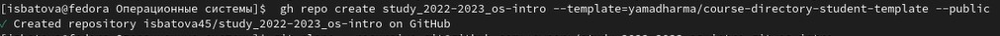
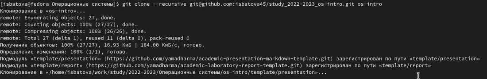

---
## Front matter
lang: ru-RU
title: Отчет по лабораторной работе №2
subtitle: Дисциплина "Операционные системы"
author:
  - Батова Ирина Сергеевна
institute:
  - Российский университет дружбы народов, Москва, Россия
date: 18 февраля 2023

## i18n babel
babel-lang: russian
babel-otherlangs: english

## Formatting pdf
toc: false
toc-title: Содержание
slide_level: 2
aspectratio: 169
section-titles: true
theme: metropolis
header-includes:
 - \metroset{progressbar=frametitle,sectionpage=progressbar,numbering=fraction}
 - '\makeatletter'
 - '\beamer@ignorenonframefalse'
 - '\makeatother'
---

# Вводная часть

## Цель работы

Целью данной лабораторной работы является изучение идеологии и применение средств контроля версий, а также освоение умения по работе с git.

# Основная часть

## Установка git и gh 

- Для начала устанавливаем git и gh.

## Базовая настройка git

- Задаем имя и email владельца репозитория, далее настраиваем utf-8 в выводе сообщений git, а также задаем имя начальной ветки, параметр autorclf и параметр saferclf.

## Создание ssh-ключа

- Для этого используется команда “ssh-keygen -C”.
- В терминале вводим команду “cat ~/.ssh/id_rsa.pub | xclip -sel clip”, чтобы скопировать ключ и загружаем его на сайт через веб-браузер.

## Создание gpg-ключа

- Для этого заходим в терминал и вводим команду 'gpg --full-generate-key'. Выбираем необходимые опции и задаем пароль.
- После аналогично копируем ключ и загружаем на сайт.

## Настройка автоматических подписей коммитов git

## Создание репозитория и каталога курса

- Создаем необходимые каталоги

## Создание репозитория и каталога курса

- Создаем и клонируем репозиторий

## Создание репозитория и каталога курса

# Вывод

## Вывод

В данной лабораторной работе мной были изучены идеологии и применение средств контроля версий, а также освоены умения по работе с git.
