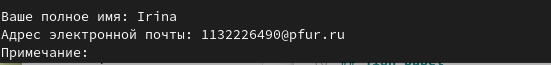

---
## Front matter
title: "Отчёт по лабораторной работе №2"
output:
     pdf_document:
         latex_engine: xelatex
subtitle: "Дисциплина: Операционные системы"
author: "Батова Ирина Сергеевна, НММбд-01-22"

## Generic otions
lang: ru-RU
toc-title: "Содержание"

## Bibliography
bibliography: bib/cite.bib
csl: pandoc/csl/gost-r-7-0-5-2008-numeric.csl

## Pdf output format
toc: true # Table of contents
toc-depth: 2
lof: true # List of figures
lot: true # List of tables
fontsize: 12pt
linestretch: 1.5
papersize: a4
documentclass: scrreprt
## I18n polyglossia
polyglossia-lang:
  name: russian
  options:
	- spelling=modern
	- babelshorthands=true
polyglossia-otherlangs:
  name: english
## I18n babel
babel-lang: russian
babel-otherlangs: english
## Fonts
mainfont: PT Serif
romanfont: PT Serif
sansfont: PT Sans
monofont: PT Mono
mainfontoptions: Ligatures=TeX
romanfontoptions: Ligatures=TeX
sansfontoptions: Ligatures=TeX,Scale=MatchLowercase
monofontoptions: Scale=MatchLowercase,Scale=0.9
## Biblatex
biblatex: true
biblio-style: "gost-numeric"
biblatexoptions:
  - parentracker=true
  - backend=biber
  - hyperref=auto
  - language=auto
  - autolang=other*
  - citestyle=gost-numeric
## Pandoc-crossref LaTeX customization
figureTitle: "Рис."
tableTitle: "Таблица"
listingTitle: "Листинг"
lofTitle: "Список иллюстраций"
lotTitle: "Список таблиц"
lolTitle: "Листинги"
## Misc options
indent: true
header-includes:
  - \usepackage{indentfirst}
  - \usepackage{float} # keep figures where there are in the text
  - \floatplacement{figure}{H} # keep figures where there are in the text
---

# Цель работы

Целью данной лабораторной работы является изучение идеологии и применение средств контроля версий, а также освоение умения по работе с git.

# Выполнение лабораторной работы

Первым делом устанавливаем git (рис. @fig:001).

{#fig:001 width=70%}

Далее устанавливаем gh (рис. @fig:002).

{#fig:002 width=70%}

После этого приступаем к базовой настройке git (рис. @fig:003). Для этого задаем имя и email владельца репозитория (строки 1 и 2), далее настраиваем utf-8 в выводе сообщений git (строка 3), а также задаем имя начальной ветки (строка 4), параметр autorclf (строка 5) и параметр saferclf (строка 6).

{#fig:003 width=70%}

После этого необходимо создать ssh ключ. Для этого используется команда “ssh-keygen -C” (рис. @fig:005).

{#fig:005 width=70%}

После этого нам необходимо загрузить этот ключ. Для этого заходим на сайт github.com, переходим в Setting – SSH and GPG keys – New SSH key (рис. @fig:006).

{#fig:006 width=70%}

Далее возвращаемся в терминал и вводим команду “cat ~/.ssh/id_rsa.pub | xclip -sel clip”, чтобы скопировать ключ. В процессе соглашаемся на установление пакета “xclip” (рис. @fig:007).

{#fig:007 width=70%}

После этого возвращаемся на github.com, вводим название ключа “Laptop_home” и в поле “Key” вставляем ключ (рис. @fig:008). Ключ создан (рис. @fig:009).

{#fig:008 width=70%}

{#fig:009 width=70%}

После создания ssh ключа нам также нужно создать gpg ключ. Для этого заходим в терминал и вводим команду 'gpg --full-generate-key'. Нам будут предлагаться разные опции. Тип ключа выбираем 'RSA and RSA' (рис. @fig:0010).

{#fig:0010 width=70%}

Следующим шагом выбираем размер (4096 бит) и срок действия ключа - неограниченный (рис. @fig:0011).

{#fig:0011 width=70%}

Далее вводим имя и email (рис. @fig:0012). Примечание оставляем пустым.

{#fig:0012 width=70%}

Далее задаем фразу-пароль (рис. @fig:0013). Ключ сгенерирован (рис. @fig:0014).

{#fig:0013 width=70%}

{#fig:0014 width=70%}

После этого выводим список ключей командой 'gpg --list-secret-keys --keyid-format LONG' (рис. @fig:0015) и находим отпечаток нужного нам ключа.

{#fig:0015 width=70%}

С помощью отпечатка и команды 'gpg --armor --export PGP Fingerprint | xclip -sel clip' копируем ключ в буфер обмена (рис. @fig:0017).

{#fig:0017 width=70%}

После этого заходим на github и загружаем на ключ туда (рис. @fig:0018).

{#fig:0018 width=70%}

Следующим нашим шагом будет настройка автоматических подписей коммитов git (рис. @fig:0019).

{#fig:0019 width=70%}

Далее настраиваем gh. Для этого вводим команду 'gh auth login' и отвечаем на наводящие вопросы (рис. @fig:0020).

{#fig:0020 width=70%}

Позже нас перекидывает в браузер, где мы вводим код и успешно заканчиваем настройку gh (рис. @fig:0021).

{#fig:0021 width=70%}

Далее нам необходимо создать репозиторий курса и настроить каталог курса. Для начала с помощью команды 'mkdir -p' создаем необходимые каталоги и с помощью команды 'cd' переходим в него (рис. @fig:0022).

{#fig:0022 width=70%}

Далее создаем репозиторий на github (рис. @fig:0023) и клонируем его (рис. @fig:0024).

{#fig:0023 width=70%}

{#fig:0024 width=70%}

Продолжаем настройку каталога курса. Переходим в каталог курса (рис. @fig:0025).

{#fig:0025 width=70%}

Далее удаляем лишние файлы и создаем необходимые каталоги (рис. @fig:0026).

{#fig:0026 width=70%}

Последним шагом отправляем файлы на сервер (рис. @fig:0027, рис. @fig:0029). Для отправки вводим фразу-пароль (рис. @fig:0028).

{#fig:0027 width=70%}

{#fig:0028 width=70%}

{#fig:0029 width=70%}

# Выводы

В данной лабораторной работе мной были изучены идеологии и применение средств контроля версий, а также освоены умения по работе с git.

# Контрольные вопросы

1. Система контроля версий (VCS) - это система, регистрирующая изменения в файлах. VCS может хранить несколько версий одного документа, позволяет возвращаться к более ранним версиям, показывает, кто и какие конкретно изменения внес в документ. Система контроля версий обычно применяется в случае, если над одним проектом работает группа людей.

2. При выполнении участником проекта своей части работы он получает нужную ему версию файлов из хранилища, а затем сохраняет новую версию файлов в хранилище. То есть централизованное хранилище сохраняет все файлы - и до правки участником, и после. Следующий пользователь перед работой начнет работу с новой, измененной версией файла. Команда commit как раз осуществляет сохранение изменений (но при этом на сервер они уходят с помощью другой команды). История проекта - это история изменения файлов, то есть кто изменил, какие файлы, какие изменения были внесены. Рабочую версию участник проекта всегда извлекает перед началом работы - то есть, рабочей версией называется та, в которой сохранены все необходимые для работы конкретного пользователя изменения.

3. Централизованные VCS созданы для бэкапирования, отслеживания и синхронизации файлов. Все изменения происходят через центральный сервер. А в децентрализованных VCS у каждого пользователя есть свой полноценный репозиторий и нет жестко заданной структуры репозиториев с центральным сервером. Децентрализованные VCS были созданы для обмена изменениями, например, Git. Пример централизованной VCS -  Subversion (SVN). 

4. При единоличной работе с хранилищем для начала создаем локальный репозиторий и делаем предварительную конфигурацию: задаем имя и email владельца репозитория, настраиваем utf-8 в выводе сообщений, задаем имя начальной ветки, параметр autorclf и параметр saferclf. Далее при внесении изменений в файлы необходимо вводить последовательность команд 'git add .', 'git commit -am', 'git push' для сохранении изменений в репозитории.

5. При работе с общим хранилищем VCS нам необходим ssh ключ. Для этого используется команда “ssh-keygen -C”, после этого копируем ключ и вставляем в соотвествующее окно в веб-браузере

6. У git можно выделить следующие основные задачи:

* хранение всей информации о любых изменениях в файлах
* фиксирование и совмещение изменений 
* сохранение истории и возможность вернуться к ранней версии файла

7. Основные команды git:

* git init - создание основного дерева репозитория

* git pull - получение обновлений (изменений) текущего дерева из центрального репозитория

* git push - отправка всех произведённых изменений локального дерева в центральный репозиторий

* git status - просмотр списка изменённых файлов в текущей директории

* git diff - просмотр текущих изменений

* git add . - добавление всех изменённых и/или созданных файлов и/или каталогов

* git add имена_файлов - добавление конкретных изменённых и/или созданных файлов и/или каталогов   

* git rm имена_файлов - удаление файла и/или каталога из индекса репозитория (при этом файл и/или каталог остаётся в локальной директории)

* git commit -am 'Описание коммита' - сохранение всех добавленных изменений и всех изменённых файлов

* git commit - сохранение добавленных изменений с внесением комментария через встроенный редактор

* git checkout -b имя_ветки - создание новой ветки, базирующейся на текущей

* git checkout имя_ветки - переключение на некоторую ветку

* git push origin имя_ветки - отправка изменений конкретной ветки в центральный репозиторий

* git merge --no-ff имя_ветки - слияние ветки с текущим деревом:

* git branch -d имя_ветки - удаление локальной уже слитой с основным деревом ветки

* git branch -D имя_ветки - принудительное удаление локальной ветки

*  git push origin :имя_ветки - удаление ветки с центрального репозитория

8. Например, добавление файла 'text.txt'

* git add text.txt
* git commit -am 'add file text.txt'
* git push

9. Ветка в git - это указатель на один из коммитов. Ветка берет свое начало от какого-то из коммитов. Ветки существуют для того, чтобы пользователи могли работать над проектом, не мешая друг другу. Обычно при работе участник проекта заводит новую ветку от последнего рабочего коммита базовой ветки, а после решения задачи объединяет созданную ветку с базовой.

10. При работе над проектом могут создаваться файлы, которые не нуждаются в выгрузке в репозиторий. Игнорируемые файлы отслеживаются в специальном файле .gitignore - для игнорирования каких-то файлов достаточно их здесь указать.
