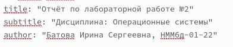
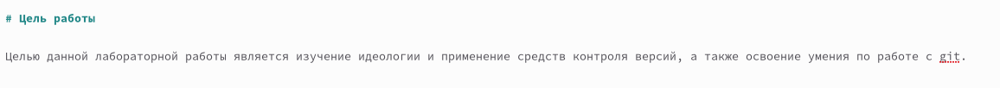
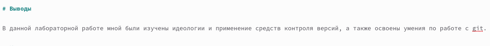
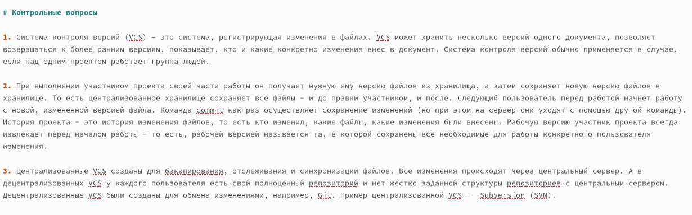
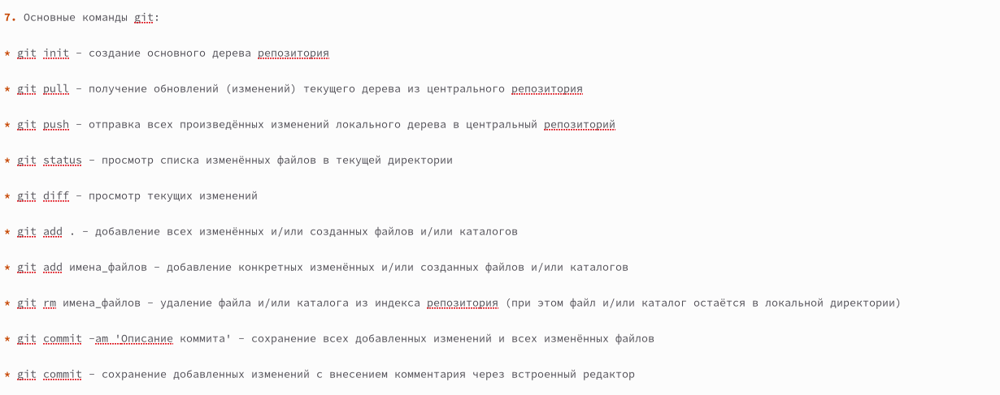

---
## Front matter
lang: ru-RU
title: Отчет по лабораторной работе №3
subtitle: Дисциплина "Операционные системы"
author:
  - Батова Ирина Сергеевна
institute:
  - Российский университет дружбы народов, Москва, Россия
date: 22 февраля 2023

## i18n babel
babel-lang: russian
babel-otherlangs: english

## Formatting pdf
toc: false
toc-title: Содержание
slide_level: 2
aspectratio: 169
section-titles: true
theme: metropolis
header-includes:
 - \metroset{progressbar=frametitle,sectionpage=progressbar,numbering=fraction}
 - '\makeatletter'
 - '\beamer@ignorenonframefalse'
 - '\makeatother'
---

# Вводная часть

## Цель работы
Целью данной лабораторной работы является научиться оформлять отчёты с помощью легковесного языка разметки Markdown.

# Основная часть

## Формирование титульного листа

- Для создания отчета по лабораторной работе №2 переходим в соответствующий каталог и открываем файл 'report.md'.
- Вносим номер лабораторной работы, указываем дисциплину, ФИО и группу.

## Указание цели работы

- Под заголовком "Цель работы" обозначаем нашу цель.

## Выполнение лабораторной работы

- Под заголовком "Выполнение лабораторной работы" пошагово описываем наши действия, делая ссылки на изображения и вставляя их в файл.

## Указание выводов

- Под заголовком "Выводы" пишем вывод по данной лабораторной работе, который согласуется с целью работы.

## Ответы на контрольные вопросы

- Создаем заголовок "Контрольные вопросы" и, нумеруя их, отвечаем на поставленные в лабораторной работе вопросы.

## Неупорядоченный список

- Для создания неупорядоченного списка используем символ '*'

# Вывод

## Вывод

В данной лабораторной работе я научилась оформлять отчёты с помощью легковесного языка разметки Markdown.
