---
## Front matter
lang: ru-RU
title: Отчёт по лабораторной работе №4
subtitle: Дисциплина 'Операционные системы'
author:
  - Батова Ирина Сергеевна
institute:
  - Российский университет дружбы народов, Москва, Россия
date: 01 марта 2023

## i18n babel
babel-lang: russian
babel-otherlangs: english

## Formatting pdf
toc: false
toc-title: Содержание
slide_level: 2
aspectratio: 169
section-titles: true
theme: metropolis
header-includes:
 - \metroset{progressbar=frametitle,sectionpage=progressbar,numbering=fraction}
 - '\makeatletter'
 - '\beamer@ignorenonframefalse'
 - '\makeatother'
---

# Вводная часть

## Цель работы

Приобретение практических навыков взаимодействия пользователя с системой посредством командной строки

# Основная часть

## Полное имя домашнего каталога

- Для начала работы определяем полное имя домашнего каталога с помощью команды 'pwd'

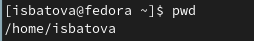

## Работа с каталогом '/tmp'

- Переходим в каталог '/tmp' с помощью команды 'cd'

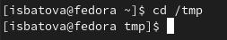

## Работа с каталогом '/tmp'

- Выводим на экран содержимое каталога в разных форматах с помощью команды 'ls' и различных опций

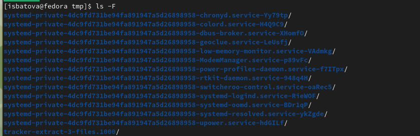

## Просмотр каталога '/var/spool'

- Определяем, что в каталоге /var/spool нет подкаталога с именем cron

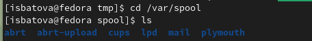

## Просмотр домашнего каталога 

- Определяем, кто является владельцами файлов в домашнем каталоге

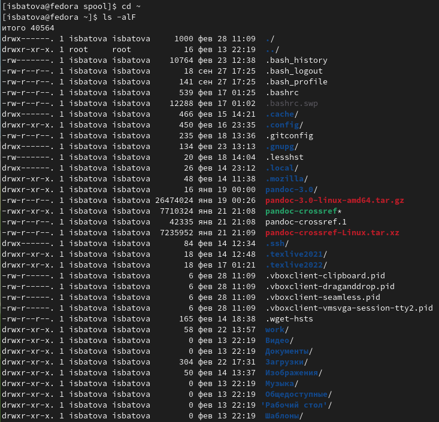

## Создание новых каталогов

- Создаем в домашнем каталоге новый каталог 'newdir' с помощью команды 'mkdir' и проверяем, создался ли у нас каталог командой 'ls' 

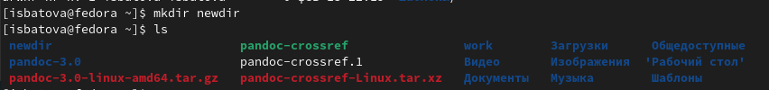

## Создание новых каталогов

- Переходим в созданный каталог и внутри него создаем подкаталог 'morefun'

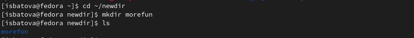

## Создание новых каталогов

- Возвращаемся в домашний каталог и создаем в нем три новых каталога с именами 'letters', 'memos' и 'misk'

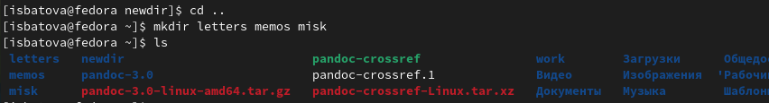

## Удаление всех созданных каталогов

- Удаляем все созданные каталоги

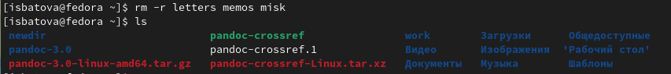

## Команда man

- Используя команду 'man ls', определяем различные возможности опций

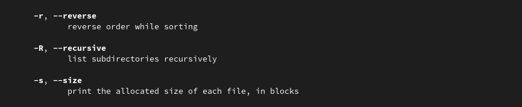

## Команда man

- Используем команду 'man' для просмотра описания следующих команд: cd, pwd, mkdir, rmdir, rm. 

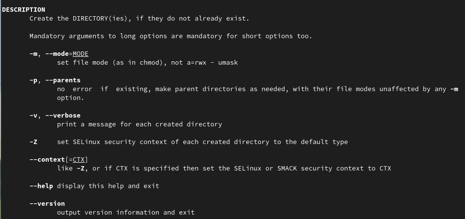

## Команда history

- Вводим команду 'history' и получаем список выполненных недавно команд, выполняем модификацию и исполнение команд 424 и 426

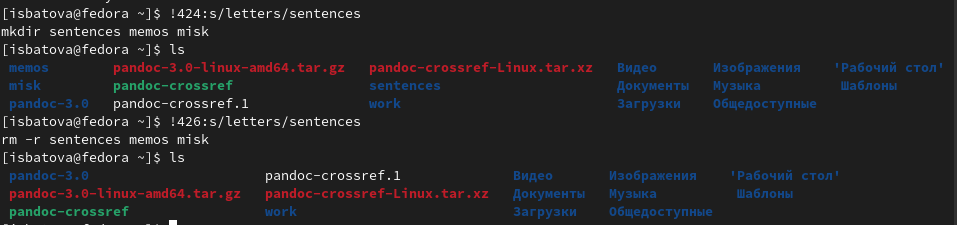

# Вывод

## Вывод

В ходе данной лабораторной работы мной были приобретены практические навыки взаимодействия с системой посредством командной строки.

