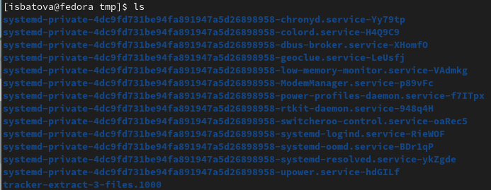
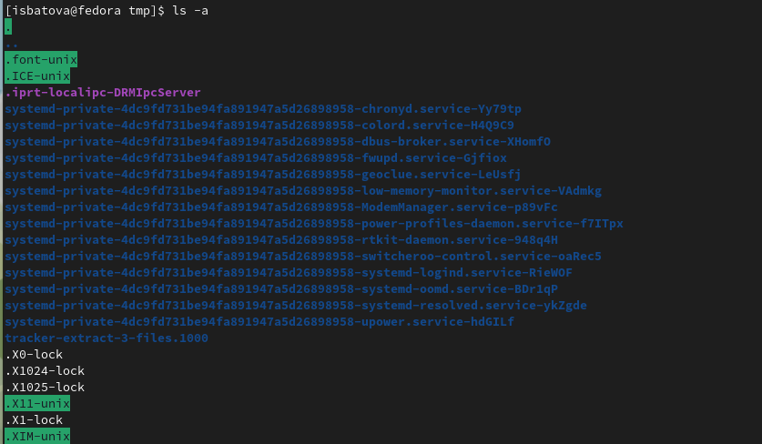
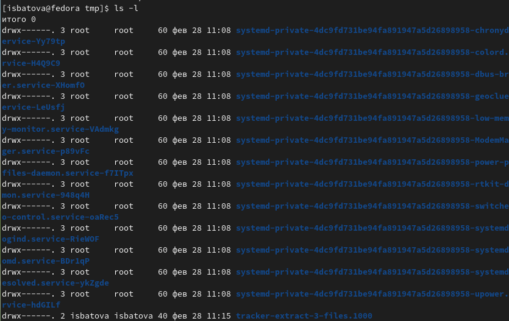
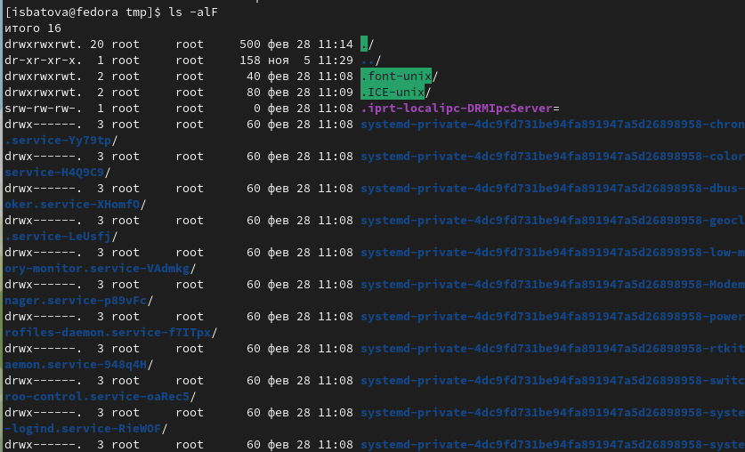
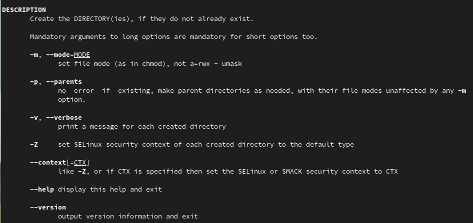
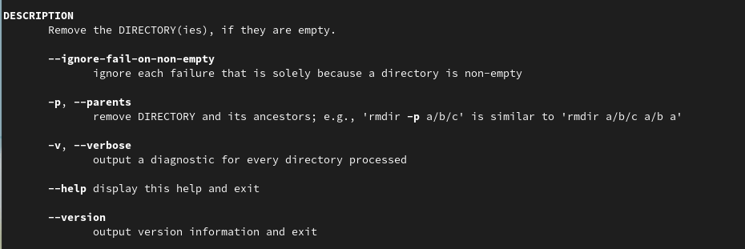
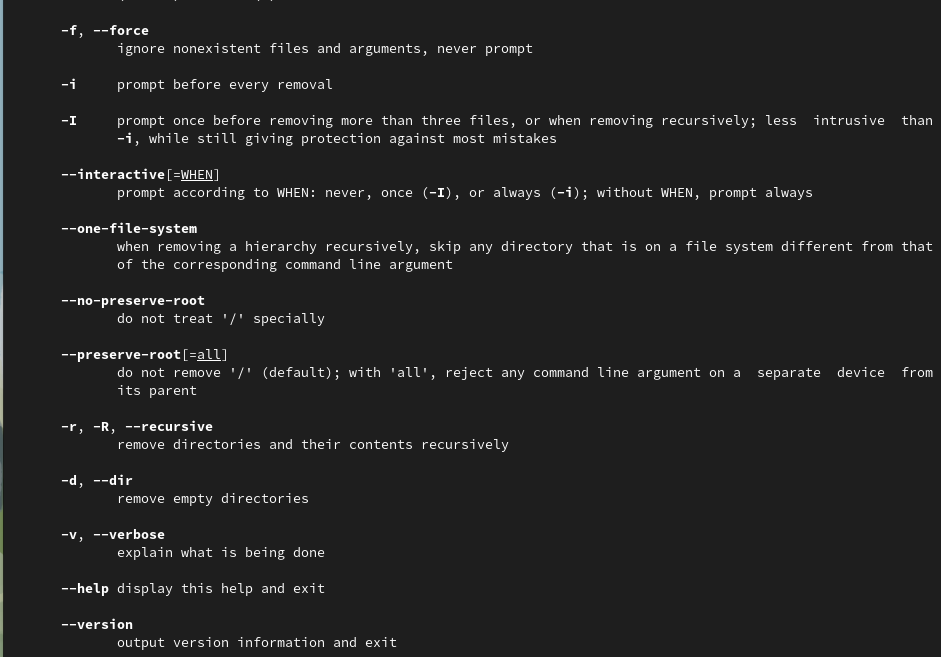

---
## Front matter
title: "Отчёт по лабораторной работе №4"
subtitle: "Дисциплина: Операционные системы"
author: "Батова Ирина Сергеевна"

## Generic otions
lang: ru-RU
toc-title: "Содержание"

## Bibliography
bibliography: bib/cite.bib
csl: pandoc/csl/gost-r-7-0-5-2008-numeric.csl

## Pdf output format
toc: true # Table of contents
toc-depth: 2
lof: true # List of figures
lot: true # List of tables
fontsize: 12pt
linestretch: 1.5
papersize: a4
documentclass: scrreprt
## I18n polyglossia
polyglossia-lang:
  name: russian
  options:
	- spelling=modern
	- babelshorthands=true
polyglossia-otherlangs:
  name: english
## I18n babel
babel-lang: russian
babel-otherlangs: english
## Fonts
mainfont: PT Serif
romanfont: PT Serif
sansfont: PT Sans
monofont: PT Mono
mainfontoptions: Ligatures=TeX
romanfontoptions: Ligatures=TeX
sansfontoptions: Ligatures=TeX,Scale=MatchLowercase
monofontoptions: Scale=MatchLowercase,Scale=0.9
## Biblatex
biblatex: true
biblio-style: "gost-numeric"
biblatexoptions:
  - parentracker=true
  - backend=biber
  - hyperref=auto
  - language=auto
  - autolang=other*
  - citestyle=gost-numeric
## Pandoc-crossref LaTeX customization
figureTitle: "Рис."
tableTitle: "Таблица"
listingTitle: "Листинг"
lofTitle: "Список иллюстраций"
lotTitle: "Список таблиц"
lolTitle: "Листинги"
## Misc options
indent: true
header-includes:
  - \usepackage{indentfirst}
  - \usepackage{float} # keep figures where there are in the text
  - \floatplacement{figure}{H} # keep figures where there are in the text
---

# Цель работы

Приобретение практических навыков взаимодействия пользователя с системой посредством командной строки.

# Задание

1. Определите полное имя вашего домашнего каталога. Далее относительно этого каталога будут выполняться последующие упражнения.
2. Выполните следующие действия:
2.1. Перейдите в каталог /tmp.
2.2. Выведите на экран содержимое каталога /tmp. Для этого используйте команду ls с различными опциями. Поясните разницу в выводимой на экран информации.
2.3. Определите, есть ли в каталоге /var/spool подкаталог с именем cron?
2.4. Перейдите в Ваш домашний каталог и выведите на экран его содержимое. Определите, кто является владельцем файлов и подкаталогов?
3. Выполните следующие действия:
3.1. В домашнем каталоге создайте новый каталог с именем newdir.
3.2. В каталоге ~/newdir создайте новый каталог с именем morefun.
3.3. В домашнем каталоге создайте одной командой три новых каталога с именами letters, memos, misk. Затем удалите эти каталоги одной командой.
3.4. Попробуйте удалить ранее созданный каталог ~/newdir командой rm. Проверьте, был ли каталог удалён.
3.5. Удалите каталог ~/newdir/morefun из домашнего каталога. Проверьте, был ли каталог удалён.
4. С помощью команды man определите, какую опцию команды ls нужно использовать для просмотра содержимое не только указанного каталога, но и подкаталогов,
входящих в него.
5. С помощью команды man определите набор опций команды ls, позволяющий отсортировать по времени последнего изменения выводимый список содержимого каталога
с развёрнутым описанием файлов.
6. Используйте команду man для просмотра описания следующих команд: cd, pwd, mkdir, rmdir, rm. Поясните основные опции этих команд.
7. Используя информацию, полученную при помощи команды history, выполните модификацию и исполнение нескольких команд из буфера команд.

# Выполнение лабораторной работы

1. Для начала работы определяем полное имя домашнего каталога с помощью команды 'pwd' (рис. @fig:001).

{#fig:001 width=70%}

2. Переходим в каталог '/tmp' с помощью команды 'cd' (рис. @fig:002).

{#fig:002 width=70%}

Далее выводим на экран содержимое каталога. Первым делом вводим команду 'ls' без опций (рис. @fig:003). В этом случае выводится список файлов и каталогов, за исключением скрытых. 

{#fig:003 width=70%}

Далее вводим команду 'ls' с опцией 'a' (рис. @fig:004). В этом случае выводится список файлов и каталогов, в том числе и скрытые. 

{#fig:004 width=70%}

Следующей вводим команду 'ls' с опцией 'F' (рис. @fig:005). В этом случае выводится список всех файлов и каталогов (и скрытых также) с информацией о типе файла (каталог, исполняемый файл или ссылка). В данном случае у нас все файлы - каталоги.

{#fig:005 width=70%}

После этого вводим команду 'ls' с опцией 'l' (рис. @fig:006). В этом случае выводится список всех файлов и каталогов с подробной информацией о файле (тип, право доступа, число ссылок, владелец и так далее).

{#fig:006 width=70%}

Последней вводим команду 'ls' с опцией 'alF' (рис. @fig:007). В этом случае выводится список всех файлов и каталогов с подробной информацией о файле, но, в отличие от предыдущей команды, выводится информация также и о скрытых каталогах.

{#fig:007 width=70%}

Следующим шагом определим, есть ли в каталоге /var/spool подкаталог с именем cron. Для этого командой 'cd' переходим в этот каталог и просматриваем его содержимое командой 'ls' (рис. @fig:008). Как показано на рисунке, данного подкаталога нет.

{#fig:008 width=70%}

Нам нужно определить, кто является владельцам файлов и подкаталогов в нашем домашнем каталоге. Для этого переходим в домашний каталог командой 'cd' и выводим содержимое на экран (рис. @fig:009). Как видно на рисунке, владельцем всех файлов, кроме родительского каталога (владельцем которого является пользователь root) является пользователь isbatova.

{#fig:009 width=70%}

3. Создаем в домашнем каталоге новый каталог 'newdir' с помощью команды 'mkdir' и проверяем, создался ли у нас каталог командой 'ls' (рис. @fig:0010).

{#fig:0010 width=70%}

Далее переходим в созданный каталог и внутри него создаем подкаталог 'morefun'. Для этого также используем команду 'mkdir' и проверяем корректность выполненной программы командой 'ls' (рис. @fig:0011).

{#fig:0011 width=70%}

После этого возвращаемся в домашний каталог и создаем в нем три новых каталога с именами 'letters', 'memos' и 'misk', аналогично проверяем корректность выполненной программы командой 'ls' (рис. @fig:0012).

{#fig:0012 width=70%}

Затем удаляем эти каталоги (рис. @fig:0013).

{#fig:0013 width=70%}

Пробуем удалить каталог 'newdir' командой rm. Он не удаляется, так как мы вводим команду без опции, а данный каталог содержит подкаталоги. Поэтому для удаления вводим команду 'rm -r' (рис. @fig:0014).

{#fig:0014 width=70%}

4. Нам нужно определить, какую опцию команды ls нужно использовать для просмотра содержимого и каталогов, и их подкатологов. Для этого вводим команду 'man ls' и находим нужную опцию '-R, --recursive' (рис. @fig:0015).

{#fig:0015 width=70%}

5. Нам нужно определить набор опций команды ls, позволяющий отсортировать по времени последнего изменения выводимый список содержимого каталога с развёрнутым описанием файлов. Для этого вводим команду 'man ls' и находим нужные опции '-l' и '-t' (рис. @fig:0016, @fig:0017). Первая выводит список с подробной информацией, а вторая сортирует список по времени последнего изменения.

{#fig:0016 width=70%}

{#fig:0017 width=70%}

6. Используем команду 'man' для просмотра описания следующих команд: cd, pwd, mkdir, rmdir, rm. 

Команда 'cd' не имеет дополнительных опций (рис. @fig:0018). 

{#fig:0018 width=70%}

Команда 'pwd' (рис. @fig:0019).

* '-L, --logical'. Позволяет не избегать символических ссылок, если путь содержит символические ссылки, то выводить их без преобразования в исходный путь.
* '-P, --physical'. Позволяет збегать всех символических ссылок, если путь содержит символические ссылки, то преобразовать их в названия исходных директорий, на которые они указывают.
* '--help'. Вывод справки по данной команде.
* '--version'. Вывод версии утилиты данной команды.

{#fig:0019 width=70%}

Команда 'mkdir' (рис. @fig:0020).

* '-m=MODE, --mode=MODE'. Устанавливает права доступа для создаваемой директории.
* '-p, --parents'. Создает все директории, которые указаны внутри пути.
* '-v, --verbose'. Выводит информацию о каждой создаваемой директории.
* '-z'. Устанавливает контекст SELinux для создаваемой директории по умолчанию.
* '--context[=CTX]'. Устанавливает контекст SELinux для создаваемой директории в значение CTX.
* '--help'. Вывод справки по данной команде.
* '--version'. Вывод версии утилиты данной команды.

{#fig:0020 width=70%}

Команда 'rmdir' (рис. @fig:0021).

* '--ignore-fail-on-non-empty'. Позволяет игнорировать ошибки при удалении непустых каталогов.
* '-p, --parents'. Каждый аргумент каталога обрабатывается как путь. Удаляется сначала каталог, потом последний компонент пути и получившийся каталог и так далее.
* '-v, --verbose'. Выводит информацию о каждой удаляемой директории.
* '--help'. Вывод справки по данной команде.
* '--version'. Вывод версии утилиты данной команды.

{#fig:0021 width=70%}

Команда 'rm' (рис. @fig:0022).

* '-f, --force'. Принудительное удаление файлов или каталогов, позволяет игнорировать несуществующие файлы.
* '-i'. Запрашивает подтверждение перед удалением.
* '-I'. Выдает один запрос на подтверждение удаления всех файлов, если удаляется больше трех файлов или используется рекурсивное удаление.
* '--interactive=[WHEN]'. Есть три варианта вместо WHEN: 'never' - никогда не запрашивать подтверждение, 'once' - один раз запросить подтверждение, 'always' - всегда запрашивать подтверждение. Если значение WHEN не задано, то оно считается как 'always'.
* '--one-file-system'. Пропускает директории, которые находятся на других файловых системах.
* '--no-preserve-root'. Если для удаления задан корневой раздел, то считать, что это обычная директория.
* '--preserve-root'. Если для удаления задан корневой раздел, то запретить выполнять команду над корневым разделом.
* '-r, -R. --recursive'. Рекурсивное удаление директорий и их содержимого.
* '-d, --dir'. Позволяет удалять пустые директории.
* '-v, --verbose'. Выводит информацию о каждой удаляемой директории.
* '--help'. Вывод справки по данной команде.
* '--version'. Вывод версии утилиты данной команды.

{#fig:0022 width=70%}

7. Вводим команду 'history' и получаем список выполненных недавно команд. Нам нужно выполните модификацию и исполнение нескольких команд. Я выбрала команды 424 и 426 (рис. @fig:0023). 

{#fig:0023 width=70%}

Вместо каталогов 'letters', 'memos' и 'misk' будут созданы и удалены каталоги 'sentences', 'memos' и 'misk' (рис. @fig:0024). 

{#fig:0024 width=70%}

# Выводы

В ходе данной лабораторной работы мной были приобретены практические навыки взаимодействия с системой посредством командной строки.

# Контрольные вопросы

1. Командная строка (также называют консоль или терминал) – это специальная программа, которая позволяет управлять компьютером путем ввода текстовых команд с клавиатуры.
2. Определить абсолютный путь текущего каталога можно с помощью команды 'pwd'. Например, если ввести 'pwd', находясь в домашнем каталоге, команда выведет '/home/isbatova', что является абсолютным путем до домашнего каталога.
3. Определить только тип файлов и их имена в текущем каталоге можно командой 'ls' с опцией '-F'. Пример можно посмотреть во втором пункте выполнения лабораторной работы.
4. Отобразить информацию о скрытых файлах можно командой 'ls' с опцией '-а'. Пример можно посмотреть во втором пункте выполнения лабораторной работы.
5. Удалить файл и каталог можно командой 'rm' или 'rmdir'. Если каталог не содержит файлов, можно использовать обе команды. Если каталог содержит файлы, нужно использовать команду 'rm -r'. Пример можно посмотреть в третьем пункте выполнения лабораторной работы.
6. Вывести информацию о последних выполненных пользователем командах можно командой 'history'.
7. Чтобы воспользоваться историей команд для их модифицированного выполнения, необходимо сначала выполнить команду 'history', чтобы узнать номер нужной командой. Далее нужно ввести в командную строку следующее: ![номер команды]:s/[что меняем]/[на что меняем]. Пример можно посмотреть в седьмом пункте выполнения лабораторной работы.
8. Последовательность команд 'cd; ls' одновременно перейдет в нужный каталог и выведет о нем информацию.
9. Символ экранирования 'обратный слэш' позволят использовать специальные символы без их интерпретации командной оболочкой. Например, если ввести 'ls -a work[обратный слэш]/study', команда выведет содержимое каталога 'work/study'.
10. Команда ls с опцией l выводит на экран подробную информацию о содержащихся файлах и каталогах: тип, право доступа, число ссылок, владелец, размер, дата последней ревизии, имя файла или каталога
11. Относительный путь к файлу - это путь к файлу, относительно текущего каталога. Например, 'cd /work/study' - это абсолютный путь до каталога 'study', а 'cd study' - относительный.
12. Для получения информации по конкретной команде необходимо ввести 'man [имя команды]'.
13. Для автоматического дополнения вводимых команд служит клавиша Tab.
