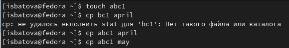
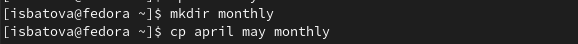
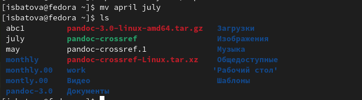
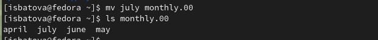
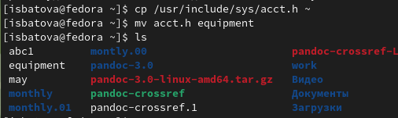
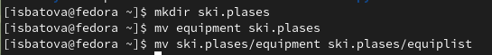
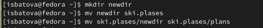
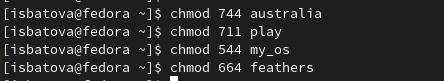
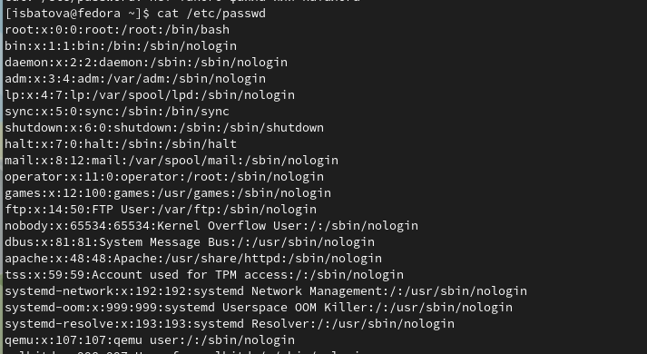
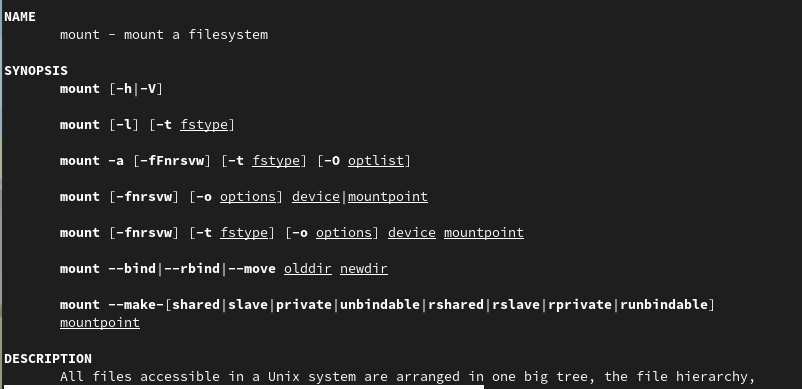

---
## Front matter
lang: ru-RU
title: Отчёт по лабораторной работе №5
subtitle: Дисциплина 'Операционные системы'
author:
  - Батова Ирина Сергеевна
institute:
  - Российский университет дружбы народов, Москва, Россия
date: 10 марта 2023

## i18n babel
babel-lang: russian
babel-otherlangs: english

## Formatting pdf
toc: false
toc-title: Содержание
slide_level: 2
aspectratio: 169
section-titles: true
theme: metropolis
header-includes:
 - \metroset{progressbar=frametitle,sectionpage=progressbar,numbering=fraction}
 - '\makeatletter'
 - '\beamer@ignorenonframefalse'
 - '\makeatother'
---

# Вводная часть

## Цель работы

Ознакомление с файловой системой Linux, её структурой, именами и содержанием каталогов. Приобретение практических навыков по применению команд для работы с файлами и каталогами, по управлению процессами (и работами), по проверке использования диска и обслуживанию файловой системы

# Основная часть

## Выполнение примеров

## Выполнение примеров

## Копирование, переименовывание и перемещение файла

- Нам нужно скопировать файл /usr/include/sys/acct.h (так как не было файла io.h) в домашний каталог и назвать его 'equipment'
- После этого перемещаем файл в каталог 'ski.plases' и переименовываем его внутри каталога в 'equiplist'

## Копирование, переименовывание и перемещение каталога

- В домашнем каталог создаем каталог 'newdir' и перемещаем его в каталог 'ski.plases', после чего переименовываем подкаталог в 'plans'

## Присвоение прав доступа

- Нам нужно определить опции команды 'chmod', чтобы присвоить заданные права доступа для двух каталогов и двух файлов

## Просмотр содержимое файла

- Просматриваем содержимое файла /etc/password

## Команда 'man'

- Выполняем команду 'man' по командам mount, fsck, mkfs, kill
- Например, команда 'mount' служит для подключения файловых систем разных устройств к большому дереву - иерархической файловой структуре. При этом физически файлы могут располагаться на разных устройствах.

# Вывод

## Вывод

В данной лабораторной работе я ознакомилась с файловой системой Linux, её структурой, именами и содержанием каталогов, а также приобрела практические навыков по применению команд для работы с файлами и каталогами, по управлению процессами (и работами), по проверке использования диска и обслуживанию файловой системы.

