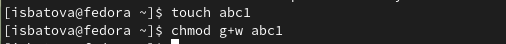

---
## Front matter
title: "Отчёт по лабораторной работе №5"
subtitle: "Дисциплина: Операционные системы"
author: "Батова Ирина Сергеевна, НММбд-01-22"

## Generic otions
lang: ru-RU
toc-title: "Содержание"

## Bibliography
bibliography: bib/cite.bib
csl: pandoc/csl/gost-r-7-0-5-2008-numeric.csl

## Pdf output format
toc: true # Table of contents
toc-depth: 2
lof: true # List of figures
lot: true # List of tables
fontsize: 12pt
linestretch: 1.5
papersize: a4
documentclass: scrreprt
## I18n polyglossia
polyglossia-lang:
  name: russian
  options:
	- spelling=modern
	- babelshorthands=true
polyglossia-otherlangs:
  name: english
## I18n babel
babel-lang: russian
babel-otherlangs: english
## Fonts
mainfont: PT Serif
romanfont: PT Serif
sansfont: PT Sans
monofont: PT Mono
mainfontoptions: Ligatures=TeX
romanfontoptions: Ligatures=TeX
sansfontoptions: Ligatures=TeX,Scale=MatchLowercase
monofontoptions: Scale=MatchLowercase,Scale=0.9
## Biblatex
biblatex: true
biblio-style: "gost-numeric"
biblatexoptions:
  - parentracker=true
  - backend=biber
  - hyperref=auto
  - language=auto
  - autolang=other*
  - citestyle=gost-numeric
## Pandoc-crossref LaTeX customization
figureTitle: "Рис."
tableTitle: "Таблица"
listingTitle: "Листинг"
lofTitle: "Список иллюстраций"
lotTitle: "Список таблиц"
lolTitle: "Листинги"
## Misc options
indent: true
header-includes:
  - \usepackage{indentfirst}
  - \usepackage{float} # keep figures where there are in the text
  - \floatplacement{figure}{H} # keep figures where there are in the text
---

# Цель работы

Ознакомление с файловой системой Linux, её структурой, именами и содержанием каталогов. Приобретение практических навыков по применению команд для работы с файлами и каталогами, по управлению процессами (и работами), по проверке использования диска и обслуживанию файловой системы.

# Задание

1. Выполните все примеры, приведённые в первой части описания лабораторной работы.
2. Выполните следующие действия, зафиксировав в отчёте по лабораторной работе используемые при этом команды и результаты их выполнения:
* Скопируйте файл /usr/include/sys/io.h в домашний каталог и назовите его equipment. Если файла io.h нет, то используйте любой другой файл в каталоге /usr/include/sys/ вместо него.
* В домашнем каталоге создайте директорию ~/ski.plases.
* Переместите файл equipment в каталог ~/ski.plases.
* Переименуйте файл ~/ski.plases/equipment в ~/ski.plases/equiplist.
* Создайте в домашнем каталоге файл abc1 и скопируйте его в каталог ~/ski.plases, назовите его equiplist2.
* Создайте каталог с именем equipment в каталоге ~/ski.plases.
* Переместите файлы ~/ski.plases/equiplist и equiplist2 в каталог ~/ski.plases/equipment.
* Создайте и переместите каталог ~/newdir в каталог ~/ski.plases и назовите его plans.
3. Определите опции команды chmod, необходимые для того, чтобы присвоить перечисленным ниже файлам выделенные права доступа, считая, что в начале таких прав нет:
* drwxr--r-- ... australia
* drwx--x--x ... play
* -r-xr--r-- ... my_os
* -rw-rw-r-- ... feathers
При необходимости создайте нужные файлы.
4. Проделайте приведённые ниже упражнения, записывая в отчёт по лабораторной работе используемые при этом команды:
* Просмотрите содержимое файла /etc/password.
* Скопируйте файл ~/feathers в файл ~/file.old.
* Переместите файл ~/file.old в каталог ~/play.
* Скопируйте каталог ~/play в каталог ~/fun.
* Переместите каталог ~/fun в каталог ~/play и назовите его games.
* Лишите владельца файла ~/feathers права на чтение.
* Что произойдёт, если вы попытаетесь просмотреть файл ~/feathers командой cat?
* Что произойдёт, если вы попытаетесь скопировать файл ~/feathers?
* Дайте владельцу файла ~/feathers право на чтение.
* Лишите владельца каталога ~/play права на выполнение.
* Перейдите в каталог ~/play. Что произошло?
* Дайте владельцу каталога ~/play право на выполнение.
5. Прочитайте man по командам mount, fsck, mkfs, kill и кратко их охарактеризуйте,
приведя примеры.

# Выполнение лабораторной работы

1. Для начала выполняем все примеры, приведенные в лабораторной работе.

Создаем файл 'abc1' и копируем его в файл 'may' и файл 'april' с помощью команды 'cp' (рис. @fig:001).

{#fig:001 width=70%}

Создаем каталог 'monthly' и копируем в него файлы 'april' и 'may' (рис. @fig:002).

{#fig:002 width=70%}

Копируем файл 'monthly/may' в файл с именем 'june' (рис. @fig:003). Проверяем это командой 'ls'.

{#fig:003 width=70%}

Копируем каталог 'monthly' в каталог с именем 'monthly.00' и копируем получившийся каталог 'monthly.00' в каталог /tmp (рис. @fig:004). 

{#fig:004 width=70%}

Переименовываем файл 'april' в файл 'july' с помощью команды 'mv' (рис. @fig:005).

{#fig:005 width=70%}

Перемещаем файл 'july' в каталог 'monthly.00' также командой 'mv' (рис. @fig:006). Проверяем это командой 'ls'.

{#fig:006 width=70%}

Переименовываем каталог 'monthly.00' в каталог 'monthly.01' и перемещаем полученный каталог в каталог 'reports', после чего переименовываем его обратно в 'monthly.00' (рис. @fig:007).

{#fig:007 width=70%}

Создаем файл 'may' командой 'touch'. Далее нам нужно задать право выполнения для владельца. Для этого вводим команду 'chmod u+x' и командой 'ls -l' проверяем корректность выполнения. Далее лишаем владельца права на выполнения командой 'chmod u-x' и опять проверяем командой 'ls -l' (рис. @fig:008).

{#fig:008 width=70%}

Далее нам нужно запретить чтения для группы и всех остальных пользователей каталога 'monthly'. Для этого вводим команду 'chmod go-r' и командой 'ls -l' проверяем корректность выполнения (рис. @fig:009).

{#fig:009 width=70%}

Создаем файл 'abc1' и задаем право записи для членов группы командой 'chmod g+w' (рис. @fig:0010).

{#fig:0010 width=70%}

2. Нам нужно скопировать файл /usr/include/sys/acct.h (так как не было файла io.h) в домашний каталог и назвать его 'equipment'. Копирование осуществляем командой 'cp', а переименовываем командой 'mv' (рис. @fig:0011).

{#fig:0011 width=70%}

Далее в домашнем каталоге создаем каталог 'ski.plases' командой 'mkdir', перемещаем туда файл 'equipment' и переименовываем в 'equplist' командой 'mv' (рис. @fig:0012).

{#fig:0012 width=70%}

Создаем в домашнем каталоге файл 'abc1' командой 'touch' и копируем его в каталог 'ski.plases' командой 'cp', после чего переименовываем файл в 'equiplist2' (рис. @fig:0013).

{#fig:0013 width=70%}

Создаем каталог 'equipment' внутри каталога 'ski.plases' и перемещаем файлы 'equplist' и 'equiplist2' в созданный каталог командой 'mv' (рис. @fig:0014).

{#fig:0014 width=70%}

В домашнем каталог создаем каталог 'newdir' и перемещаем его в каталог 'ski.plases', после чего переименовываем подкаталог в 'plans'. Оба действия выполняются командой 'mv' (рис. @fig:0015). 

{#fig:0015 width=70%}

3. Создаем каталог 'australia' и 'play' (команда 'mkdir'), а также файлы 'my_os' и 'feathers' (команда 'touch') (рис. @fig:0016). 

{#fig:0016 width=70%}

Нам нужно определить опции команды 'chmod', чтобы присвоить следующие права доступа:

* drwxr--r-- ... australia
* drwx--x--x ... play
* -r-xr--r-- ... my_os
* -rw-rw-r-- ... feathers

По таблице из лабораторной работы "Форма записи прав доступа" определяем опции и выполняем их (рис. @fig:0017). 

{#fig:0017 width=70%}

Командой 'ls -l' проверяем - все права доступы присвоены в соответствие с заданием (рис. @fig:0018).

{#fig:0018 width=70%}

4. Просматриваем содержимое файла /etc/password командой 'cat /etc/password' (рис. @fig:0019).

{#fig:0019 width=70%}

файл '~/feathers' в файл '~/file.old' командой 'cp feathers file.old' и перемещаем файл '~/file.old' в каталог '~/play' командой 'mv file.old play' (рис. @fig:0020).

{#fig:0020 width=70%}

Копируем каталог '~/play' в каталог '~/fun' командой 'cp -r play fun', перемещаем каталог '~/fun' в каталог '~/play' командой 'mv fun play' и называем его 'games' командой 'mv play/fun play/games' (рис. @fig:0021).

{#fig:0021 width=70%}

Лишаем владельца файла '~/feathers' права на чтение командой 'chmod u-r feathers'. При этом при попытке просмотра этого файла командой 'cat' или копирования файла командой 'cp' нам отказывает в доступе, ведь мы забрали права на чтение. Возвращаем их командой 'chmod u+r feathers' (рис. @fig:0022).

{#fig:0022 width=70%}

Лишаем владельца каталога ~/play права на выполнение командой 'chmod u-x play'. При попытке перейти в каталог командой 'cd' нам отказывает в доступе. Возвращаем право на выполнения владельцем этот каталога командой 'chmod u+x play' (рис. @fig:0023).

{#fig:0023 width=70%} 

5. Выполняем команду 'man' по командам mount, fsck, mkfs, kill.

* Команда 'mount' (рис. @fig:0024)

Данная команда служит для подключения файловых систем разных устройств к большому дереву - иерархической файловой структуре. При этом физически файлы могут располагаться на разных устройствах.

Пример:

mount -t vfstype device dir 

Эта команда предлагает ядру смонтировать файловую систему типа vfstype, расположенному на устройстве device, к каталогу dir. При этом предыдущее содержимое, владелец, режим доступа к данному каталогу становятся недоступными, пока device подключен к dir.

{#fig:0024 width=70%} 

* Команда 'fsck' (рис. @fig:0025)

Данная команда проверяет и в интерактивном режиме восстанавливает несовместимые состояния файловой системы. Используется для восстановления поврежденных файловых систем в ситуациях, когда система не загружается или раздел не может быть смонтирован.

Пример:

sudo fsck -p /dev/sdc1

'Sudo' указывает нам, что мы выполняем команду с правами суперпользователя, а опция 'p' указывает команде автоматически исправить все проблемы.

{#fig:0025 width=70%} 

* Команда 'mkfs' (рис. @fig:0026)

Данная команда используется для создания новой файловой системы Linux на некотором устройстве, обычно в разделе жесткого диска. В качестве аргумента моет выступать или имя устройству, или точка монтирования. При окончании работы команда возвращает 0 в случае успеха и 1 в случае неуспеха.

Пример:

mkfs -t ext2 /dev/hdb1

Команда создаст новую файловую систему типа ext2 в разделе /dev/hdb1 (второй жесткий диск).

{#fig:0026 width=70%} 

* Команда 'kill' (рис. @fig:0027)

Команда посылает сигнал процессу или выводит список допустимых сигналов. 

Пример:

kill -L

Команда выведет список всех доступных сигналов.

{#fig:0027 width=70%} 

# Выводы

В данной лабораторной работе я ознакомилась с файловой системой Linux, её структурой, именами и содержанием каталогов, а также приобрела практические навыков по применению команд для работы с файлами и каталогами, по управлению процессами (и работами), по проверке использования диска и обслуживанию файловой системы.

# Контрольные вопросы

1. Вводим команду 'df -Th' в терминал, чтобы узнать какие файловые системы существуют на жестком диске моего компьютера. Команда выводит нам всего пять типов: devtmpfs, tmpfs, btrfs, etx4, iso9660.

* tmpfs - используется для хранения файлов в оперативной памяти, при этом создает блочное устройство требуемого размера, которое затем подключают к папке. Является виртуальной файловой системой (создана для хранения временной информации в памяти, пока запущена система)
* devtmpfs - позволяет ядру создать экземпляр tmpfs с именем devtmpfs при инициализации ядра, прежде чем регистрируется какое-либо устройство с драйверами. Монтируется на /dev. Также является виртуальной файловой системой.
* btrfs - основанная на B-древе файловая система с расширенными возможностями (является альтернативой ZFS). Уделено особое внимание отказоустойчивости, самовосстановлению и простоте администрирования.
* etx4 - дисковая файловая система с открытым исходным кодом, распространяемая под лицензией GPL. Является файловой системой по умолчанию для многих дистрибутивов Linux. 
* iso9660 - исходная стандартная файловая система для дисков данных CD. 

2. Файловая система Linux представляет собой пространство диска, разбитое на блоки фиксированного размера. Начинается файловая система с корневого каталога и разрастается в директории, в результате чего получается древовидная иерархическая структура, в которой абсолютный путь к любому файлу или каталогу начинается с корневого каталога. 

* root - главный каталог. Путь ко всем файлами начинается с root, все дополнительные разделы или оптические диски подключаются к корневому каталогу.

* bin - каталог, содержащий исполняемые файлы.

* boot - каталог, содержащий все файлы, связанные с загрузчиком системы. Используется для загрузки операционной системы.

* dev - каталог, содержащий все файлы физических устройств, которые могут входить в состав аппаратного обеспечения компьютера.

* etc - каталог, содержащий конфигурационные файлы большинства системных утилит и программ.

* home - домашний каталог пользователя.

* lib, lib64 - каталоги, где содержатся динамические библиотеки Linux.

* lost+found - каталог, используемый утилитой fsck (проверка файловой системы). При нахождении в ходе проверки поврежденных файлов, утилита помещает их в этот каталог.

* media - каталог, в который система монтирует все подключаемые внешние накопители.

* mnt - каталог, в который системные администраторы могут монтировать внешние файловые системы.

* opt - каталог, в котором размещаются дополнительные пакеты программ.

* proc - виртуальная файловая система, основной задачей которой является получение состояние системы и частично выполнение управляющих действий. 

* run - каталог, содержащий PID файлы процессов, причем после перезагрузки все файлы теряются.

* sbin - каталог, также содержащий исполняемые файлы, однако здесь находятся программы, которые можно выполнять только с правами суперпользователя.

* srv - каталог, содержащий файлы серверов.

* sys - каталог, содержащий информацию об инициализированных устройствах, сгрупированную по различным критериям.

* tmp - каталог, в котором хранятся временные файлы, необходимые для запущенного программного обеспечения и приложений, работающих в системе.

* usr - каталог, содержащий динамически компануемые программы, файлы пользователей и программы, устанавливаемые вручную.

* var - каталог, содержащий файлы, которые чаще всего подвержены изменениям.

4. Целостность файлов нарушается чаще всего из-за некорректного выключения компьютера или других неполадок с устройством. Для устранения повреждений нужно воспользоваться командой 'fsck'. 

5. Файловая система создается командой 'mkfs'. 

6. Команды для просмотра текстовых файлов:

* cat - команда читает данные из файла и выводит их на экран. С помощью различных опций можно нумеровать только непустые строки (-b), нумеровать все строки (-n), удалять все повторяющиеся строки (-s), отображать табуляции (-T) и другое.

* less - позволяет перематывать текст вперед, назад, осуществлять поиск в обоих направлениях, переходить сразу в начало или конец файла. Команда загружает текст небольшими фрагментами, неполностью. 

* head - выводит первые 10 строк файла (10 по умолчанию, можно указать другое число). 

* tail - выводит последние 10 строк файла (аналогично 10 по умолчанию, можно указать другое число). 

7. Команда cp используется для копирования файлов и каталогов.

Cинтаксис:

cp [опции] файл-источник файл-приемник

Основные опции:

* --attributes-only − не копировать содержимое файла, а только флаги доступа и владельца
* -f, --force − перезаписывать существующие файлы
* -i, --interactive − спрашивать, нужно ли перезаписывать существующие файлы
* -L − копировать не символические ссылки, а то, на что они указывают
* -n − не перезаписывать существующие файлы
* -P − не следовать символическим ссылкам
* -r − копировать папку Linux рекурсивно
* -s − не выполнять копирование файлов в Linux, а создавать символические ссылки
* -u − скопировать файл, только если он был изменён
* -x − не выходить за пределы этой файловой системы
* -p − сохранять владельца, временные метки и флаги доступа при копировании
* -t − считать файл-приемник директорией и копировать файл-источник в эту директорию

8. Команда mv используется для перемещения и переименования файлов и каталогов.

Синтаксис:

mv [-опции] старый_файл новый_файл

Основные опции:

* --help − выводит на экран официальную документацию об утилите
* --version − отображает версию mv
* -b − создает копию файлов, которые были перемещены или перезаписаны
* -f − при активации не будет спрашивать разрешение у владельца файла, если речь идет о перемещении или переименовании файла
* -i − наоборот, будет спрашивать разрешение у владельца
* -n − отключает перезапись уже существующих объектов
* --strip-trailing-slashes — удаляет завершающий символ / у файла при его наличии
* -t [директория] — перемещает все файлы в указанную директорию
* -u − осуществляет перемещение только в том случае, если исходный файл новее объекта назначения
* -v − отображает сведения о каждом элементе во время обработки команды

9. Права доступа определяют, какие действия может или не может совершать пользователь с данным файлом или каталогом. Изменить права доступа к файлу может изменить владелец или пользователь с правами администратора командой 'chmod'. Синтаксис команды - chmod режим имяфайла.

Режим имеет следующие компоненты структуры и способ записи:
* = установить право
* - лишить права
* + дать право
* r чтение
* w запись
* x выполнение
* u (user) владелец файла
* g (group) группа, к которой принадлежит владелец файла
* o (others) все остальные

Также можно использовать цифровую запись вместо символьной. 
