---
## Front matter
lang: ru-RU
title: Отчёт по лабораторной работе №6"
subtitle: Дисциплина "Операционные системы"
author:
  - Батова И. С.
institute:
  - Российский университет дружбы народов, Москва, Россия
date: 16 марта 2023

## i18n babel
babel-lang: russian
babel-otherlangs: english

## Formatting pdf
toc: false
toc-title: Содержание
slide_level: 2
aspectratio: 169
section-titles: true
theme: metropolis
header-includes:
 - \metroset{progressbar=frametitle,sectionpage=progressbar,numbering=fraction}
 - '\makeatletter'
 - '\beamer@ignorenonframefalse'
 - '\makeatother'
---

# Вводная часть

## Цель работы

Ознакомление с инструментами поиска файлов и фильтрации текстовых данных. Приобретение практических навыков: по управлению процессами (и заданиями), по проверке использования диска и обслуживанию файловых систем.

# Основная часть

## Запись в файл file.txt названий файлов

- Записываем в файл file.txt названия файлов, содержащихся в каталоге /etc, дописываем в этот же файл названия файлов, содержащихся в домашнем каталоге
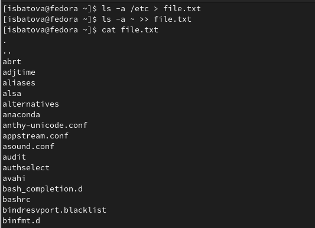

## Вывод имен всех файлов из file.txt, имеющих расширение .conf

- Выводим имена всех файлов из file.txt, имеющих расширение .conf, записываем их в новый текстовой файл conf.txt.
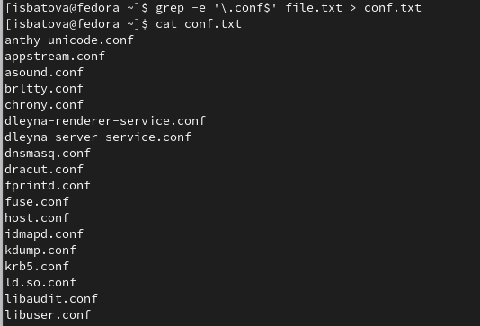
## Файлы домашнего каталога с 'c'

- Определяем, какие файлы в вашем домашнем каталоге имеют имена, начинающиеся с символа c

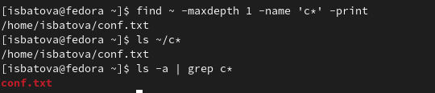

## Файлы каталога /etc с 'h'

- Нужно по странично вывести на экран имена файлов из каталога /etc, начинающиеся с символа h

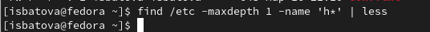
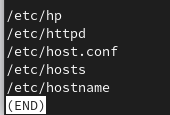

## Фоновый режим процесса

- Запускаем в фоновом режиме процесс, который будет записывать в файл ~/logfile файлы, имена которых начинаются с log
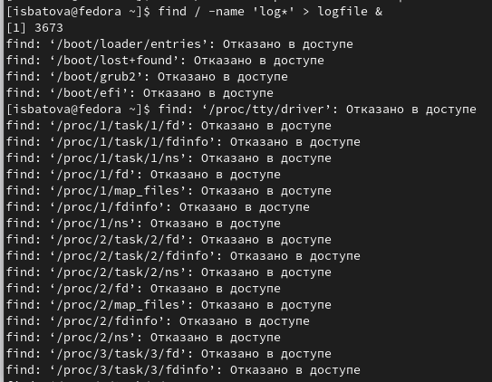

## Фоновый режим процесса

- Запускаем в фоновом режиме gedit
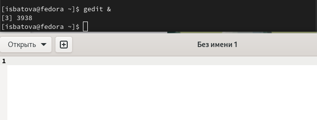

## Процесс gedit

- Определяем идентификатор процесса gedit

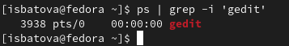

## Процесс gedit

- Завершаем процесс gedit

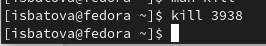

## Утилиты 'df' и 'du'

- df - команда, показывающая список всех файловых систем по именам устройств, их размер, занятое и свободное пространство и точки монтирования.

- du - команда, выводящая информацию об объеме дискового пространства, занятого файлами и директориями.

## Утилита 'df'

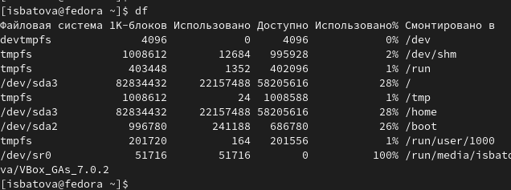

## Утилита 'du'

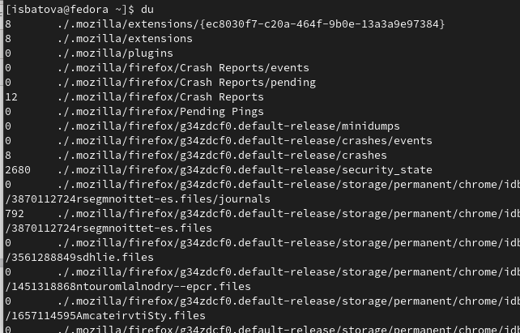

## Имена всех директорий домашнего каталога

- Выводим имена всех директорий, имеющихся в вашем домашнем каталоге

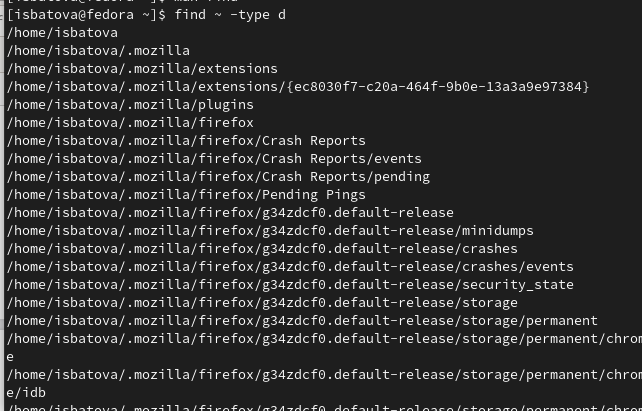

# Вывод

## Вывод

В ходе данной лабораторной работы я ознакомилась с инструментами поиска файлов и фильтрации текстовых данных, а также приобрела практические навыки по управлению процессами (и заданиями), по проверке использования диска и обслуживанию файловых систем.

