---
## Front matter
title: "Отчёт по лабораторной работе №6"
subtitle: "Дисциплина: Операционные системы"
author: "Батова Ирина Сергеевна, НММбд-01-22"

## Generic otions
lang: ru-RU
toc-title: "Содержание"

## Bibliography
bibliography: bib/cite.bib
csl: pandoc/csl/gost-r-7-0-5-2008-numeric.csl

## Pdf output format
toc: true # Table of contents
toc-depth: 2
lof: true # List of figures
lot: true # List of tables
fontsize: 12pt
linestretch: 1.5
papersize: a4
documentclass: scrreprt
## I18n polyglossia
polyglossia-lang:
  name: russian
  options:
	- spelling=modern
	- babelshorthands=true
polyglossia-otherlangs:
  name: english
## I18n babel
babel-lang: russian
babel-otherlangs: english
## Fonts
mainfont: PT Serif
romanfont: PT Serif
sansfont: PT Sans
monofont: PT Mono
mainfontoptions: Ligatures=TeX
romanfontoptions: Ligatures=TeX
sansfontoptions: Ligatures=TeX,Scale=MatchLowercase
monofontoptions: Scale=MatchLowercase,Scale=0.9
## Biblatex
biblatex: true
biblio-style: "gost-numeric"
biblatexoptions:
  - parentracker=true
  - backend=biber
  - hyperref=auto
  - language=auto
  - autolang=other*
  - citestyle=gost-numeric
## Pandoc-crossref LaTeX customization
figureTitle: "Рис."
tableTitle: "Таблица"
listingTitle: "Листинг"
lofTitle: "Список иллюстраций"
lotTitle: "Список таблиц"
lolTitle: "Листинги"
## Misc options
indent: true
header-includes:
  - \usepackage{indentfirst}
  - \usepackage{float} # keep figures where there are in the text
  - \floatplacement{figure}{H} # keep figures where there are in the text
---

# Цель работы

Ознакомление с инструментами поиска файлов и фильтрации текстовых данных. Приобретение практических навыков: по управлению процессами (и заданиями), по проверке использования диска и обслуживанию файловых систем.

# Задание

1. Осуществите вход в систему, используя соответствующее имя пользователя.
2. Запишите в файл file.txt названия файлов, содержащихся в каталоге /etc. Допишите в этот же файл названия файлов, содержащихся в вашем домашнем каталоге.
3. Выведите имена всех файлов из file.txt, имеющих расширение .conf, после чего запишите их в новый текстовой файл conf.txt.
4. Определите, какие файлы в вашем домашнем каталоге имеют имена, начинавшиеся с символа c? Предложите несколько вариантов, как это сделать.
5. Выведите на экран (по странично) имена файлов из каталога /etc, начинающиеся с символа h.
6. Запустите в фоновом режиме процесс, который будет записывать в файл ~/logfile файлы, имена которых начинаются с log.
7. Удалите файл ~/logfile.
8. Запустите из консоли в фоновом режиме редактор gedit.
9. Определите идентификатор процесса gedit, используя команду ps, конвейер и фильтр grep. Как ещё можно определить идентификатор процесса?
10. Прочтите справку (man) команды kill, после чего используйте её для завершения процесса gedit.
11. Выполните команды df и du, предварительно получив более подробную информацию об этих командах, с помощью команды man.
12. Воспользовавшись справкой команды find, выведите имена всех директорий, имеющихся в вашем домашнем каталоге.

# Выполнение лабораторной работы

1. Осуществляю вход в систему.

2. Нам нужно записать в файл file.txt названия файлов, содержащихся в каталоге /etc. Для этого используем команду 'ls -a /etc > file.txt'. Следующим шагом дописываем в этот же файл названия файлов, содержащихся в домашнем каталоге, командой 'ls -a ~ >> file.txt'. Для проверки вводим команду 'cat file.txt' и видим, что все выполнено корректно (рис. @fig:001).

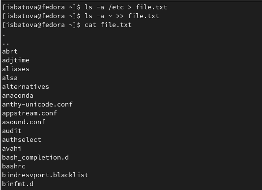{#fig:001 width=70%}

3. Чтобы вывести имена всех файлов из file.txt, имеющих расширение .conf, и записать их в файл conf.txt, используем команду 'grep -e '|.conf$ file.txt > conf.txt'. Аналогично проверяем корректность выполнения командой 'cat' (рис. @fig:002).

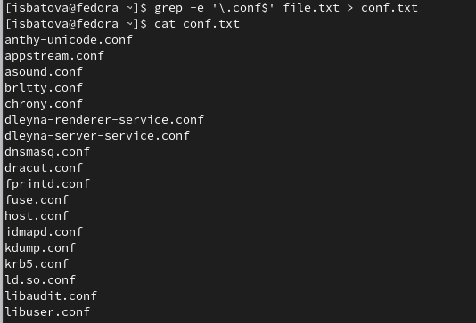{#fig:002 width=70%}

4. Определить, какие файлы в вашем домашнем каталоге имеют имена, начинавшиеся с символа c, можно несколькими способами.

* команда find ~ -maxdepth 1 -name 'c*' -print
* команда ls ~/c*
* команда ls -a | grep c*

Все команды выводят нам одинаковый результат (рис. @fig:003).

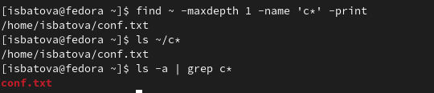{#fig:003 width=70%}

5. Нам нужно по странично вывести на экран имена файлов из каталога /etc, начинающиеся с символа h. Используем для этого команду 'find /etc -maxdepth 1 -name 'h*' | less' (рис. @fig:004, @fig:005).

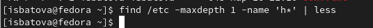{#fig:004 width=70%}

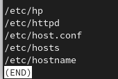{#fig:005 width=70%}

6. Запускаем в фоновом режиме процесс, который будет записывать в файл ~/logfile файлы, имена которых начинаются с log, с помощью команды 'find / -name 'log*' > logfile &' (рис. @fig:006). Символ '&' отвечает за выполнение команды в фоновом режиме.

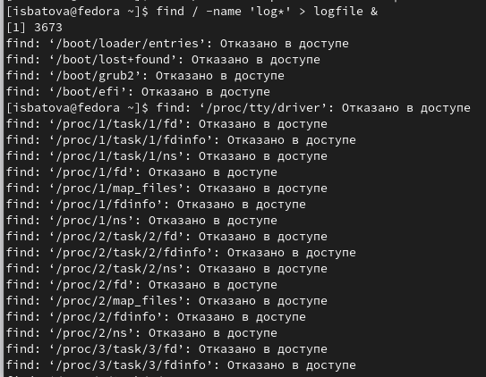{#fig:006 width=70%}

7. Удаляем файл ~/logfile (рис. @fig:007).

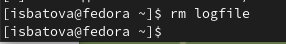{#fig:007 width=70%}

8. Запускаем из консоли в фоновом режиме редактор gedit командой 'gedit &' (рис. @fig:008).

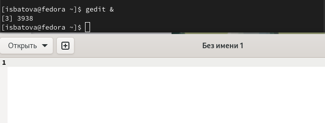{#fig:008 width=70%}

9. С помощью команды 'ps | grep -i 'gedit'' определяем идентификатор процесса gedit - 3938 (рис. @fig:009).

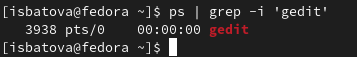{#fig:009 width=70%}

Определить PID можно и коандой 'pgrep gedit'.

10. С помощью команды 'man' читаем справку о команде 'kill' (рис. @fig:0010).

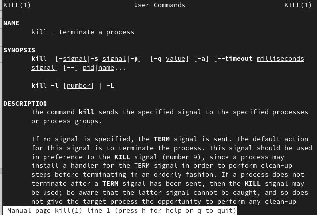{#fig:0010 width=70%}

Завершаем процесс gedit командой 'kill 3938' (рис. @fig:0011). 

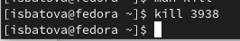{#fig:0011 width=70%}
11. С помощью команды 'man' читаем справку о командах 'df' (рис. @fig:0012) и 'du' (рис. @fig:0013).

* df - команда, показывающая список всех файловых систем по именам устройств, их размер, занятое и свободное пространство и точки монтирования.

* du - команда, выводящая информацию об объеме дискового пространства, занятого файлами и директориями.

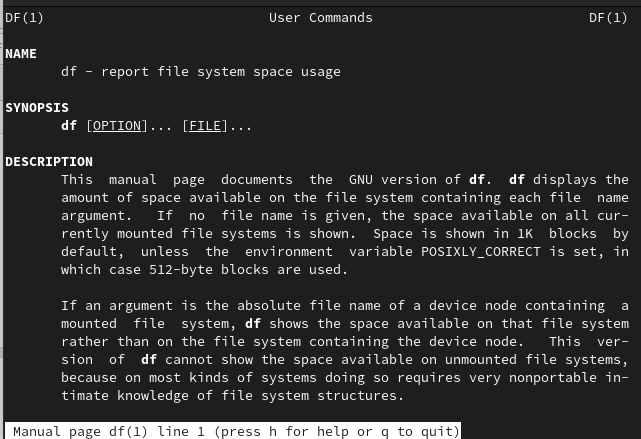{#fig:0012 width=70%}

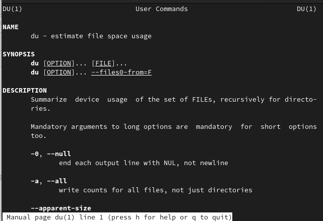{#fig:0013 width=70%}

Далее выполняем эти команды (рис. @fig:0014, @fig:0015).

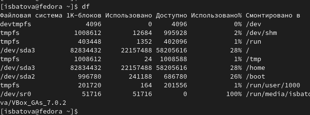{#fig:0014 width=70%}

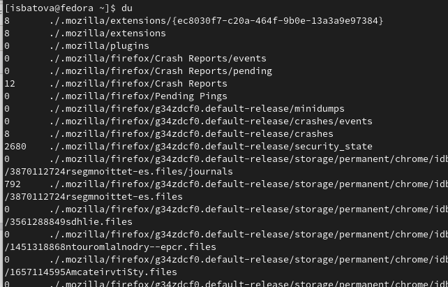{#fig:0015 width=70%}

12. С помощью команды 'man' читаем справку о команде 'find' (рис. @fig:0016).

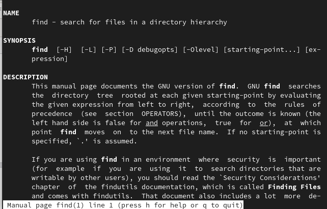{#fig:0016 width=70%}

Ознакомившись со справкой, выводим имена всех директорий, имеющихся в вашем домашнем каталоге, используя команду 'find ~ -type d' (рис. @fig:0017).

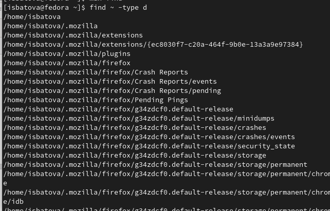{#fig:0017 width=70%}

# Выводы

В ходе данной лабораторной работы я ознакомилась с инструментами поиска файлов и фильтрации текстовых данных, а также приобрела практические навыки по управлению процессами (и заданиями), по проверке использования диска и обслуживанию файловых систем.

# Контрольные вопросы

1. 
* Стандартный поток ввода (stdin) — 0;
* Стандартный поток вывода (stdout) — 1;

2. Операция > - это перенаправление вывода в файл, а операция >> - перенаправление вывода в файл и открытие файла в режиме добавления.

3. Конвейер (pipe) служит для объединения простых команд или утилит в цепочки, в которых результат работы предыдущей команды передаётся последующей. 

4. Процесс - это набор данных, используемых для выполнения программы, а программа - это набор команд.

5. PID - это идентификатор данного процесса, GID - идентификатор группы UNIX, в которой работает программа.

6. Задачи - это запущенные фоном программы. Управлять ими можно командой 'jobs'. Чтобы команда была запущена в фоновом режиме, необходимо в конце добавить символ '&'.

7.  
* top - программа, показывающая список работающих процессов в системе 
* htop - утилита, выводящая меняющийся список системных процессов (показывает абсолютно все процессы в системе)

8. Команда find - команда для поиска файлов и каталогов на основе специальных условий. Пример: 'find ~ -type d' - команда осуществляет поиск директорий в домашнем каталоге.

9. Да, файл можно найти по содержимому с помощью команды 'grep'.

10. Определить объем свободной памяти на жёстком диске можно командой 'df'.

11. Определить объем домашнего каталога можно командой 'du ~/'.

12. Перед остановкой процесса необходимо определить его PID. Для этого используем команды 'ps', которая выведет список активных процессов в системе и информацию о них, и 'grep', которая будет выполнять поиск по результатам команды ps. После определения PID процесса, мы используем команду 'kill' с параметров PID для "убийства" процесса. Помимо этой команды, можно использовать команду 'kilall' для "убийства" всех процессов, имеющих одно и то же имя, это может быть удобно, так как для этого нам не нужно знать PID всех процессов.
