---
## Front matter
lang: ru-RU
title: Отчёт по лабораторной работе №7
subtitle: Дисциплина "Операционные системы"
author:
  - Батова Ирина Сергеевна, НММбд-01-22
institute:
  - Российский университет дружбы народов, Москва, Россия
date: 21 марта 2023

## i18n babel
babel-lang: russian
babel-otherlangs: english

## Formatting pdf
toc: false
toc-title: Содержание
slide_level: 2
aspectratio: 169
section-titles: true
theme: metropolis
header-includes:
 - \metroset{progressbar=frametitle,sectionpage=progressbar,numbering=fraction}
 - '\makeatletter'
 - '\beamer@ignorenonframefalse'
 - '\makeatother'
---

# Вводная часть

## Цель работы

Освоение основных возможностей командной оболочки Midnight Commander. Приобретение навыков практической работы по просмотру каталогов и файлов; манипуляций с ними.

# Основная часть

## Midnight Commander

- Вводим команду 'man mc' для справке о команде mc 

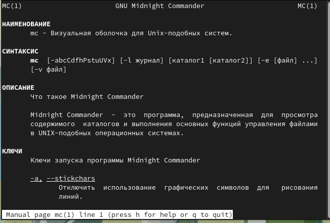

## Midnight Commander

- Запускаем из командной строки mc
- Окно mc состоит из двух панелей. Верхнее меню содержит пять подменю - "Левая панель", "Файл", "Команда", "Настройки" и "Правая панель"
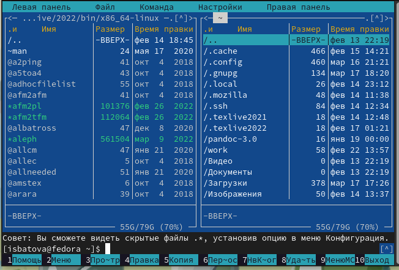

## Выделение файлов

- Выделить файлы можно клавишей 'insert'

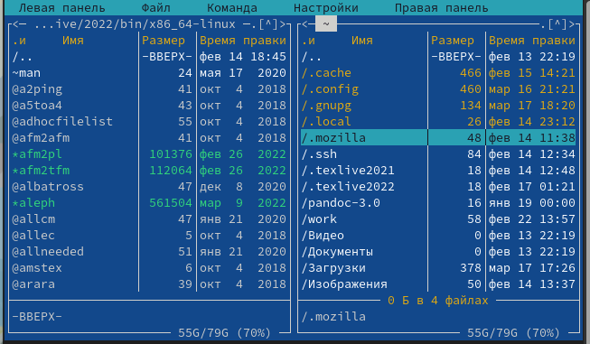

## Копирование файлов

- Копировать файл можно сочетанием клавиш 'fn'+'F5'. В открывшемся окне указываем путь до места, куда хотим копировать файл 

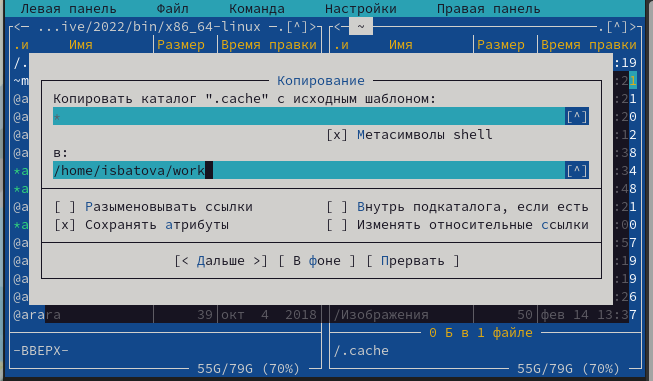

## Перемещение файлов

- Переместить файл можно сочетанием клавиш 'fn'+'F6'. В открывшемся окне указываем путь до места, куда хотим переместить файл 

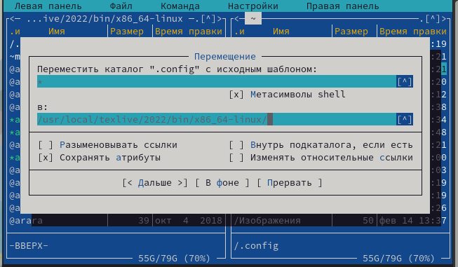

## Левая панель

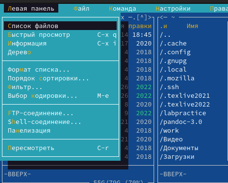

## Левая панель

- "Список файлов". Отображает список файлов с краткой информацией.
- "Быстрый просмотр". Позволяет быстро просмотреть содержимое файла, не заходя в него.
- "Информация". Отображает подробную информацию о файле.
- "Дерево". Отображает дерево данного каталога.

## Левая панель

- "Формат списка". Укороченный формат отображает имя файла/каталога, расширенный формат отображает подробную информацию о файле/каталоге, стандартный формат ставится по умолчанию, определенный пользователем - позволяет пользователю самому определить, какую информацию вывести.
- "Порядок сортировки". Позволяет сортировать файлы/каталоги по определенному критерию.
- "Фильтр". Позволяет вывести файлы/каталоги, подходящие под выражение.
- "Выбор кодировки". Позволяет выбрать кодировку файла или каталога.

## Файл

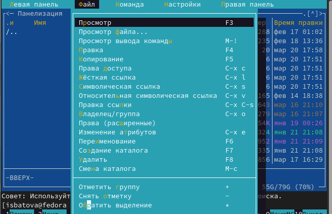

## Файл

- Просмотрим содержимое текстового файла 'file.txt'. Для этого выберем этот текстовый файл и перейдем в пункт подменю "Просмотр" 

- Отредактировать содержимое текстового файла (без сохранения результатов редактирования) можно выделив файл и перейдя в пункт "Правка". Нам открывается файл с возможностью редактирования

- Создаем каталог с именем 'labpractice' с помощью пункта "Создание каталога" в подменю. В открывшемся окне указываем имя каталога

- Копируем файл 'file.txt' в каталог 'labpractice' с помощью пункта "Копирование". В открывшемся окне указываем полный путь до каталога 

## Команда 

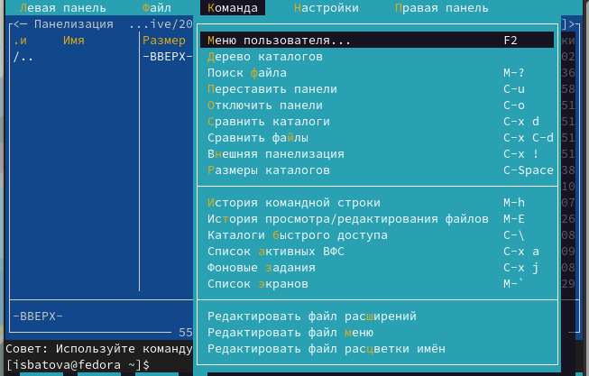

## Команда

- Необходимо найти файл с расширением .c, содержащего строку main. Для этого выбираем пункт "Поиск файла" и вводим соответствующие параметры

- Выбор и повторение одной из предыдущих команд можно осуществить с помощью пункта "История командной строки".

- Чтобы перейти в домашний каталог выбираем пункт "Дерево каталога" и нажимаем на необходимый нам каталог 

- Переходим в пункт "Редактировать файл расширений". Этот пункт позволяет задать определенные действия при запуске файлов с определенным расширением.

- Переходим в пункт "Редактировать файл меню". Этот пункт позволяет редактировать контекстное меню пользователя.

## Настройки

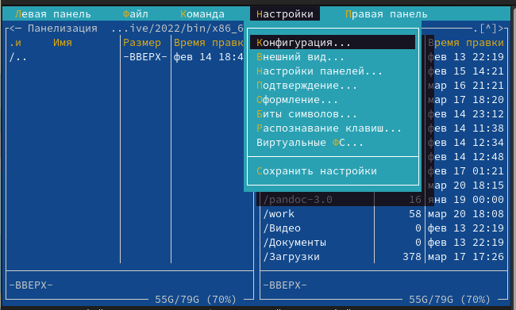

## Настройки

- "Конфигурация". Позволяет корректировать настройки работы с панелями.

- "Внешний вид". Определяет элементы, которые отображаются при вызове Midnight Commander. Разбиение панелей, линейка меню, командная строка, метки клавиш и другое.

- "Настройки панелей". Более подробная настройка для панелей - навигация, цветовыделение, быстрый поиск и другое.

- "Подтверждение". Позволяет установить запрос о подтверждении действий при определенных операциях.

## Настройки

- "Оформление". Позволяет установить цветовую гамму mc.

- "Биты символов". Позволяет установить формат обработки информации локальным терминалом.

- "Распознание клавиш". Позволяет тестировать функциональные клавиши.

- "Виртуальные ФС". Позволяет корректировать настройки виртуальной файловой системы.

- "Сохранить настройки". Сохраняет все изменения.

## Текстовый редактор mc

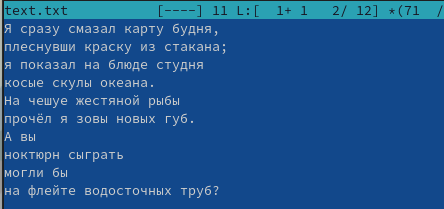

## Текстовый редактор mc

- Удаляем вторую строку текста, оставляя на ней курсор и нажатием клавиш 'fn'+'F8'

- Выделяем третью строку клавишами 'fn'+'F3' и копируем ее на следующую строк клавишами 'fn'+'F5'

- Выделяем последнюю строку клавишами 'fn'+'F3' и переносим ее на следующую строк клавишами 'fn'+'F6'

- Сохраняем файл клавишами 'fn'+'F2'. 

## Текстовый редактор mc

- Отменяем последнее действие клавишами 'ctrl'+'u'. Строка возвращается на место 

- Переходим в конец файла клавишами 'ctrl'+'end' и пишем "Зачем?" 

- Переходим в начало файла клавишами 'ctrl'+'home' и пишем "Почему?" 

- Сохраняем файл клавишами 'fn'+'F2' и закрываем его клавишами 'fn'+'F10'.

## Выключение/включение подсветки синтаксиса

- Открываем меню редактора и в подменю "Команда" выбираем пункт "Включить/выключить подсветку синтаксиса". После этого подсветка синтаксиса у нас выключается 

## Выключение/включение подсветки синтаксиса

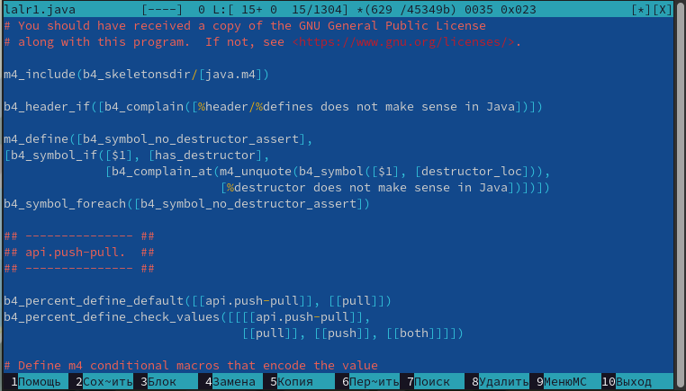

## Выключение/включение подсветки синтаксиса

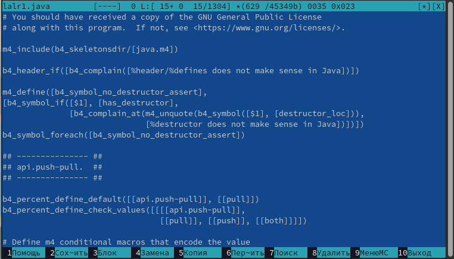

# Вывод

## Вывод

В ходе данной лабораторной работы мной были освоены основные возможности командной оболочки Midnight Commander, а также приобретены навыки практической работы по просмотру каталогов и файлов; манипуляций с ними.

