---
## Front matter
title: "Отчёт по лабораторной работе №7"
subtitle: "Дисциплина: Операционные системы"
author: "Батова Ирина Сергеевна, НММбд-01-22"

## Generic otions
lang: ru-RU
toc-title: "Содержание"

## Bibliography
bibliography: bib/cite.bib
csl: pandoc/csl/gost-r-7-0-5-2008-numeric.csl

## Pdf output format
toc: true # Table of contents
toc-depth: 2
lof: true # List of figures
lot: true # List of tables
fontsize: 12pt
linestretch: 1.5
papersize: a4
documentclass: scrreprt
## I18n polyglossia
polyglossia-lang:
  name: russian
  options:
	- spelling=modern
	- babelshorthands=true
polyglossia-otherlangs:
  name: english
## I18n babel
babel-lang: russian
babel-otherlangs: english
## Fonts
mainfont: PT Serif
romanfont: PT Serif
sansfont: PT Sans
monofont: PT Mono
mainfontoptions: Ligatures=TeX
romanfontoptions: Ligatures=TeX
sansfontoptions: Ligatures=TeX,Scale=MatchLowercase
monofontoptions: Scale=MatchLowercase,Scale=0.9
## Biblatex
biblatex: true
biblio-style: "gost-numeric"
biblatexoptions:
  - parentracker=true
  - backend=biber
  - hyperref=auto
  - language=auto
  - autolang=other*
  - citestyle=gost-numeric
## Pandoc-crossref LaTeX customization
figureTitle: "Рис."
tableTitle: "Таблица"
listingTitle: "Листинг"
lofTitle: "Список иллюстраций"
lotTitle: "Список таблиц"
lolTitle: "Листинги"
## Misc options
indent: true
header-includes:
  - \usepackage{indentfirst}
  - \usepackage{float} # keep figures where there are in the text
  - \floatplacement{figure}{H} # keep figures where there are in the text
---

# Цель работы

Освоение основных возможностей командной оболочки Midnight Commander. Приобретение навыков практической работы по просмотру каталогов и файлов; манипуляций с ними.

# Задание

1. Изучите информацию о mc, вызвав в командной строке man mc.
2. Запустите из командной строки mc, изучите его структуру и меню.
3. Выполните несколько операций в mc, используя управляющие клавиши (операции с панелями; выделение/отмена выделения файлов, копирование/перемещение файлов, получение информации о размере и правах доступа на файлы и/или каталоги и т.п.)
4. Выполните основные команды меню левой (или правой) панели. Оцените степень подробности вывода информации о файлах.
5. Используя возможности подменю Файл, выполните:
* просмотр содержимого текстового файла;
* редактирование содержимого текстового файла (без сохранения результатов редактирования);
* создание каталога;
* копирование в файлов в созданный каталог.
6. С помощью соответствующих средств подменю Команда осуществите:
* поиск в файловой системе файла с заданными условиями (например, файла с расширением .c или .cpp, содержащего строку main);
* выбор и повторение одной из предыдущих команд;
* переход в домашний каталог;
* анализ файла меню и файла расширений.
7. Вызовите подменю Настройки . Освойте операции, определяющие структуру экрана mc(Full screen, Double Width, Show Hidden Files и т.д.)ю
8. Создайте текстовой файл text.txt.
9. Откройте этот файл с помощью встроенного в mc редактора.
10. Вставьте в открытый файл небольшой фрагмент текста, скопированный из любого другого файла или Интернета.
11. Проделайте с текстом следующие манипуляции, используя горячие клавиши:
* Удалите строку текста.
* Выделите фрагмент текста и скопируйте его на новую строку.
* Выделите фрагмент текста и перенесите его на новую строку.
* Сохраните файл.
* Отмените последнее действие.
* Перейдите в конец файла (нажав комбинацию клавиш) и напишите некоторый текст.
* Перейдите в начало файла (нажав комбинацию клавиш) и напишите некоторый текст.
* Сохраните и закройте файл.
12. Откройте файл с исходным текстом на некотором языке программирования (например C или Java)
13. Используя меню редактора, включите подсветку синтаксиса, если она не включена, или выключите, если она включена.

# Выполнение лабораторной работы

1. Вводим команду 'man mc' для справке о команде mc (рис. @fig:001).

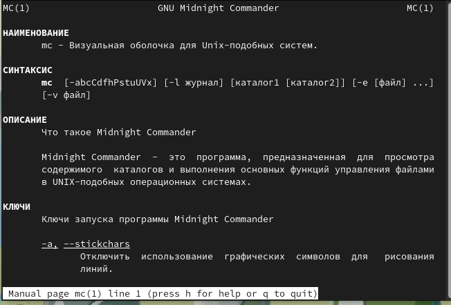{#fig:001 width=70%}

Midnight Commander - программа, предназначенная для просмотра содержимого каталогов и выполнения основных функций управления файлами. Визуальная оболочка для UNIX-подобных систем.

2. Запускаем из командной строки mc (рис. @fig:002).

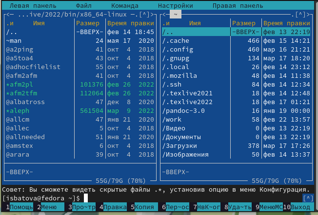{#fig:002 width=70%}

Окно mc состоит из двух панелей. Верхнее меню содержит пять подменю - "Левая панель", "Файл", "Команда", "Настройки" и "Правая панель". 

3. Выполняем несколько операций в mc, используя управляющие клавиши.

* Выделить файлы можно клавишей 'insert'. Можно выделить несколько файлов, просто пролистывая их вниз. Выделенные файлы написаны желтым цветом (рис. @fig:003).

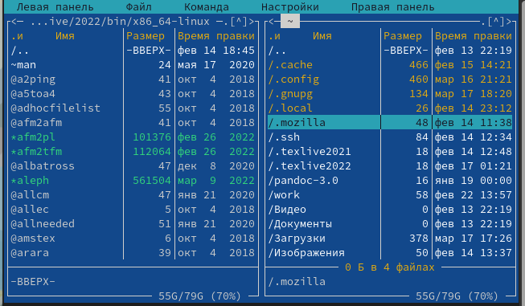{#fig:003 width=70%}

* Копировать файл можно сочетанием клавиш 'fn'+'F5'. В открывшемся окне указываем путь до места, куда хотим копировать файл (рис. @fig:004). 

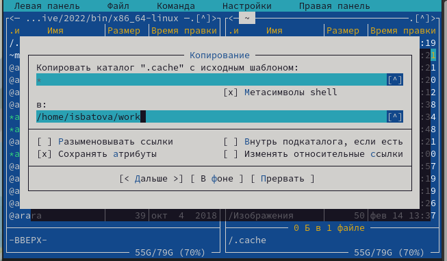{#fig:004 width=70%}

* Переместить файл можно сочетанием клавиш 'fn'+'F6'. В открывшемся окне указываем путь до места, куда хотим переместить файл (рис. @fig:005). 

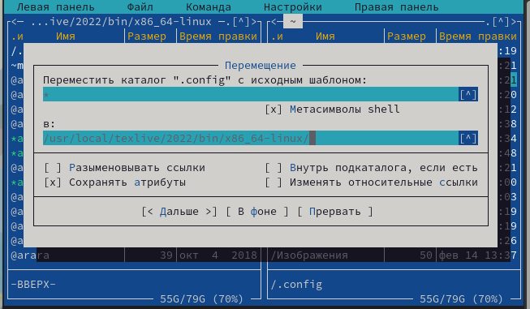{#fig:005 width=70%}

4. Выполняем основные команды меню левой панели (рис. @fig:006). 

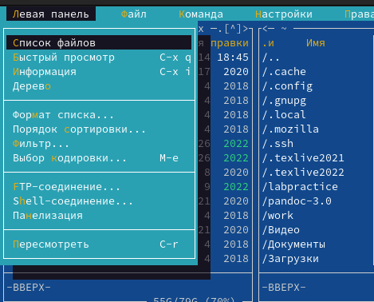{#fig:006 width=70%}

* "Список файлов" (рис. @fig:007). Отображает список файлов с краткой информацией.

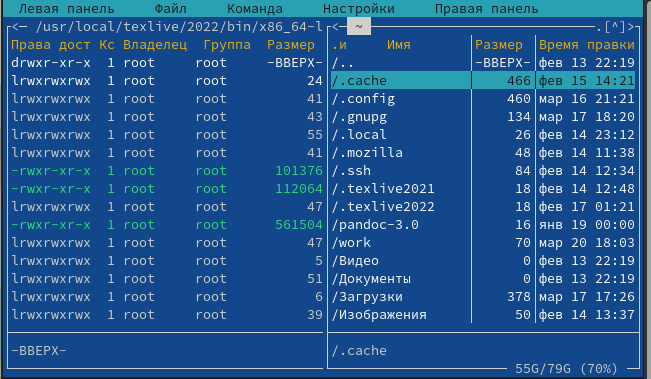{#fig:007 width=70%}

* "Быстрый просмотр" (рис. @fig:008). Позволяет быстро просмотреть содержимое файла, не заходя в него.

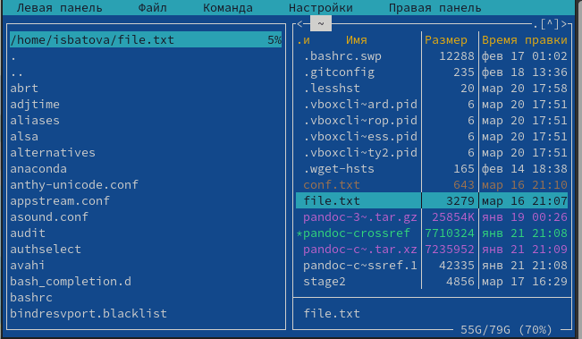{#fig:008 width=70%}

* "Информация" (рис. @fig:009). Отображает подробную информацию о файле.

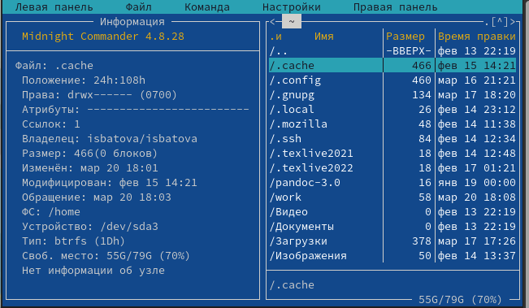{#fig:009 width=70%}

* "Дерево" (рис. @fig:0010). Отображает дерево данного каталога.

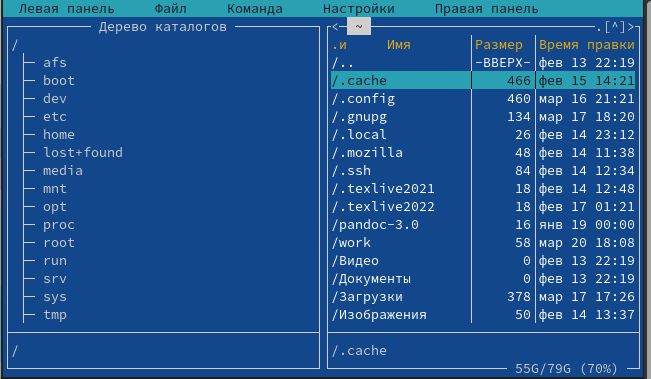{#fig:0010 width=70%}

* "Формат списка" (рис. @fig:0011). Укороченный формат отображает имя файла/каталога, расширенный формат отображает подробную информацию о файле/каталоге, стандартный формат ставится по умолчанию, определенный пользователем - позволяет пользователю самому определить, какую информацию вывести.

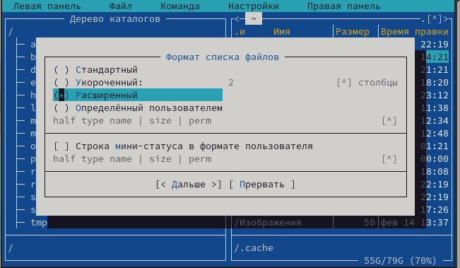{#fig:0011 width=70%}

* "Порядок сортировки" (рис. @fig:0012). Позволяет сортировать файлы/каталоги по определенному критерию.

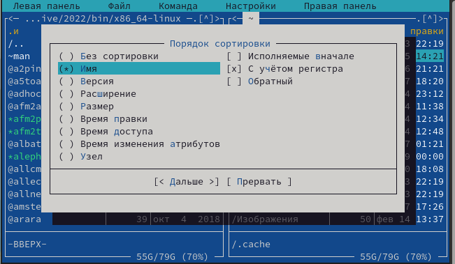{#fig:0012 width=70%}

* "Фильтр" (рис. @fig:0013). Позволяет вывести файлы/каталоги, подходящие под выражение.

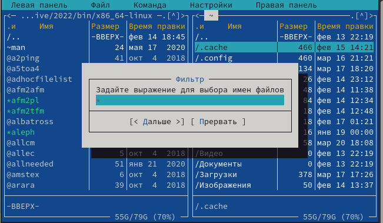{#fig:0013 width=70%}

* "Выбор кодировки" (рис. @fig:0014). Позволяет выбрать кодировку файла или каталога.

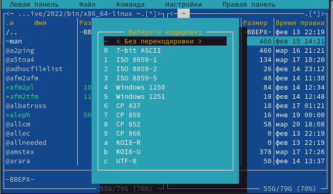{#fig:0014 width=70%}

Наиболее подробную информацию о файле можно узнать из пункта "Информация", менее подробную - "Список файлов" и "Формат списка".

5. Выполняем некоторые действия, используя возможности подменю "Файл" (рис. @fig:0015). 

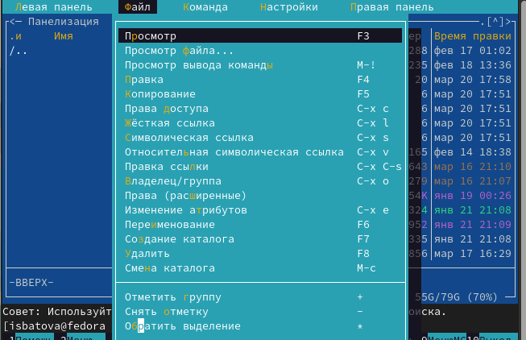{#fig:0015 width=70%}

* Просмотрим содержимое текстового файла 'file.txt'. Для этого выберем этот текстовый файл и перейдем в пункт подменю "Просмотр" (рис. @fig:0016). 

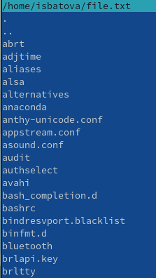{#fig:0016 width=70%}

* Отредактировать содержимое текстового файла (без сохранения результатов редактирования) можно выделив файл и перейдя в пункт "Правка". Нам открывается файл с возможностью редактирования. Я отредактировала третью строчку файла, но не сохранила изменения (рис. @fig:0017). 

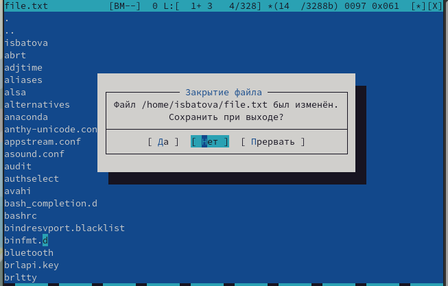{#fig:0017 width=70%}

* Создаем каталог с именем 'labpractice' с помощью пункта "Создание каталога" в подменю. В открывшемся окне указываем имя каталога (рис. @fig:0018). 

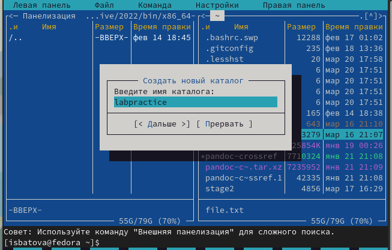{#fig:0018 width=70%}

* Копируем файл 'file.txt' в каталог 'labpractice' с помощью пункта "Копирование". В открывшемся окне указываем полный путь до каталога (рис. @fig:0019).

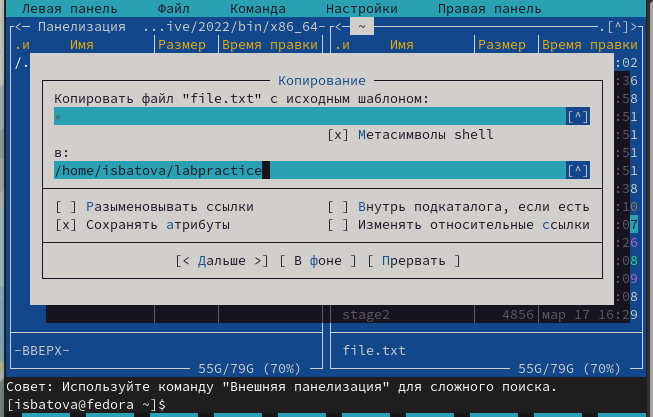{#fig:0019 width=70%}

6. Выполняем некоторые действия с помощью соответствующих средств подменю "Команда" (рис. @fig:0020). 

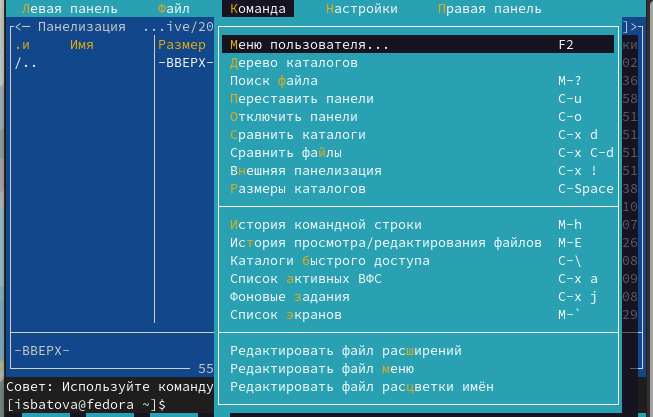{#fig:0020 width=70%}

* Необходимо найти файл с расширением .c, содержащего строку main. Для этого выбираем пункт "Поиск файла" и вводим соответствующие параметры (рис. @fig:0021). 

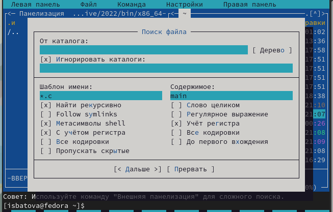{#fig:0021 width=70%}

* Выбор и повторение одной из предыдущих команд можно осуществить с помощью пункта "История командной строки".

* Чтобы перейти в домашний каталог выбираем пункт "Дерево каталога" и нажимаем на необходимый нам каталог (рис. @fig:0022).

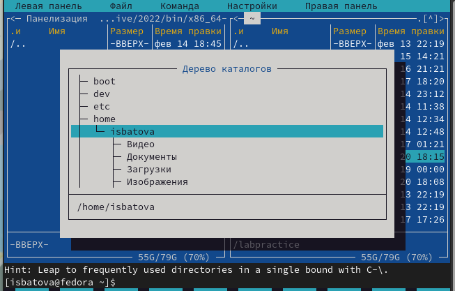{#fig:0022 width=70%}

* Переходим в пункт "Редактировать файл расширений" (рис. @fig:0023). Этот пункт позволяет задать определенные действия при запуске файлов с определенным расширением.

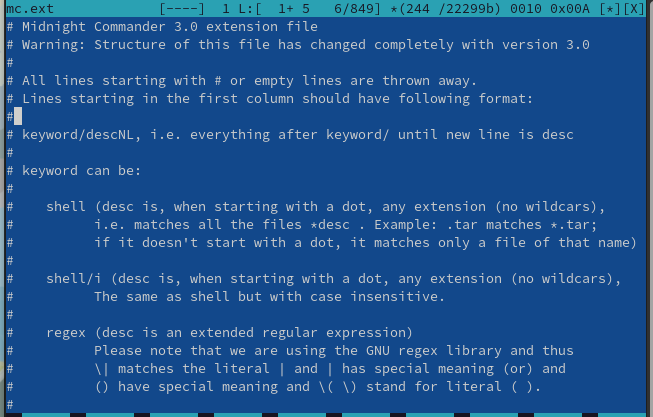{#fig:0023 width=70%}

Переходим в пункт "Редактировать файл меню" (рис. @fig:0024). Этот пункт позволяет редактировать контекстное меню пользователя.

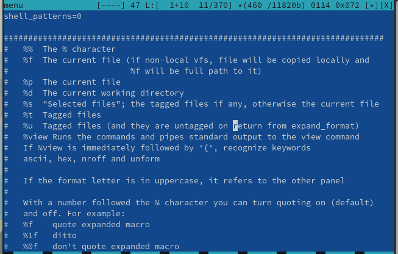{#fig:0024 width=70%}

7. Вызовем подменю "Настройки" (рис. @fig:0025) и рассмотрим основные операции, определяющие структуру экрана. 

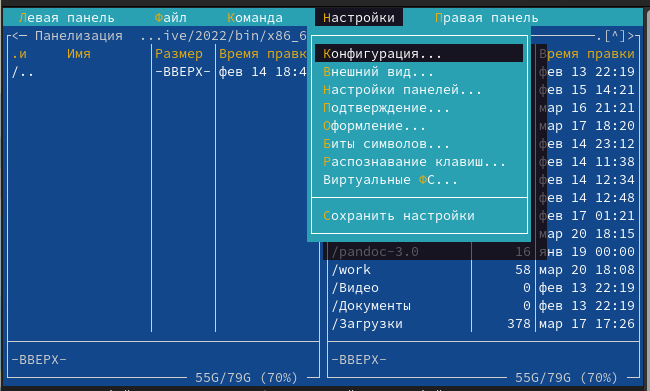{#fig:0025 width=70%}

* "Конфигурация". Позволяет корректировать настройки работы с панелями.

* "Внешний вид". Определяет элементы, которые отображаются при вызове Midnight Commander. Разбиение панелей, линейка меню, командная строка, метки клавиш и другое.

* "Настройки панелей". Более подробная настройка для панелей - навигация, цветовыделение, быстрый поиск и другое.

* "Подтверждение". Позволяет установить запрос о подтверждении действий при определенных операциях.

* "Оформление". Позволяет установить цветовую гамму mc.

* "Биты символов". Позволяет установить формат обработки информации локальным терминалом.

* "Распознание клавиш". Позволяет тестировать функциональные клавиши.

* "Виртуальные ФС". Позволяет корректировать настройки виртуальной файловой системы.

* "Сохранить настройки". Сохраняет все изменения.

8. Создаем файл с именем "text.txt" командой 'touch'.

9. Открываем файл "text.txt" с помощью встроенного mc редактора командой 'mcedit' (рис. @fig:0026).

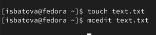{#fig:0026 width=70%}

10. Вставляем в файл небольшой фрагмент текста (рис. @fig:0027).

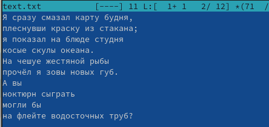{#fig:0027 width=70%}

11. Далее нам необходимо выполнить с текстом некоторые действия, используя горячие клавиши:

* Удаляем вторую строку текста, оставляя на ней курсор и нажатием клавиш 'fn'+'F8' (рис. @fig:0028).

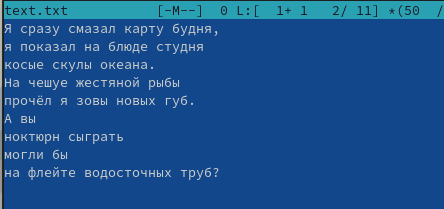{#fig:0028 width=70%}

* Выделяем третью строку клавишами 'fn'+'F3' и копируем ее на следующую строк клавишами 'fn'+'F5' (рис. @fig:0029).

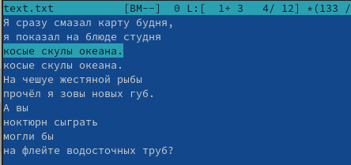{#fig:0029 width=70%}

* Выделяем последнюю строку клавишами 'fn'+'F3' и переносим ее на следующую строк клавишами 'fn'+'F6' (рис. @fig:0030).

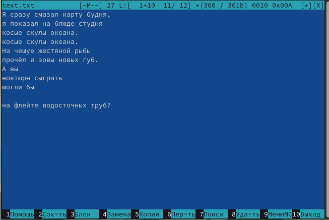{#fig:0030 width=70%}

* Сохраняем файл клавишами 'fn'+'F2'. 

* Отменяем последнее действие клавишами 'ctrl'+'u'. Строка возвращается на место (рис. @fig:0031).

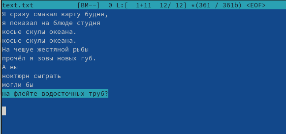{#fig:0031 width=70%}

* Переходим в конец файла клавишами 'ctrl'+'end' и пишем "Зачем?" (рис. @fig:0032).

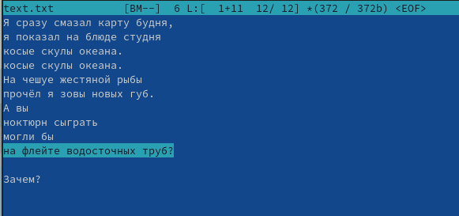{#fig:0032 width=70%}

* Переходим в начало файла клавишами 'ctrl'+'home' и пишем "Почему?" (рис. @fig:0033).

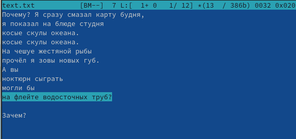{#fig:0033 width=70%}

* Сохраняем файл клавишами 'fn'+'F2' и закрываем его клавишами 'fn'+'F10'.

12. Нам необходимо найти файл с исходным текстом на Java. Для этого в подменю "Команда" выбираем пункт "Поиск файлов", задаем соответствующие параметры (шаблон имени "*.java") и открываем любой из файлов (рис. @fig:0034, @fig:0035).

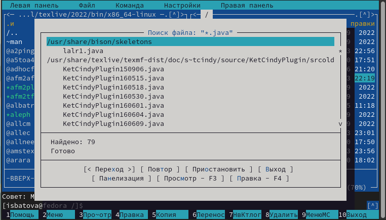{#fig:0034 width=70%}

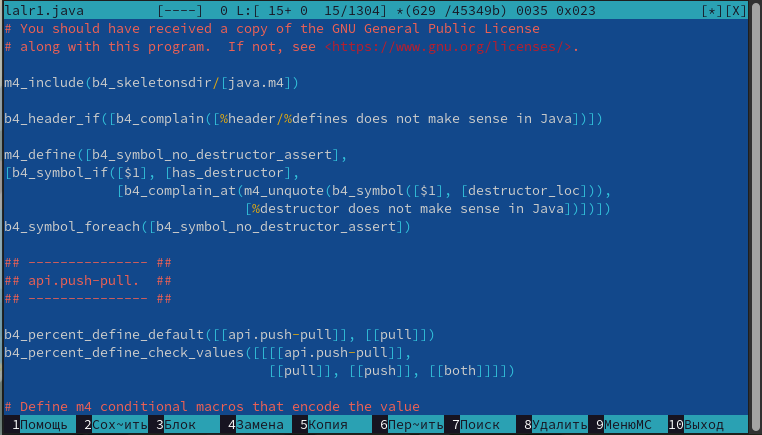{#fig:0035 width=70%}

13. Открываем меню редактора и в подменю "Команда" выбираем пункт "Включить/выключить подсветку синтаксиса". После этого подсветка синтаксиса у нас выключается (рис. @fig:0036).

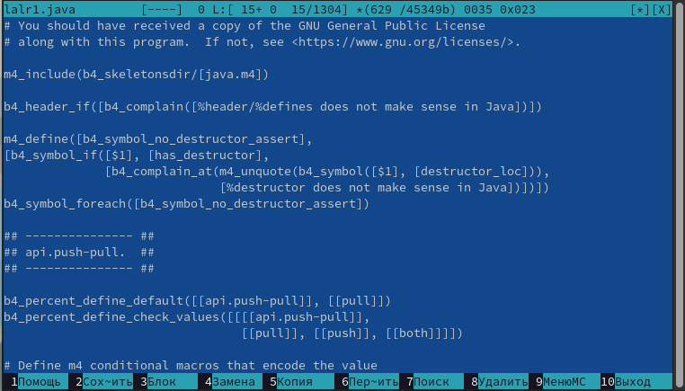{#fig:0036 width=70%}

# Выводы

В ходе данной лабораторной работы мной были освоены основные возможности командной оболочки Midnight Commander, а также приобретены навыки практической работы по просмотру каталогов и файлов; манипуляций с ними.

# Контрольные вопросы

1. 

* Режим "Информация". На панель выводятся сведения о файле и текущей файловой системе, расположенных на активной панели.
* Режим "Дерево". На панель выводится структура дерева каталогов.

2. Примерами таких операций могут послужить копирование, перемещение/переименовывание, создание каталога, удаление файла, изменение прав доступа. Например для копирования shell используется команда 'cp', а в mc используется клавиши 'fn'+F5'.

3. 

* "Список файлов". Отображает список файлов с краткой информацией.
* "Быстрый просмотр". Позволяет быстро просмотреть содержимое файла, не заходя в него.
* "Информация". Отображает подробную информацию о файле.
* "Дерево". Отображает дерево данного каталога.
* "Формат списка". Укороченный формат отображает имя файла/каталога, расширенный формат отображает подробную информацию о файле/каталоге, стандартный формат ставится по умолчанию, определенный пользователем - позволяет пользователю самому определить, какую информацию вывести.
* "Порядок сортировки". Позволяет сортировать файлы/каталоги по определенному критерию.
* "Фильтр". Позволяет вывести файлы/каталоги, подходящие под выражение.
* "Выбор кодировки". Позволяет выбрать кодировку файла или каталога.

4. 

* "Просмотр". Позволяет посмотреть содержимое текущего файла без возможности редактирования.
* "Просмотр вывода команды". Функция запроса команды с параметрами.
* "Правка". Открывает текущий файл для его редактирования.
* "Копирование". Осуществляет копирование одного или нескольких файлов или каталогов в указанное пользователем во всплывающем окне место.
* "Права доступа". Позволяет указать права доступа к одному или нескольким файлам или каталогам.
* "Жёсткая ссылка". Позволяет создать жёсткую ссылку к текущему файлу.
* "Символическая ссылка". Позволяет создать символическую ссылку к текущему файлу.
* "Владелец/группа". Позволяет задать владельца и имя группы для одного или нескольких файлов или каталогов.
* "Права (расширенные)". Позволяет изменить права доступа и владения для одного или нескольких файлов или каталогов.
* "Переименование". Позволяет переименовать (или переместить) один или несколько файлов или каталогов.
* "Создание каталога". Позволяет создать каталог.
* "Удалить". Позволяет удалить один или несколько файлов или каталогов.
* "Выход". Завершает работу.

5. 

* "Дерево каталогов". Отображает структуру каталогов системы.
* "Поиск файла". Выполняет поиск файлов по заданным параметрам.
* "Переставить панели". Меняет местами левую и правую панели.
* "Сравнить каталоги". Сравнивает содержимое двух каталогов.
* "Размеры каталогов". Отображает размер и время изменения каталога.
* "История командной строки". Выводит на экран список ранее выполненных в оболочке команд.
* "Каталоги быстрого доступа". При вызове выполняется быстрая смена текущего каталога на один из заданного списка.
* "Восстановление файлов". Позволяет восстановить файлы.
* "Редактировать файл расширений". Позволяет задать определенные действия при запуске файлов с определенным расширением.
* "Редактировать файл меню". Позволяет редактировать контекстное меню.
* "Редактировать файл расцветки имён". Позволяет подобрать расцветку имён файлов в зависимости от их типа.

6. 

* "Конфигурация". Позволяет корректировать настройки работы с панелями.
* "Внешний вид". Определяет элементы, которые отображаются при вызове Midnight Commander. Разбиение панелей, линейка меню, командная строка, метки клавиш и другое.
* "Настройки панелей". Более подробная настройка для панелей - навигация, цветовыделение, быстрый поиск и другое.
* "Подтверждение". Позволяет установить запрос о подтверждении действий при определенных операциях.
* "Оформление". Позволяет установить цветовую гамму mc.
* "Биты символов". Позволяет установить формат обработки информации локальным терминалом.
* "Распознание клавиш". Позволяет тестировать функциональные клавиши.
* "Виртуальные ФС". Позволяет корректировать настройки виртуальной файловой системы.
* "Сохранить настройки". Сохраняет все изменения.

7. 

* F1 – вызов контекстно-зависимой подсказки
* F2 – вызов пользовательского меню с возможностью создания и/или дополнения дополнительных функций
* F3 – просмотр содержимого файла, на который указывает подсветка в активной панели (без возможности
редактирования)
* F4 – вызов встроенного в mc редактора для изменения содержания файла, на который указывает подсветка в активной панели
* F5 – копирование одного или нескольких файлов, отмеченных в первой (активной) панели, в каталог, отображаемый на второй панели
* F6 – перенос одного или нескольких файлов, отмеченных в первой (активной) панели, в каталог, отображаемый на второй панели
* F7 – создание подкаталога в каталоге, отображаемом в активной панели
* F8 – удаление одного или нескольких файлов (каталогов), отмеченных в первой (активной) панели файлов
* F9 – вызов меню mc
* F10 – выход из mc

8. 

* «Ctrl-y» − удалить строку
* «Ctrl-u» − отмена последней операции
* «ins» - вставка/замена
* «F7» − поиск (можно использовать регулярные выражения)
* «↑-F7» − повтор последней операции поиска
* «F4» − замена
* «F3» − первое нажатие − начало выделения, второе − окончание
выделения
* «F5» − копировать выделенный фрагмент
* «F6» − переместить выделенный фрагмент
* «F8» − удалить выделенный фрагмент
* «F2» − записать изменения в файл
* «F10» − выйти из редактора

9. Для редактирования меню пользователя нужно перейти в пункт «Редактировать файл меню» - «Команда» и изменить настройки файла. 

10. Часть команд «Меню пользователя», а также меню «Файл» позволяют выполнять действия, определяемые пользователем, над
текущим файлом. 
