---
## Front matter
lang: ru-RU
title: Отчёт по лабораторной работе №8
subtitle: Дисциплина "Операционные системы"
author:
  - Батова И. С.
institute:
  - Российский университет дружбы народов, Москва, Россия
date: 29 марта 2023

## i18n babel
babel-lang: russian
babel-otherlangs: english

## Formatting pdf
toc: false
toc-title: Содержание
slide_level: 2
aspectratio: 169
section-titles: true
theme: metropolis
header-includes:
 - \metroset{progressbar=frametitle,sectionpage=progressbar,numbering=fraction}
 - '\makeatletter'
 - '\beamer@ignorenonframefalse'
 - '\makeatother'
---

# Вводная часть

## Цель работы

Познакомиться с операционной системой Linux. Получить практические навыки работы с редактором vi, установленным по умолчанию практически во всех дистрибутивах.

# Основная часть

## Задание 1

Создание нового файла с использованием vi

## Создание нового файла с использованием vi

- Вызываем vi и создаем файл hello.sh 

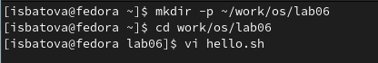

## Создание нового файла с использованием vi

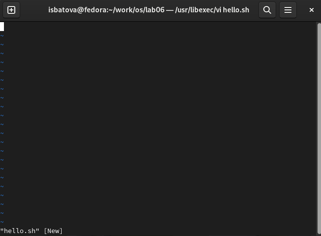

## Режим вставки

- Нажимаем клавишу "i", нам открывается возможность редактирования

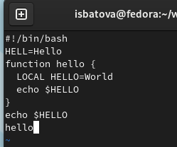

## Завершение работы с файлом

- Нажимаем клавишу "Esc" для перехода в командный режим, нам закрывается возможность редактирования
- Нажимаем ":" для перехода в режим последней строки
- Нажимаем "w" (записать) и "q" (выйти), а затем клавишу Enter 

## Завершение работы с файлом

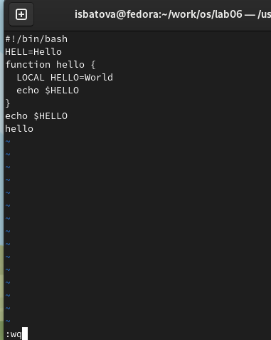

## Исполняемый файл

- Делаем файл исполняемым

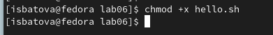

## Задание 2

Редактирование существующего файла

## Вызов vi

- Вызываем vi на редактирование файла

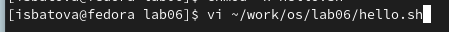

## Редактирование слова

- Устанавливаем курсор в конец слова HELL второй строки 
- Переходим в режим вставки с помощью клавиши "i' и заменяем слово 'HELL' на 'HELLO' 

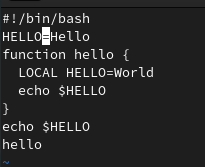

## Замена слова

- Устанавливаем курсор на четвертую строку 
- Стираем слово LOCAL сочетанием клавиш "d" и "w"
- Переходим в режим вставки с помощью клавиши "i' и набираем текст: "local" 

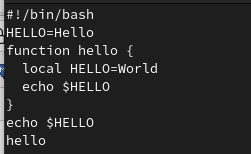

## Удаление строки

- Удаляем последнюю строку клавишами "d", "d" 

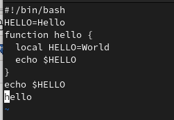

## Отмена удаления строки

- Вводим команду отмены изменений "u" и строка вновь появляется

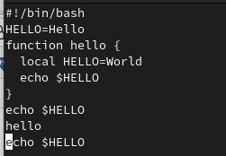

## Завершение работы с файлом

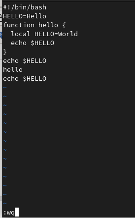

# Вывод

## Вывод

В ходе данной лабораторной работы я познакомилась с операционной системой Linux и получила практические навыки работы с редактором vi, установленным по умолчанию практически во всех дистрибутивах.

