---
## Front matter
title: "Отчёт по лабораторной работе №8"
subtitle: "Дисциплина: Операционные системы"
author: "Батова Ирина Сергеевна, НММбд-01-22"

## Generic otions
lang: ru-RU
toc-title: "Содержание"

## Bibliography
bibliography: bib/cite.bib
csl: pandoc/csl/gost-r-7-0-5-2008-numeric.csl

## Pdf output format
toc: true # Table of contents
toc-depth: 2
lof: true # List of figures
lot: true # List of tables
fontsize: 12pt
linestretch: 1.5
papersize: a4
documentclass: scrreprt
## I18n polyglossia
polyglossia-lang:
  name: russian
  options:
	- spelling=modern
	- babelshorthands=true
polyglossia-otherlangs:
  name: english
## I18n babel
babel-lang: russian
babel-otherlangs: english
## Fonts
mainfont: PT Serif
romanfont: PT Serif
sansfont: PT Sans
monofont: PT Mono
mainfontoptions: Ligatures=TeX
romanfontoptions: Ligatures=TeX
sansfontoptions: Ligatures=TeX,Scale=MatchLowercase
monofontoptions: Scale=MatchLowercase,Scale=0.9
## Biblatex
biblatex: true
biblio-style: "gost-numeric"
biblatexoptions:
  - parentracker=true
  - backend=biber
  - hyperref=auto
  - language=auto
  - autolang=other*
  - citestyle=gost-numeric
## Pandoc-crossref LaTeX customization
figureTitle: "Рис."
tableTitle: "Таблица"
listingTitle: "Листинг"
lofTitle: "Список иллюстраций"
lotTitle: "Список таблиц"
lolTitle: "Листинги"
## Misc options
indent: true
header-includes:
  - \usepackage{indentfirst}
  - \usepackage{float} # keep figures where there are in the text
  - \floatplacement{figure}{H} # keep figures where there are in the text
---

# Цель работы

Познакомиться с операционной системой Linux. Получить практические навыки работы с редактором vi, установленным по умолчанию практически во всех дистрибутивах.

# Задание

Задание 1. Создание нового файла с использованием vi

1. Создайте каталог с именем ~/work/os/lab06.
2. Перейдите во вновь созданный каталог.
3. Вызовите vi и создайте файл hello.sh
4. Нажмите клавишу i и вводите следующий текст.
5. Нажмите клавишу Esc для перехода в командный режим после завершения ввода текста.
6. Нажмите : для перехода в режим последней строки и внизу вашего экрана появится приглашение в виде двоеточия.
7. Нажмите w (записать) и q (выйти), а затем нажмите клавишу Enter для сохранения вашего текста и завершения работы.
8. Сделайте файл исполняемым

Задание 2. Редактирование существующего файла

1. Вызовите vi на редактирование файла
2. Установите курсор в конец слова HELL второй строки.
3. Перейдите в режим вставки и замените на HELLO. Нажмите Esc для возврата в командный режим.
4. Установите курсор на четвертую строку и сотрите слово LOCAL.
5. Перейдите в режим вставки и наберите следующий текст: local, нажмите Esc для возврата в командный режим.
6. Установите курсор на последней строке файла. Вставьте после неё строку, содержащую следующий текст: echo $HELLO.
7. Нажмите Esc для перехода в командный режим.
8. Удалите последнюю строку.
9. Введите команду отмены изменений u для отмены последней команды.
10. Введите символ : для перехода в режим последней строки. Запишите произведённые изменения и выйдите из vi.

# Выполнение лабораторной работы

Задание 1.

1. Создаем каталог с именем "~/work/os/lab06" командой 'mkdir -p' (рис. @fig:001).
2. Далее переходим в созданный каталог командой 'cd' (рис. @fig:001).

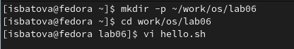{#fig:001 width=70%}

3. После этого вызываем vi и создаем файл hello.sh (рис. @fig:002).

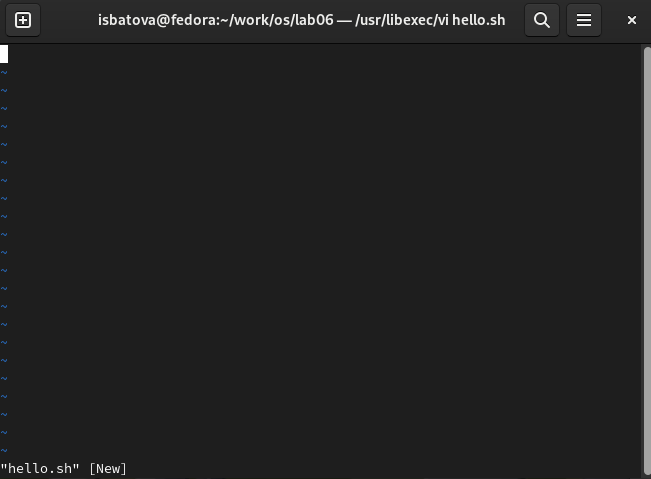{#fig:002 width=70%}

4. Далее нажимаем клавишу "i", нам открывается возможность редактирования. Вводим текст из лабораторной работы (рис. @fig:003).

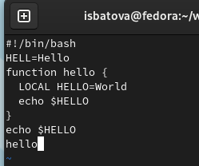{#fig:003 width=70%}

5. Нажимаем клавишу "Esc" для перехода в командный режим, нам закрывается возможность редактирования (рис. @fig:004).

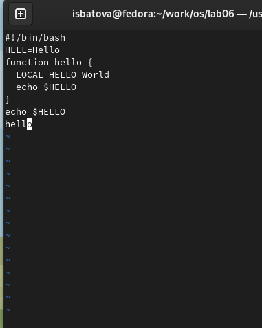{#fig:004 width=70%}

6. Далее нажимаем ":" для перехода в режим последней строки. Внизу экрана появляется приглашение в виде двоеточия (рис. @fig:005).

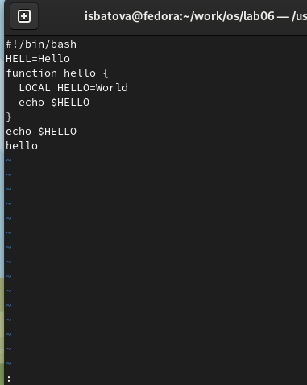{#fig:005 width=70%}

7. Нажимаем "w" (записать) и "q" (выйти), а затем клавишу Enter (рис. @fig:006). Наш текст сохраняется и мы завершаем работу с файлом.

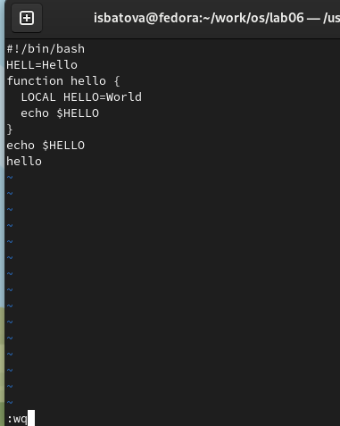{#fig:006 width=70%}

8. Далее нам нужно сделать файл исполняемым. Для этого используем команду 'chmod +x hello.sh' (рис. @fig:007).

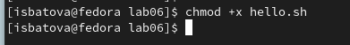{#fig:007 width=70%}

Задание 2. 

1. Для начала работы вызываем vi на редактирование файла (рис. @fig:008). Нам открывается наш файл с текстом.

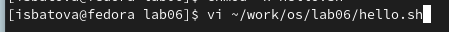{#fig:008 width=70%}

2. Устанавливаем курсор в конец слова HELL второй строки (рис. @fig:009).

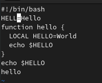{#fig:009 width=70%}

3. Переходим в режим вставки с помощью клавиши "i' и заменяем слово 'HELL' на 'HELLO' (рис. @fig:0010). После этого нажимаем "Esc" для возврата в командный режим.

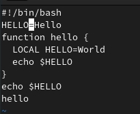{#fig:0010 width=70%}

4. Далее устанавливаем курсор на четвертую строку (рис. @fig:0011) и стираем слово LOCAL сочетанием клавиш "d" и "w" (рис. @fig:0012).

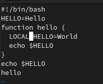{#fig:0011 width=70%}

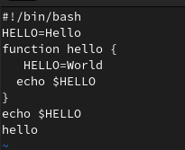{#fig:0012 width=70%}

5. Переходим в режим вставки с помощью клавиши "i' и набираем текст: "local" (рис. @fig:0013). После этого нажимаем "Esc" для возврата в командный режим.

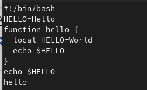{#fig:0013 width=70%}

6. Далее устанавливаем курсор на последней строке файла (рис. @fig:0014). Вновь переходим в режим вставки и вставляем после неё строку, содержащую следующий текст: "echo $HELLO" (рис. @fig:0015).

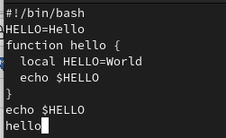{#fig:0014 width=70%}

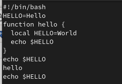{#fig:0015 width=70%}

7. Нажимаем "Esc" для перехода в командный режим.

8. Удаляем последнюю строку клавишами "1", "d", "d" (рис. @fig:0016).

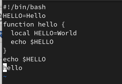{#fig:0016 width=70%}

9. Вводим команду отмены изменений "u" и строка вновь появляется (рис. @fig:0017).

{#fig:0017 width=70%}

10. Вводим символ ":" для перехода в режим последней строки. Далее нажимаем "w" для записи и "q" для выхода, а затем клавишу Enter (рис. @fig:0018).

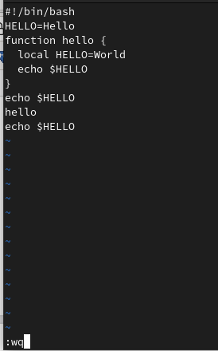{#fig:0018 width=70%}

# Выводы

В ходе данной лабораторной работы я познакомилась с операционной системой Linux и получила практические навыки работы с редактором vi, установленным по умолчанию практически во всех дистрибутивах.

# Контрольные вопросы

1. Характеристика режимов работы редактора vi:
* командный режим, предназначен для ввода команд редактирования и навигации по редактируемому файлу
* режим вставки − предназначен для ввода содержания редактируемого файла
* режим последней (или командной) строки − используется для записи изменений в файл и выхода из редактора

2. Для выхода из редактора vi без сохранения изменений нужно нажать клавиши ":", "q" и "!".

3. Команды позиционирования:

* "0" (ноль) − переход в начало строки;
* "$" − переход в конец строки;
* "G" − переход в конец файла;
* n"G" − переход на строку с номером n

4. При использовании заглавных W (переход на слово вперед) и B (переход на слово назад) редактор как разделитель между словами понимает пробел, табуляцию и возврат каретки. При использовании строчных w и b под разделителями понимаются любые знаки пунктуации.

5. Для перехода любого места редактируемого файла в начало файла нужно нажать клавиши "l" и "G", для перехода в конец файла просто "G".

6. Команды редактирования:

Вставка текста

* "а" − вставить текст после курсора
* "А" − вставить текст в конец строки
* "i" − вставить текст перед курсором
* n "i" − вставить текст n раз
* "I" − вставить текст в начало строки

Вставка строки

* "о" − вставить строку под курсором
* "О" − вставить строку над курсором

Удаление текста

* "x" − удалить один символ в буфер
* "d" "w" − удалить одно слово в буфер
* "d" "$" − удалить в буфер текст от курсора до конца строки
* "d" "0" − удалить в буфер текст от начала строки до позиции курсора
* "d" "d" − удалить в буфер одну строку
* n "d" "d" − удалить в буфер n строк

Отмена и повтор произведённых изменений

* "u" − отменить последнее изменение
* "." − повторить последнее изменение

Копирование текста в буфер

* "Y" − скопировать строку в буфер
* n "Y" − скопировать n строк в буфер
* "y" "w" − скопировать слово в буфер

Вставка текста из буфера

* "p" − вставить текст из буфера после курсора
* "P" − вставить текст из буфера перед курсором

Замена текста

* "c" "w" − заменить слово
* n "c" "w" − заменить n слов
* "c" "$" − заменить текст от курсора до конца строки
* "r" − заменить слово
* "R" − заменить текст

Поиск текста

* "/" текст − произвести поиск вперёд по тексту указанной строки символов "текст"
* "?" текст − произвести поиск назад по тексту указанной строки символов "текст"

Копирование и перемещение текста

* ":" n,m "d" – удалить строки с n по m
* ":" i,j "m" k – переместить строки с i по j, начиная со строки k
* ":" i,j "t" k – копировать строки с i по j в строку k
* ":" i,j "w" имя-файла – записать строки с i по j в файл с именем имя-файла

7. Для заполнения строки символами $, переходим на эту строку, нажав клавиши n "G", где n – номер строки, нажимаем
"0" для перехода в начало строки, нажимаем "c" "$" для замены текст от курсора до конца строки, вводим символы $. 

8. Для отмены некорректного действия, связанного с процессом редактирования, необходимо нажать «u». 

9. Команды режима последней строки:

Копирование и перемещение текста

* ":" n,m "d" − удалить строки с n по m
* ":" i,j "m" k − переместить строки с i по j, начиная со строки k
* ":" i,j "t" k − копировать строки с i по j в строку k
* ":" i,j "w" имя-файла − записать строки с i по j в файл с именем имя-файла

Запись в файл и выход из редактора

* ":" "w" − записать изменённый текст в файл, не выходя из vi
* ":" "w" имя-файла − записать изменённый текст в новый файл с именем имя-файла
* ":" "w" "!" имя-файла − записать изменённый текст в файл с именем имя-файла
* ":" "w" "q" − записать изменения в файл и выйти из vi
* ":" "q" − выйти из редактора vi
* ":" "q" "!" − выйти из редактора без записи
* ":" "e" "!" − вернуться в командный режим, отменив все изменения, произведённые со времени последней записи

10. Для определения позиции, в которой заканчивается строка, без перемещения курсора нужно, находясь на нужной строке, нажать «$» и посмотреть на число после запятой в правом нижнем углу экрана.

11. Опции редактора vi позволяют настроить рабочую среду. Для задания опций используется команда set (в режиме последней строки):

* ":" set all − вывести полный список опций
* ":" set nu − вывести номера строк
* ":" set list − вывести невидимые символы
* ":" set ic − не учитывать при поиске, является ли символ прописным или строчным.

Если вы хотите отказаться от использования опции, то в команде set перед именем опции надо поставить no.

12. В режиме командной строки внизу редактора присутствует ":", в режиме вставки текст "-- ВСТАВКА --", в командном режиме текст отсутствует. 

