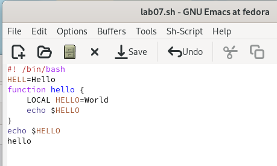
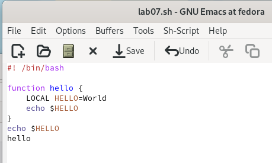
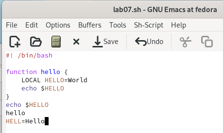
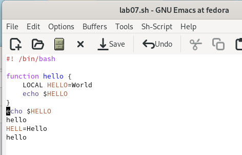
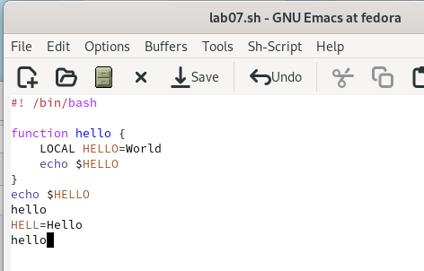
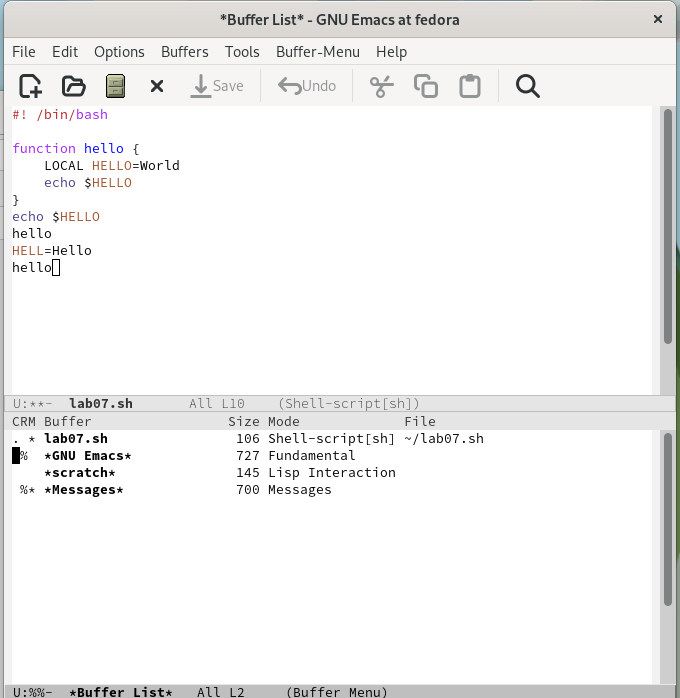
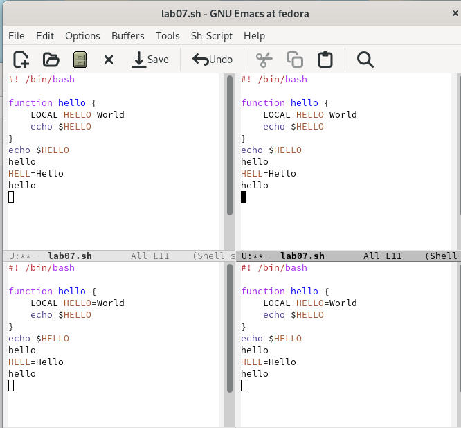
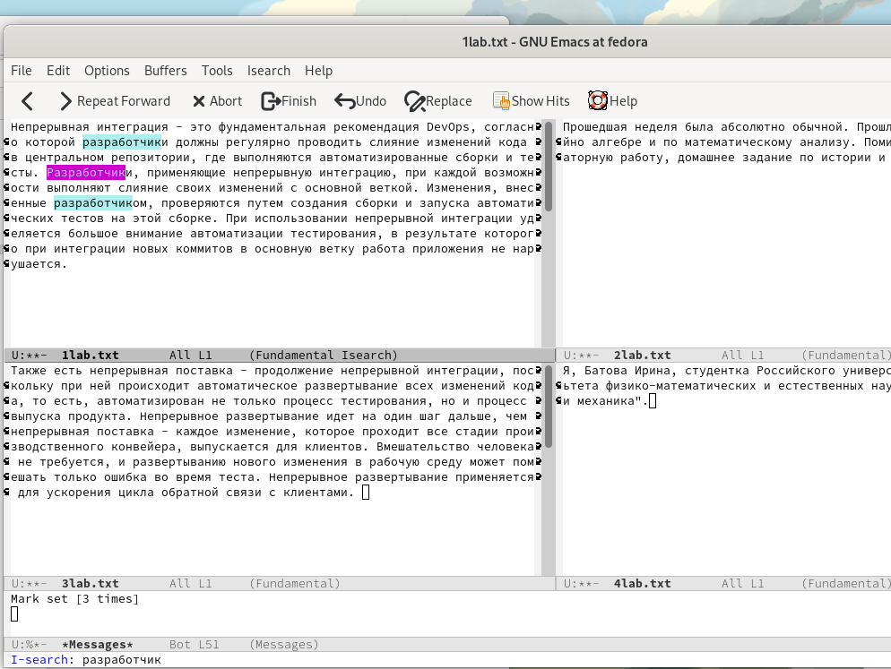

---
## Front matter
lang: ru-RU
title: Отчёт по лабораторной работе №9
subtitle: Дисциплина "Операционные системы"
author:
  - Батова Ирина Сергеевна, НММбд-01-22
institute:
  - Российский университет дружбы народов, Москва, Россия
  
date: 06 апреля 2023

## i18n babel
babel-lang: russian
babel-otherlangs: english

## Formatting pdf
toc: false
toc-title: Содержание
slide_level: 2
aspectratio: 169
section-titles: true
theme: metropolis
header-includes:
 - \metroset{progressbar=frametitle,sectionpage=progressbar,numbering=fraction}
 - '\makeatletter'
 - '\beamer@ignorenonframefalse'
 - '\makeatother'
---

# Вводная часть

## Цель работы

Познакомиться с операционной системой Linux. Получить практические навыки работы с редактором Emacs.

# Основная часть

## Начало работы

- Открываем Emacs в фоновом режиме
- В редакторе создаем файл "lab07.sh" с помощью комбинации клавиш 

## Начало работы

- Набираем в файле текст из лабораторной работы

## Стандартные процедуры редактирования

- Вырезаем вторую строку с помощью комбинации клавиш 

## Стандартные процедуры редактирования

- Вставляем эту строку в конец файла с помощью комбинации клавиш 

## Перемещение курсора

- Перемещаем курсор в начало строки с помощью комбинации клавиш 

## Перемещение курсора

- Перемещаем курсор в конец буфера с помощью комбинации клавиш 

## Управление буферами

- Выводим список активных буферов на экран с помощью комбинации клавиш 
- Перемещаемся во вновь открытое окно со списком открытых буферов

## Управление окнами

- Делим фрейм на два окна по вертикали 
- Каждое из этих окон делим на две части по горизонтали 

## Режим поиска 

- Переключаемся в режим поиска 
- Также есть другой режим поиска, в который можно переключиться 

# Вывод

## Вывод

В ходе данной лабораторной работы я продолжила ознакомление с операционной системой Linux и получила практические навыки работы с редактором Emacs.

