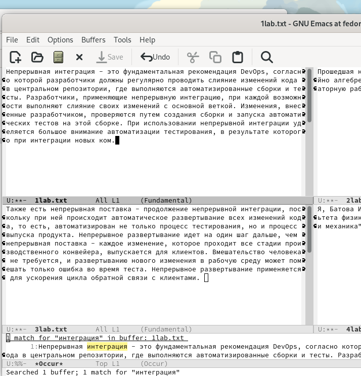

---
## Front matter
title: "Отчёт по лабораторной работе №9"
subtitle: "Дисциплина: Операционные системы"
author: "Батова Ирина Сергеевна, НММбд-01-22"

## Generic otions
lang: ru-RU
toc-title: "Содержание"

## Bibliography
bibliography: bib/cite.bib
csl: pandoc/csl/gost-r-7-0-5-2008-numeric.csl

## Pdf output format
toc: true # Table of contents
toc-depth: 2
lof: true # List of figures
lot: true # List of tables
fontsize: 12pt
linestretch: 1.5
papersize: a4
documentclass: scrreprt
## I18n polyglossia
polyglossia-lang:
  name: russian
  options:
	- spelling=modern
	- babelshorthands=true
polyglossia-otherlangs:
  name: english
## I18n babel
babel-lang: russian
babel-otherlangs: english
## Fonts
mainfont: PT Serif
romanfont: PT Serif
sansfont: PT Sans
monofont: PT Mono
mainfontoptions: Ligatures=TeX
romanfontoptions: Ligatures=TeX
sansfontoptions: Ligatures=TeX,Scale=MatchLowercase
monofontoptions: Scale=MatchLowercase,Scale=0.9
## Biblatex
biblatex: true
biblio-style: "gost-numeric"
biblatexoptions:
  - parentracker=true
  - backend=biber
  - hyperref=auto
  - language=auto
  - autolang=other*
  - citestyle=gost-numeric
## Pandoc-crossref LaTeX customization
figureTitle: "Рис."
tableTitle: "Таблица"
listingTitle: "Листинг"
lofTitle: "Список иллюстраций"
lotTitle: "Список таблиц"
lolTitle: "Листинги"
## Misc options
indent: true
header-includes:
  - \usepackage{indentfirst}
  - \usepackage{float} # keep figures where there are in the text
  - \floatplacement{figure}{H} # keep figures where there are in the text
---

# Цель работы

Познакомиться с операционной системой Linux. Получить практические навыки работы с редактором Emacs.

# Задание

1. Открыть emacs.
2. Создать файл lab07.sh с помощью комбинации Ctrl-x Ctrl-f (C-x C-f).
3. Набрать текст.
4. Сохранить файл с помощью комбинации Ctrl-x Ctrl-s (C-x C-s).
5. Проделать с текстом стандартные процедуры редактирования, каждое действие должно осуществляться комбинацией клавиш.
* Вырезать одной командой целую строку (С-k).
* Вставить эту строку в конец файла (C-y).
* Выделить область текста (C-space).
* Скопировать область в буфер обмена (M-w).
* Вставить область в конец файла.
* Вновь выделить эту область и на этот раз вырезать её (C-w).
* Отмените последнее действие (C-/).
6. Научитесь использовать команды по перемещению курсора.
* Переместите курсор в начало строки (C-a).
* Переместите курсор в конец строки (C-e).
* Переместите курсор в начало буфера (M-<).
* Переместите курсор в конец буфера (M->).
7. Управление буферами.
* Вывести список активных буферов на экран (C-x C-b)
* Переместитесь во вновь открытое окно (C-x) o со списком открытых буферов и переключитесь на другой буфер.
* Закройте это окно (C-x 0).
* Теперь вновь переключайтесь между буферами, но уже без вывода их списка на экран (C-x b).
8. Управление окнами.
* Поделите фрейм на 4 части: разделите фрейм на два окна по вертикали (C-x 3), а затем каждое из этих окон на две части по горизонтали (C-x 2) (см. рис. 9.1
* В каждом из четырёх созданных окон откройте новый буфер (файл) и введите несколько строк текста.
9. Режим поиска
* Переключитесь в режим поиска (C-s) и найдите несколько слов, присутствующих
в тексте.
* Переключайтесь между результатами поиска, нажимая C-s.
* Выйдите из режима поиска, нажав C-g.
* Перейдите в режим поиска и замены (M-%), введите текст, который следует найти и заменить, нажмите Enter , затем введите текст для замены. После того как будут подсвечены результаты поиска, нажмите ! для подтверждения замены.
* Испробуйте другой режим поиска, нажав M-s o.

# Выполнение лабораторной работы

1. Открываем Emacs в фоновом режиме, введя в терминале команду 'emacs &' (рис. @fig:001).

{#fig:001 width=70%}

2. В редакторе создаем файл "lab07.sh" с помощью комбинации клавиш C-x C-f.

3. Набираем в файле текст из лабораторной работы (рис. @fig:002).

{#fig:002 width=70%}

4. Сохраняем файл с помощью комбинации клавиш C-x C-s.

5. 

* Вырезаем вторую строку с помощью комбинации клавиш С-k (рис. @fig:003).

{#fig:003 width=70%}

* Вставляем эту строку в конец файла с помощью комбинации клавиш C-y (рис. @fig:004).

{#fig:004 width=70%}

* Выделяем область текста с помощью комбинации клавиш C-space (рис. @fig:005).

{#fig:005 width=70%}

* Копируем выделенную область текста в буфер обмена с помощью комбинации клавиш Alt-w.

* Вставить этот текст в конец файла с помощью комбинации клавиш C-y (рис. @fig:006).

{#fig:006 width=70%}

* Вновь выделяем эту область и вырезаем её с помощью комбинации клавиш C-w (рис. @fig:007).

{#fig:007 width=70%}

* Отменяем последнее действие с помощью комбинации клавиш C-слэш (рис. @fig:008).

{#fig:008 width=70%}

6. 

* Перемещаем курсор в начало строки с помощью комбинации клавиш C-a (рис. @fig:009).

{#fig:009 width=70%}

* Перемещаем курсор в конец строки с помощью комбинации клавиш C-e (рис. @fig:0010).

{#fig:0010 width=70%}

* Перемещаем курсор в начало буфера с помощью комбинации клавиш Alt-< (рис. @fig:0011).

{#fig:0011 width=70%}

* Перемещаем курсор в конец буфера с помощью комбинации клавиш Alt-> (рис. @fig:0012).

{#fig:0012 width=70%}

7. 

* Выводим список активных буферов на экран с помощью комбинации клавиш C-x C-b (рис. @fig:0013).

{#fig:0013 width=70%}

* Перемещаемся во вновь открытое окно со списком открытых буферов сочетанием клавиш C-x o со списком открытых буферов, переключаемся на буфер 'GNU Emacs' с помощью стрелок и клавиши enter (рис. @fig:0014).

{#fig:0014 width=70%}

* Закрываем это окно с помощью комбинации клавиш C-x 0.

* Переключаемся на буфер 'scratch' без вывода списка буферов на экран с помощью комбинации клавиш C-x b (рис. @fig:0015).

{#fig:0015 width=70%}

8. 

* Нам необходимо поделить фрейм на 4 части. Для начала делим фрейм на два окна по вертикали с помощью комбинации клавиш C-x 3 (рис. @fig:0016).

{#fig:0016 width=70%}

Затем каждое из этих окон делим на две части по горизонтали с помощью комбинации клавиш C-x 2 (рис. @fig:0017).

{#fig:0017 width=70%}

* В каждом из четырёх созданных окон нам нужно открыть новый буфер (файл) и ввести несколько строк текста. 

Для этого создаем через терминал четыре файла (рис. @fig:0018).

{#fig:0018 width=70%}

Далее в каждом окне открываем соответствующий буфер и вводим немного текста (рис. @fig:0019).

{#fig:0019 width=70%}

9. 

* Переключаемся в режим поиска с помощью комбинации клавиш C-s. Находим в первом окне слово "разработчик" (рис. @fig:0020).

{#fig:0020 width=70%}

* Переключаемся между результатами поиска с помощью комбинации клавиш C-s (рис. @fig:0021).

{#fig:0021 width=70%}

* Выходим из режима поиска с помощью комбинации клавиш C-g.

* Пробуем другой режим поиска с помощью комбинации клавиш M-s o (рис. @fig:0022).

{#fig:0022 width=70%}

Этот режим отличается от первого тем, что в данном режиме считывается строка поиска не осуществляет поиск точного совпадения.

# Вывод

В ходе данной лабораторной работы я продолжила ознакомление с операционной системой Linux и получила практические навыки работы с редактором Emacs.

# Контрольные вопросы

1. Emacs − один из наиболее мощных и широко распространённых редакторов, используемых в мире Unix. По популярности он
соперничает с редактором vi.

Emacs может быть:
* текстовым редактором;
* программой для чтения почты и новостей Usenet;
* интегрированной средой разработки (IDE);
* операционной системой и т.д.

2. Основные трудности при освоении редакторы является большое количество комбинаций клавиш, отличных от комбинаций в большинстве других, более популярных редакторов.

3. Буфер – это объект, представляющий собой текст.  Окно – это область экрана, отображающая буфер. 

4. Да (проверено).

5. При запуске по умолчанию создаются буферы "scratch", "Messages", "GNU Emacs". 

6. 

* C-c | - при зажатом ctrl нажимаем с, затем, отпустив предыдущие клавиши, |

* C-c C-| - при зажатом ctrl нажимаем с, затем, отпустив предыдущие клавиши, при зажатом ctrl нажимаем |

7. Для деления окна на две части используется комбинация клавиш "Ctrl-x 3" (деление по вертикали) и "Ctrl-x 2" (деление по горизонтали).

8. В файле .emacs.

9. Клавиша «←» удаляет символ перед курсором, но ее можно переназначить в файле .emacs.

10. Для меня более удобным редактором является vi, так как для меня проще было запомнить необходимые сочетания клавиш ввиду их логичности. 
