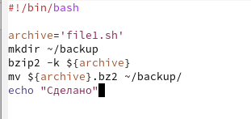
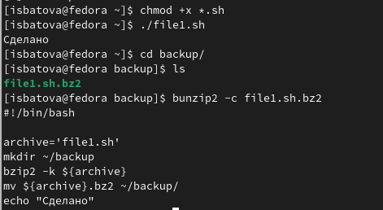
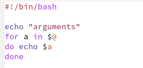
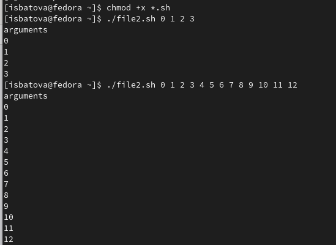
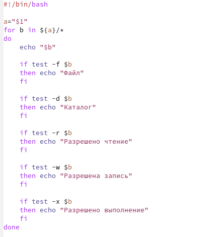
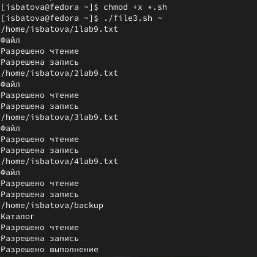
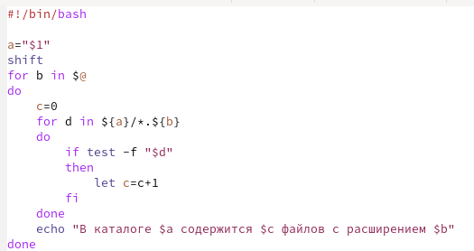
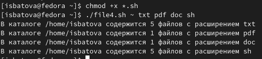

---
## Front matter
lang: ru-RU
title: Отчёт по лабораторной работе №10
subtitle: Дисциплина "Операционные системы"
author:
  - Батова Ирина Сергеевна, НММбд-01-22
institute:
  - Российский университет дружбы народов, Москва, Россия
  
date: 12 апреля 2023

## i18n babel
babel-lang: russian
babel-otherlangs: english

## Formatting pdf
toc: false
toc-title: Содержание
slide_level: 2
aspectratio: 169
section-titles: true
theme: metropolis
header-includes:
 - \metroset{progressbar=frametitle,sectionpage=progressbar,numbering=fraction}
 - '\makeatletter'
 - '\beamer@ignorenonframefalse'
 - '\makeatother'
---

# Вводная часть

## Цель работы

Изучить основы программирования в оболочке ОС UNIX/Linux. Научиться писать небольшие командные файлы.

# Основная часть

## Программа 1, архивация файла

- Создаем файл для написания скрипта и открываем его.
- В данном скрипте мы сначала сохраняем в переменную archive сам файл, далее создаем каталог 'backup', архивируем наш скрипт и перемещаем его в созданный каталог. После выполнения на экран выводится команда "Сделано".

## Программа 1, архивация файла

## Проверка программы 1

- Далее мы добавляем право на выполнение файла командой 'chmod +x *.sh' и выполняем скрипт командой './file1.sh'. Для проверки корректности выполнения переходим в создавшийся каталог (команда cd), проверяем, что там есть архивированный файл (команда ls) и просматриваем содержимое архива (команда 'bunzip2 -c'). 

## Проверка программы 1

## Программа 2, вывод аргументов

- Создаем файл для написания скрипта и открываем его.
- Сначала мы выводим слово 'arguments', затем пишем цикл для прохода по всем введенным пользователем аргументам и выводим эти аргументы на экран.

## Программа 2, вывод аргументов

## Проверка программы 2

- Далее мы добавляем право на выполнение файла командой 'chmod +x *.sh' и выполняем скрипт командой './file2.sh (аргументы)'. Для проверки корректности выполнения скрипта я выполнила программу как для числа аргументов меньше 10, так и больше.

## Проверка программы 2

## Программа 3, аналог команды 'ls'

- Создаем файл для написания скрипта и открываем его.
- Сначала мы в переменную a записываем путь до данного каталога. Далее мы пишем цикл, проходящий по всем каталогам и файлам заданного каталога. Затем на экран выводится название заданного каталога, после чего мы последовательно с помощью if проверяем, являются ли файлы обычными файлами, каталогами, а также наличие разрешения на чтение, запись и выполнение. В соответствии с результатами цикла на экран выводится соответствующая надпись.

## Программа 3, аналог команды 'ls'

## Проверка программы 3

- Далее мы добавляем право на выполнение файла командой 'chmod +x *.sh' и выполняем скрипт командой './file3.sh ~' (то есть проверяем файлы в домашнем каталоге). 

## Проверка программы 3

## Программа 4, вычисление количества файлов с указанным форматом

- Создаем файл для написания скрипта и открываем его.
- Сначала мы в переменную a записываем путь до данного каталога. Далее удаляем первый аргумент (сам каталог) и вводим цикл, проходящий по всем заданным аргументам. Далее пишем цикл, проходящий по файлам, имеющим расширение аргумента 1, и через if добавляем к счетчику +1, если путь указывает на файл. В конце выводим соответствующее сообщение на экран.

## Программа 4, аналог команды 'ls'

## Проверка программы 4

- Далее мы добавляем право на выполнение файла командой 'chmod +x *.sh' и выполняем скрипт командой './file4.sh ~ txt pdf doc sh' (то есть проверяем файлы в домашнем каталоге в форматах txt, pdf, doc, sh). 

## Проверка программы 4

# Вывод

## Вывод

В данной лабораторной работе мной были изучены основы программирования в оболочке ОС UNIX/Linux. Я также научилась писать небольшие командные файлы.

