---
## Front matter
title: "Отчёт по лабораторной работе №10"
subtitle: "Дисциплина: Операционные системы"
author: "Батова Ирина Сергеевна, НММбд-01-22"

## Generic otions
lang: ru-RU
toc-title: "Содержание"

## Bibliography
bibliography: bib/cite.bib
csl: pandoc/csl/gost-r-7-0-5-2008-numeric.csl

## Pdf output format
toc: true # Table of contents
toc-depth: 2
lof: true # List of figures
lot: true # List of tables
fontsize: 12pt
linestretch: 1.5
papersize: a4
documentclass: scrreprt
## I18n polyglossia
polyglossia-lang:
  name: russian
  options:
	- spelling=modern
	- babelshorthands=true
polyglossia-otherlangs:
  name: english
## I18n babel
babel-lang: russian
babel-otherlangs: english
## Fonts
mainfont: PT Serif
romanfont: PT Serif
sansfont: PT Sans
monofont: PT Mono
mainfontoptions: Ligatures=TeX
romanfontoptions: Ligatures=TeX
sansfontoptions: Ligatures=TeX,Scale=MatchLowercase
monofontoptions: Scale=MatchLowercase,Scale=0.9
## Biblatex
biblatex: true
biblio-style: "gost-numeric"
biblatexoptions:
  - parentracker=true
  - backend=biber
  - hyperref=auto
  - language=auto
  - autolang=other*
  - citestyle=gost-numeric
## Pandoc-crossref LaTeX customization
figureTitle: "Рис."
tableTitle: "Таблица"
listingTitle: "Листинг"
lofTitle: "Список иллюстраций"
lotTitle: "Список таблиц"
lolTitle: "Листинги"
## Misc options
indent: true
header-includes:
  - \usepackage{indentfirst}
  - \usepackage{float} # keep figures where there are in the text
  - \floatplacement{figure}{H} # keep figures where there are in the text
---

# Цель работы

Изучить основы программирования в оболочке ОС UNIX/Linux. Научиться писать небольшие командные файлы.

# Задание

1. Написать скрипт, который при запуске будет делать резервную копию самого себя (то есть файла, в котором содержится его исходный код) в другую директорию backup в вашем домашнем каталоге. При этом файл должен архивироваться одним из архиваторов на выбор zip, bzip2 или tar. Способ использования команд архивации необходимо узнать, изучив справку.
2. Написать пример командного файла, обрабатывающего любое произвольное число аргументов командной строки, в том числе превышающее десять. Например, скрипт может последовательно распечатывать значения всех переданных аргументов.
3. Написать командный файл — аналог команды ls (без использования самой этой команды и команды dir). Требуется, чтобы он выдавал информацию о нужном каталоге и выводил информацию о возможностях доступа к файлам этого каталога.
4. Написать командный файл, который получает в качестве аргумента командной строки формат файла (.txt, .doc, .jpg, .pdf и т.д.) и вычисляет количество таких файлов в указанной директории. Путь к директории также передаётся в виде аргумента командной строки.

# Выполнение лабораторной работы

1. Для начала работы изучим справку по командам архивации.

Чтобы изучить команду 'zip', вводим 'man zip' (рис. @fig:001).

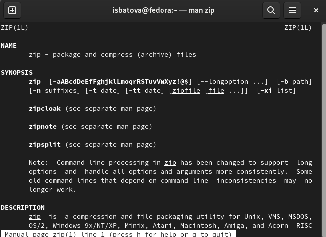{#fig:001 width=70%}

Аналогично изучаем команды 'bzip2' (рис. @fig:002) и 'tar' (рис. @fig:003).

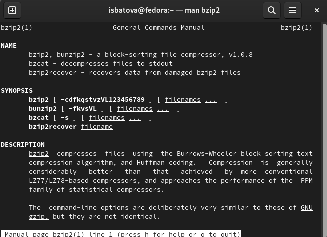{#fig:002 width=70%}

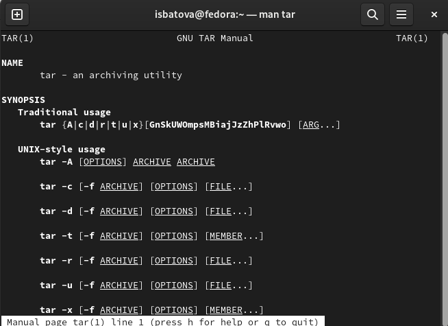{#fig:003 width=70%}

Далее создаем файл для написания скрипта и открываем его (рис. @fig:004).

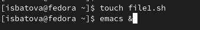{#fig:004 width=70%}

Нам необходимо написать скрипт, который при запуске будет делать резервную копию самого себя (то есть файла, в котором содержится его исходный код) в другую директорию backup в вашем домашнем каталоге. В качестве архиватора я выбрала bzip2.

Вводим скрипт в наш файл (рис. @fig:005). 

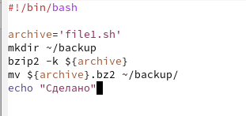{#fig:005 width=70%}

В данном скрипте мы сначала сохраняем в переменную archive сам файл, далее создаем каталог 'backup', архивируем наш скрипт и перемещаем его в созданный каталог. После выполнения на экран выводится команда "Сделано".

Далее мы добавляем право на выполнение файла командой 'chmod +x *.sh' и выполняем скрипт командой './file1.sh'. Для проверки корректности выполнения переходим в создавшийся каталог (команда cd), проверяем, что там есть архивированный файл (команда ls) и просматриваем содержимое архива (команда 'bunzip2 -c'). Программа работает корректно (рис. @fig:006).

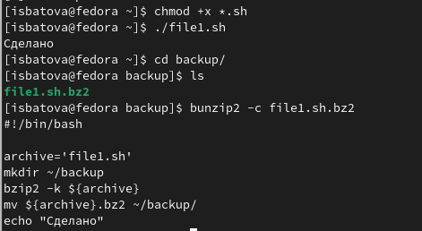{#fig:006 width=70%}

2. Для начала работы создаем файл для написания скрипта и открываем его (рис. @fig:007).

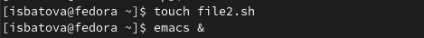{#fig:007 width=70%}

Нам необходимо написать командный файл, обрабатывающий любое произвольное число аргументов командной строки, в том числе превышающее десять. Сделаем так, чтобы скрипт последовательно распечатывал значения всех переданных аргументов.

Вводим скрипт в наш файл (рис. @fig:008). 

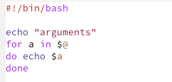{#fig:008 width=70%}

Сначала мы выводим слово 'arguments', затем пишем цикл для прохода по всем введенным пользователем аргументам и выводим эти аргументы на экран.

Далее мы добавляем право на выполнение файла командой 'chmod +x *.sh' и выполняем скрипт командой './file2.sh (аргументы)'. Для проверки корректности выполнения скрипта я выполнила программу как для числа аргументов меньше 10, так и больше (рис. @fig:009).

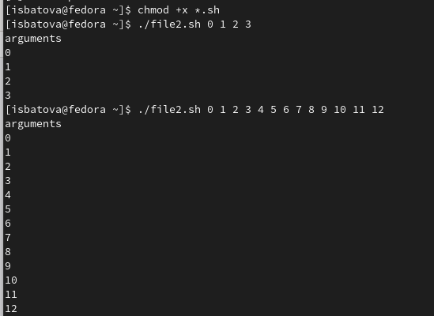{#fig:009 width=70%}

3. Для начала работы создаем файл для написания скрипта и открываем его (рис. @fig:0010).

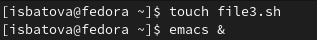{#fig:0010 width=70%}

Нам необходимо написать командный файл — аналог команды ls (без использования самой этой команды и команды dir). Требуется, чтобы он выдавал информацию о нужном каталоге и выводил информацию о возможностях доступа к файлам этого каталога.

Вводим скрипт в наш файл (рис. @fig:0011). 

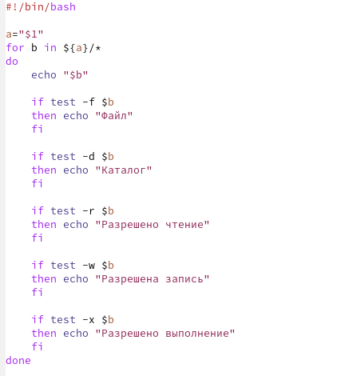{#fig:0011 width=70%}

Сначала мы в переменную a записываем путь до данного каталога. Далее мы пишем цикл, проходящий по всем каталогам и файлам заданного каталога. Затем на экран выводится название заданного каталога, после чего мы последовательно с помощью if проверяем, являются ли файлы обычными файлами, каталогами, а также наличие разрешения на чтение, запись и выполнение. В соответствии с результатами цикла на экран выводится соответствующая надпись.

Далее мы добавляем право на выполнение файла командой 'chmod +x *.sh' и выполняем скрипт командой './file3.sh ~' (то есть проверяем файлы в домашнем каталоге). Видим, что программа выполняется корректно (рис. @fig:0012).

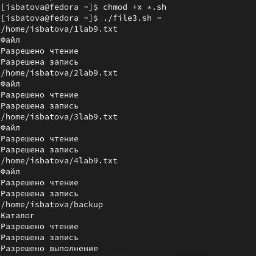{#fig:0012 width=70%}

4. Для начала работы создаем файл для написания скрипта и открываем его (рис. @fig:0013).

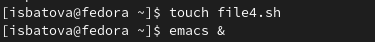{#fig:0013 width=70%}

Нам необходимо написать командный файл, который получает в качестве аргумента командной строки формат файла (.txt, .doc, .jpg, .pdf и т.д.) и вычисляет количество таких файлов в указанной директории. При этом путь к директории также передаётся в виде аргумента командной строки.

Вводим скрипт в наш файл (рис. @fig:0014).

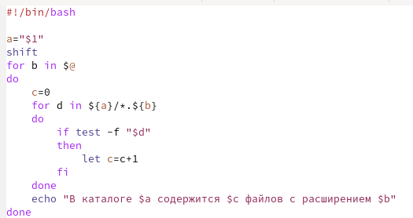{#fig:0014 width=70%}

Сначала мы в переменную a записываем путь до данного каталога. Далее удаляем первый аргумент (сам каталог) и вводим цикл, проходящий по всем заданным аргументам. Далее пишем цикл, проходящий по файлам, имеющим расширение аргумента 1, и через if добавляем к счетчику +1, если путь указывает на файл. В конце выводим соответствующее сообщение на экран.

Далее мы добавляем право на выполнение файла командой 'chmod +x *.sh' и выполняем скрипт командой './file4.sh ~ txt pdf doc sh' (то есть проверяем файлы в домашнем каталоге в форматах txt, pdf, doc, sh). Видим, что программа выполняется корректно (рис. @fig:0015).

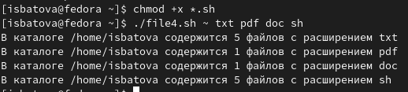{#fig:0015 width=70%}

# Выводы

В данной лабораторной работе мной были изучены основы программирования в оболочке ОС UNIX/Linux. Я также научилась писать небольшие командные файлы.

# Контрольные вопросы

1. Командная оболочка − это программа, позволяющая пользователю взаимодействовать с операционной системой компьютера. В операционных системах типа UNIX/Linux наиболее часто используются следующие реализации командных оболочек:

* оболочка Борна (Bourne shell или sh) − стандартная командная оболочка UNIX/Linux, содержащая базовый, но при этом полный набор функций;
* С-оболочка (или csh) − надстройка на оболочкой Борна, использующая Сподобный синтаксис команд с возможностью сохранения истории выполнения команд;
* оболочка Корна (или ksh) − напоминает оболочку С, но операторы управления программой совместимы с операторами оболочки Борна;
* BASH − сокращение от Bourne Again Shell (опять оболочка Борна), в основе своей совмещает свойства оболочек С и Корна (разработка компании Free Software Foundation).

2. POSIX (Portable Operating System Interface for Computer Environments) − набор стандартов описания интерфейсов взаимодействия операционной системы и прикладных программ.

3. Командный процессор bash обеспечивает возможность использования переменных типа строка символов. Имена переменных могут быть выбраны пользователем. Пользователь имеет возможность присвоить переменной значение некоторой строки символов. Значение, присвоенное некоторой переменной, может быть впоследствии использовано. 

Оболочка bash также позволяет работать с массивами. Для создания массива используется команда set с флагом -A. За флагом следует имя переменной, а затем список значений, разделённых пробелами.

4. Команда "let" является показателем того, что последующие аргументы представляют собой выражение, подлежащее вычислению. 

Команда "read" позволяет читать значения переменных со стандартного ввода.

5. В языке программирования bash можно применять сложение, вычитание, умножение, целочисленное деление и целочисленный остаток от деления.

6. В (( )) можно записывать условия оболочки bash. Помимо этого, внутри двойных скобок можно вычислять арифметические выражения и возвращать результат.

7. 

* PATH - значением данной переменной является список каталогов, в которых командный процессор осуществляет поиск программы или команды, указанной в командной строке.

* PS1 и PS2 - переменные предназначены для отображения промптера командного процессора. 

* HOME - имя домашнего каталога пользователя. 

* IFS - последовательность символов, являющихся разделителями в командной строке.

* MAIL - имя файла, указанного в этой переменной, проверяется командным процессор каждый раз перед выводом на экран промптера 

* TERM - тип используемого терминала.

* LOGNAME - переменная, содержащая регистрационное имя пользователя

8. Метасимволы - символы, имеющие для командного процессора определенный смысл. К ним относятся: ' < > * ? | \ " &.

9. Экранирование осуществляется с помощью предшествующего метасимволу символа обратного слэша. Для экранирования группы метасимволов нужно заключить её в
одинарные кавычки. 

10. Для создания мы создаем текстовый файл и помещаем в него последовательность команд. Чтобы не вводить каждый раз последовательности символов bash, нужно обеспечить доступ к выполнению этого файла командой "chmod +x имя_файла". Далее вызываем командный файл на выполнение, вводя его имя в терминале как программу.

11. Группа команд объединяется объединить в функцию. Для этого существует ключевое слово function, после которого следует имя функции и список команд, заключённых в фигурные скобки. 

12. Необходимо воспользоваться командами "test -f [путь до файла]" (является ли обычным файлом) и "test -d [путь до файла]" (является ли каталогом).

13. Команда "set" используется для вывода списка переменных окружения. 

Команда "typeset" предназначена для наложения ограничений на переменные.

Команду "unset" следует использовать для удаления переменной из окружения командной оболочки.

14. При вызове командного файла на выполнение параметры ему могут быть переданы точно таким же образом, как и выполняемой программе. С точки зрения командного файла эти параметры являются позиционными. Символ $ является метасимволом командного процессора. В командный файл можно передать до девяти параметров. 

15. 

* $* − отображается вся командная строка или параметры оболочки;
* $? − код завершения последней выполненной команды;
* $$ − уникальный идентификатор процесса, в рамках которого выполняется командный процессор;
* $! − номер процесса, в рамках которого выполняется последняя
вызванная на выполнение в командном режиме команда;
* $- − значение флагов командного процессора;
* ${#name} − возвращает целое значение длины строки в переменной name;
* ${name[n]} − обращение к n-му элементу массива;
* ${name[*]} − перечисляет все элементы массива, разделённые пробелом;
* ${name[@]} − то же самое, но позволяет учитывать символы пробелы в самих переменных;
* ${name:-value} − если значение переменной name не определено, то оно будет заменено на указанное value;
* ${name:value} − проверяется факт существования переменной;
* ${name=value} − если name не определено, то ему присваивается значение value;
* ${name?value} − останавливает выполнение, если имяпеременной не определено, и выводит value как сообщение об ошибке;
* ${name+value} − это выражение работает противоположно ${name-value}. Если переменная определена, то подставляется value;
* ${name#pattern} − представляет значение переменной name с удалённым самым коротким левым образцом (pattern);
* ${#name[*]} и ${#name[@]} − эти выражения возвращают количество элементов в массиве name.
