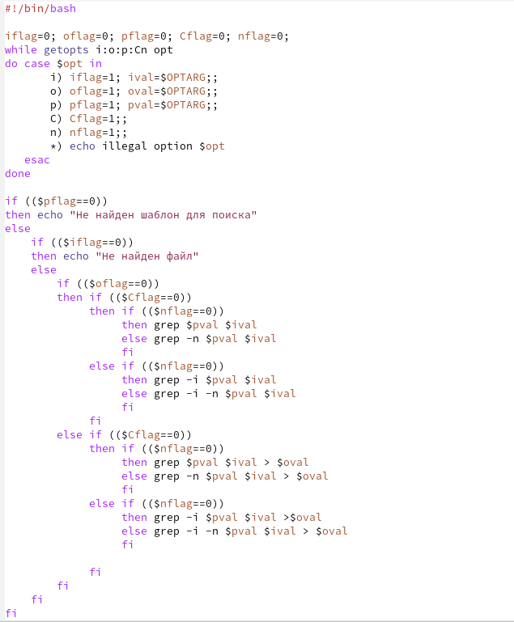
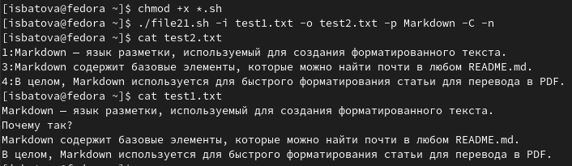
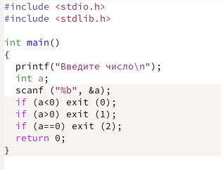
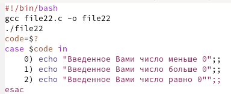
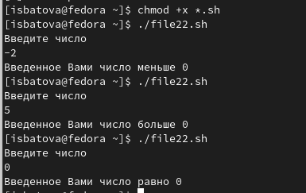
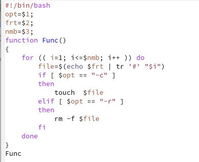
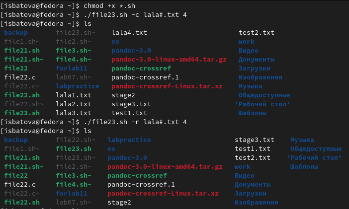
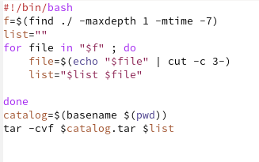
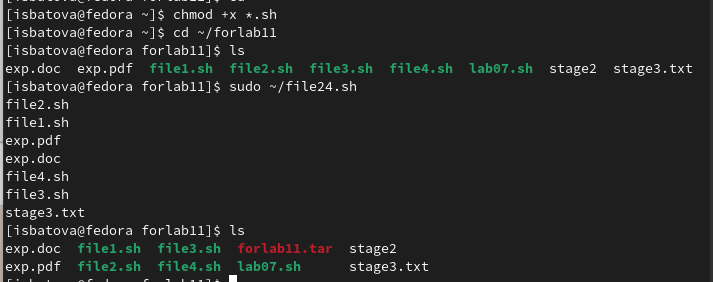

---
## Front matter
lang: ru-RU
title: Отчёт по лабораторной работе №11
subtitle: Дисциплина "Операционные системы"
author:
  - Батова Ирина Сергеевна, НММбд-01-22
institute:
  - Российский университет дружбы народов, Москва, Россия

date: 20 апреля 2023

## i18n babel
babel-lang: russian
babel-otherlangs: english

## Formatting pdf
toc: false
toc-title: Содержание
slide_level: 2
aspectratio: 169
section-titles: true
theme: metropolis
header-includes:
 - \metroset{progressbar=frametitle,sectionpage=progressbar,numbering=fraction}
 - '\makeatletter'
 - '\beamer@ignorenonframefalse'
 - '\makeatother'
---

# Вводная часть

## Цель работы

Изучить основы программирования в оболочке ОС UNIX. Научится писать более сложные командные файлы с использованием логических управляющих конструкций и циклов.

# Основная часть

## Программа 1

- В данном скрипте мы сначала вводим соответствующие опциям переменные и присваиваем этим переменным 0. Далее программа просматривает командную строку на наличие опций и присваивает 1 тем опциям (переменным), которые есть в командной строке. После этого мы используем команду if для проверки наличия различных опций. Сначала проверяем есть ли шаблон для поиска (слово, которое ищем), а потом есть ли файл, в котором будет искаться это слово. При невыполнении хотя бы одного из условий программа выводит ошибку. Далее мы перебираем различное сочетание опций и выводим соответствующие строки в файл.

## Программа 1, архивация файла

## Проверка программы 1

- Далее добавляем право на выполнение файла командой 'chmod +x *.sh', создаем файл с текстом (test1.txt) и пустой файл, в который выводятся данные (test2.txt) и выполняем скрипт командой './file21.sh (аргументы)'. Для проверки корректности выполнения просматриваем содержимое файла командой cat

## Проверка программы 1

## Программа 2 на языке Си

- В данном скрипте мы запрашиваем у пользователя число, затем программа считывает его и определяет, число больше нуля, равно нулю или меньше нуля. 

## Программа 2 на языке Си

## Программа 2 

- В данном скрипте мы сначала компилируем файл с программой на языке Си в объектный файл. Далее вводим команды запуска этого объектного файла, затем программа анализирует, какое число получилось на выходе. После этого с помощью команды "case" выводим соответствующее сообщение.

## Программа 2 

## Проверка программы 2

- Далее добавляем право на выполнение файла командой 'chmod +x *.sh' и выполняем скрипт командой './file22.sh'. Для проверки корректности выполнения я ввела несколько чисел из разных диапазонов 

## Проверка программы 2

## Программа 3

- В данном скрипте мы вводим переменные для опций, которые будут введены пользователям - опция -r или -с (remove - удалить или create - создать), формат файла и количество файлов, которые нужно создать. После этого задаем функцию Func, которая будет удалять и создавать нужное количество файлов нужного формата в зависимости от аргументов, и запускаем ее внутри программы. 

## Программа 3

## Проверка программы 3

- Далее добавляем право на выполнение файла командой 'chmod +x *.sh' и выполняем скрипт командой './file23.sh (аргументы)'. Для проверки корректности выполнения просматриваем содержимое каталога командой ls и после создания, и после удаления

## Проверка программы 3

## Программа 4

- В данном скрипте сначала с помощью команды find находим файлы, которые были изменены меньше недели назад и создаем переменную для списка файлов, которые будем архивировать. Далее с помощью цикла for анализируем каждый файл по времени создания и в зависимости от этого добавляем его в "список файлов" или нет. После окончания цикла архивируем все файлы, содержащиеся в списке.

## Программа 4

## Проверка программы 4

- Далее добавляем право на выполнение файла командой 'chmod +x *.sh', переходим в специально созданный каталог 'forlab11', в который помещены файлы различное давности, и выполняем скрипт командой 'sudo ~/file24.sh'. Для проверки корректности выполнения просматриваем содержимое каталога командой ls и видим, что был создан архив файлов 

## Проверка программы 4

# Вывод

## Вывод

В данной лабораторной работе мной были изучены основы программирования в оболочке ОС UNIX. Помимо этого, я научилась писать более сложные командные файлы с использованием логических управляющих конструкций и циклов.

