---
## Front matter
title: "Отчёт по лабораторной работе №11"
subtitle: "Дисциплина: Операционные системы"
author: "Батова Ирина Сергеевна, НММбд-01-22"

## Generic otions
lang: ru-RU
toc-title: "Содержание"

## Bibliography
bibliography: bib/cite.bib
csl: pandoc/csl/gost-r-7-0-5-2008-numeric.csl

## Pdf output format
toc: true # Table of contents
toc-depth: 2
lof: true # List of figures
lot: true # List of tables
fontsize: 12pt
linestretch: 1.5
papersize: a4
documentclass: scrreprt
## I18n polyglossia
polyglossia-lang:
  name: russian
  options:
	- spelling=modern
	- babelshorthands=true
polyglossia-otherlangs:
  name: english
## I18n babel
babel-lang: russian
babel-otherlangs: english
## Fonts
mainfont: PT Serif
romanfont: PT Serif
sansfont: PT Sans
monofont: PT Mono
mainfontoptions: Ligatures=TeX
romanfontoptions: Ligatures=TeX
sansfontoptions: Ligatures=TeX,Scale=MatchLowercase
monofontoptions: Scale=MatchLowercase,Scale=0.9
## Biblatex
biblatex: true
biblio-style: "gost-numeric"
biblatexoptions:
  - parentracker=true
  - backend=biber
  - hyperref=auto
  - language=auto
  - autolang=other*
  - citestyle=gost-numeric
## Pandoc-crossref LaTeX customization
figureTitle: "Рис."
tableTitle: "Таблица"
listingTitle: "Листинг"
lofTitle: "Список иллюстраций"
lotTitle: "Список таблиц"
lolTitle: "Листинги"
## Misc options
indent: true
header-includes:
  - \usepackage{indentfirst}
  - \usepackage{float} # keep figures where there are in the text
  - \floatplacement{figure}{H} # keep figures where there are in the text
---

# Цель работы

Изучить основы программирования в оболочке ОС UNIX. Научится писать более сложные командные файлы с использованием логических управляющих конструкций и циклов.

# Задание

1. Используя команды getopts grep, написать командный файл, который анализирует командную строку с ключами:
* iinputfile — прочитать данные из указанного файла;
* ooutputfile — вывести данные в указанный файл;
* pшаблон — указать шаблон для поиска;
* C — различать большие и малые буквы;
* n — выдавать номера строк.
а затем ищет в указанном файле нужные строки, определяемые ключом -p.

2. Написать на языке Си программу, которая вводит число и определяет, является ли оно больше нуля, меньше нуля или равно нулю. Затем программа завершается с помощью функции exit(n), передавая информацию в о коде завершения в оболочку. Командный файл должен вызывать эту программу и, проанализировав с помощью команды $?, выдать сообщение о том, какое число было введено.

3. Написать командный файл, создающий указанное число файлов, пронумерованных последовательно от 1 до N (например 1.tmp, 2.tmp, 3.tmp,4.tmp и т.д.). Число файлов, которые необходимо создать, передаётся в аргументы командной строки. Этот же командный файл должен уметь удалять все созданные им файлы (если они существуют).

4. Написать командный файл, который с помощью команды tar запаковывает в архив все файлы в указанной директории. Модифицировать его так, чтобы запаковывались только те файлы, которые были изменены менее недели тому назад (использовать команду find).

# Выполнение лабораторной работы

1. Для начала работы создаем файл для написания скрипта и открываем его (рис. @fig:001).

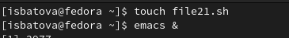{#fig:001 width=70%}

Нам необходимо, используя команды getopts grep, написать командный файл, который анализирует командную строку с ключами, а затем ищет в указанном файле нужные строки, определяемые ключом -p.

Вводим скрипт в наш файл (рис. @fig:002). 

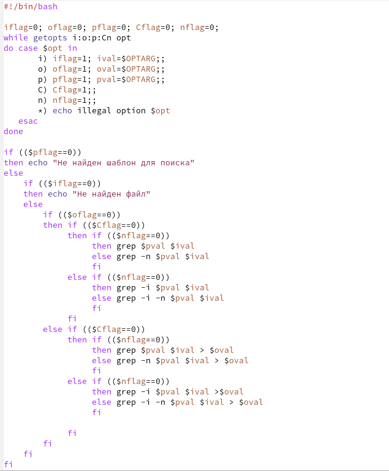{#fig:002 width=70%}

В данном скрипте мы сначала вводим соответствующие опциям переменные и присваиваем этим переменным 0. Далее программа просматривает командную строку на наличие опций и присваивает 1 тем опциям (переменным), которые есть в командной строке. После этого мы используем команду if для проверки наличия различных опций. Сначала проверяем есть ли шаблон для поиска (слово, которое ищем), а потом есть ли файл, в котором будет искаться это слово. При невыполнении хотя бы одного из условий программа выводит ошибку. Далее мы перебираем различное сочетание опций и выводим соответствующие строки в файл.

Далее добавляем право на выполнение файла командой 'chmod +x *.sh', создаем файл с текстом (test1.txt) и пустой файл, в который выводятся данные (test2.txt) и выполняем скрипт командой './file21.sh (аргументы)'. Для проверки корректности выполнения просматриваем содержимое файла командой cat (рис. @fig:003).

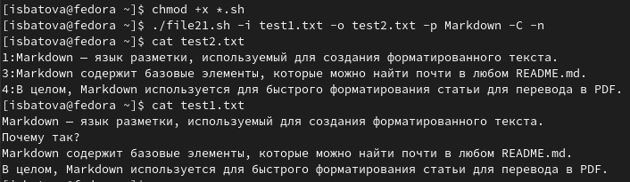{#fig:003 width=70%}

2. Для начала работы создаем файл для написания скрипта на языке Си и файл для написания скрипта на bash. Сначала открываем первый файл (рис. @fig:004).

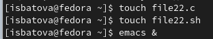{#fig:004 width=70%}

Нам необходимо, написать на языке Си программу, которая вводит число и определяет, является ли оно больше нуля, меньше нуля или равно нулю. После этого программа должна завершаться с помощью функции exit(n), передавая информацию в о коде завершения в оболочку. Командный файл должен вызывать эту программу и, проанализировав его, выдать сообщение о том, какое число было введено.

Вводим скрипт на языке си в файл 'file22.c' (рис. @fig:005). 

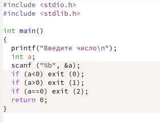{#fig:005 width=70%}

В данном скрипте мы запрашиваем у пользователя число, затем программа считывает его и определяет, число больше нуля, равно нулю или меньше нуля. 

Далее открываем файл 'file22.sh' и вводим в него скрипт (рис. @fig:006). 

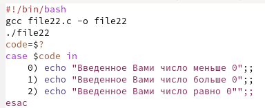{#fig:006 width=70%}

В данном скрипте мы сначала компилируем файл с программой на языке Си в объектный файл. Далее вводим команды запуска этого объектного файла, затем программа анализирует, какое число получилось на выходе. После этого с помощью команды "case" выводим соответствующее сообщение.

Далее добавляем право на выполнение файла командой 'chmod +x *.sh' и выполняем скрипт командой './file22.sh'. Для проверки корректности выполнения я ввела несколько чисел из разных диапазонов (рис. @fig:007).

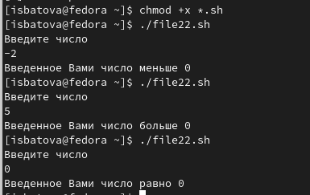{#fig:007 width=70%}

3. Для начала работы создаем файл для написания скрипта и открываем его (рис. @fig:008).

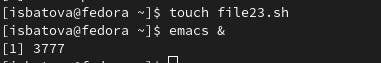{#fig:008 width=70%}

Нам необходимо написать командный файл, создающий указанное число файлов, пронумерованных последовательно от 1 до N, число файлов, которые необходимо создать, передаётся в аргументы командной строки. При этом этот же командный файл должен уметь удалять все созданные им файлы (если они существуют).

Вводим скрипт в наш файл (рис. @fig:009). 

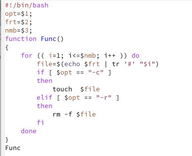{#fig:009 width=70%}

В данном скрипте мы вводим переменные для опций, которые будут введены пользователям - опция -r или -с (remove - удалить или create - создать), формат файла и количество файлов, которые нужно создать. После этого задаем функцию Func, которая будет удалять и создавать нужное количество файлов нужного формата в зависимости от аргументов, и запускаем ее внутри программы. 

Далее добавляем право на выполнение файла командой 'chmod +x *.sh' и выполняем скрипт командой './file23.sh (аргументы)'. Для проверки корректности выполнения просматриваем содержимое каталога командой ls и после создания, и после удаления (рис. @fig:0010).

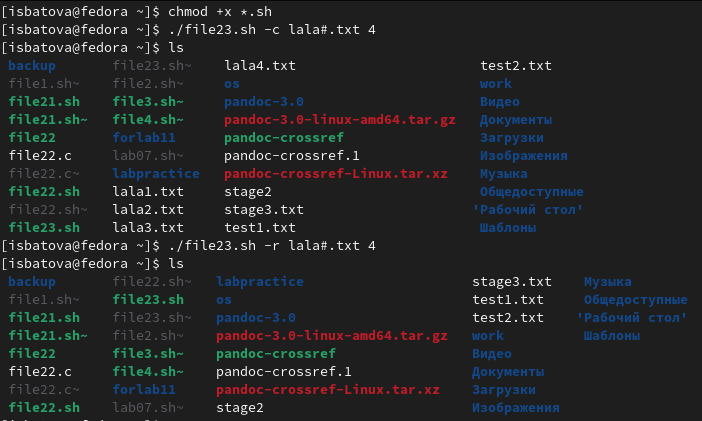{#fig:0010 width=70%}

4. Для начала работы создаем файл для написания скрипта и открываем его (рис. @fig:0011).

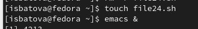{#fig:0011 width=70%}

Нам необходимо написать командный файл, который с помощью команды tar запаковывает в архив все файлы в указанной директории, а затем модифицировать его так, чтобы запаковывались только те файлы, которые были изменены менее недели тому назад.

Вводим скрипт в наш файл (рис. @fig:0012). 

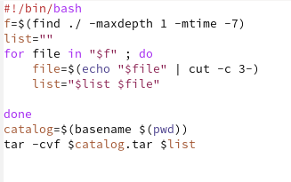{#fig:0012 width=70%}

В данном скрипте сначала с помощью команды find находим файлы, которые были изменены меньше недели назад и создаем переменную для списка файлов, которые будем архивировать. Далее с помощью цикла for анализируем каждый файл по времени создания и в зависимости от этого добавляем его в "список файлов" или нет. После окончания цикла архивируем все файлы, содержащиеся в списке.

Далее добавляем право на выполнение файла командой 'chmod +x *.sh', переходим в специально созданный каталог 'forlab11', в который помещены файлы различное давности, и выполняем скрипт командой 'sudo ~/file24.sh'. Для проверки корректности выполнения просматриваем содержимое каталога командой ls и видим, что был создан архив файлов (рис. @fig:0013).

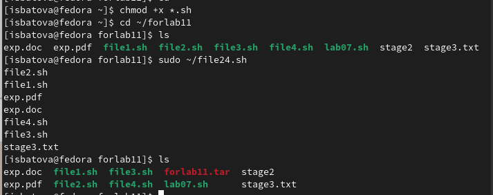{#fig:0013 width=70%}

# Выводы

В данной лабораторной работе мной были изучены основы программирования в оболочке ОС UNIX. Помимо этого, я научилась писать более сложные командные файлы с использованием логических управляющих конструкций и циклов.

# Контрольные вопросы

1. Команда getopts осуществляет синтаксический анализ командной строки, выделяя флаги, и используется для объявления переменных.

2. При перечислении имён файлов текущего каталога используются такие метасимволы, как "*" (соответствует произвольной, в том числе и пустой строке) , "?" (соответствует любому одинарному символу), "[c1-c2]" — соответствует любому символу, лексикографически находящемуся между символами c1 и с2.

3. В языке bash есть следующие операторы действия: for (при каждом следующем выполнении оператора цикла for переменная принимает следующее значение из списка значений), case (реализует возможность ветвления на произвольное число ветвей), if (сначала выполняется последовательность команд (операторов), которую задаёт список команд в строке, содержащей служебное слово if, а затем, если последняя выполненная команда из этой последовательности команд возвращает нулевой код завершения (истина), то будет выполнена последовательность команд (операторов), которую задаёт список команд в строке, содержащей служебное слово then) и while (cначала выполняется последовательность команд (операторов), которую задаёт список команд в строке, содержащей служебное слово while, а затем, если последняя выполненная команда из этой последовательности команд возвращает нулевой код завершения (истина), выполняется последовательность команд (операторов), которую задаёт списоккоманд в строке, содержащей служебное слово do, после чего осуществляется безусловный переход на начало оператора цикла while). 

4. Для прерывания цикла используются операторы break (завершает выполнение цикла) и оператор continue (завершает данную итерацию блока операторов).

5. Команда true всегда возвращает код завершения, равный нулю, и команда false, которая всегда возвращает код завершения, не равный нулю.

6. Строка if test -f man$s/$i.$s проверяет, существует ли файл man$s/$i.$s и является ли он обычным файлом. 

7. При замене в операторе цикла while служебного слова while на until условие, при выполнении которого осуществляется выход из цикла, меняется на противоположное. 
