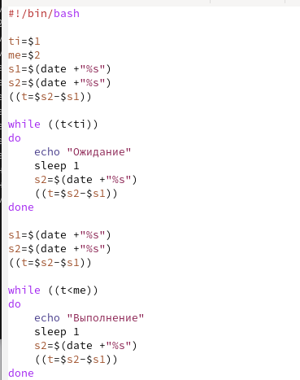
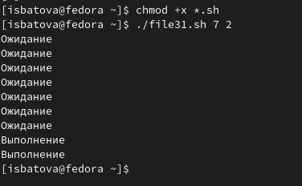
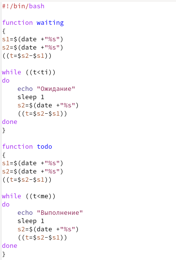
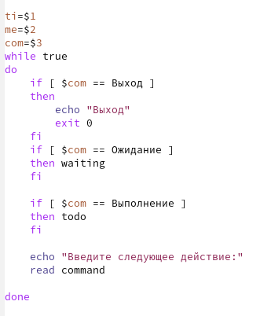
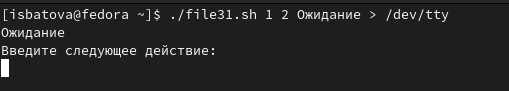
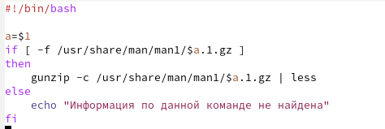
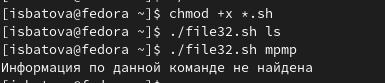
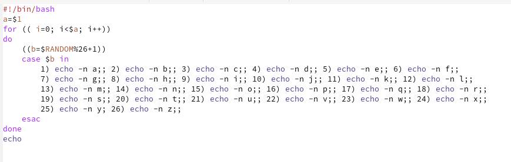
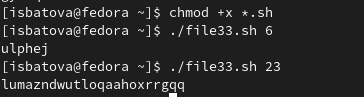

---
## Front matter
lang: ru-RU
title: Отчёт по лабораторной работе №12
subtitle: Дисциплина "Операционные системы"
author:
  - Батова Ирина Сергеевна, НММбд-01-22
institute:
  - Российский университет дружбы народов, Москва, Россия
  
date: 26 апреля 2023

## i18n babel
babel-lang: russian
babel-otherlangs: english

## Formatting pdf
toc: false
toc-title: Содержание
slide_level: 2
aspectratio: 169
section-titles: true
theme: metropolis
header-includes:
 - \metroset{progressbar=frametitle,sectionpage=progressbar,numbering=fraction}
 - '\makeatletter'
 - '\beamer@ignorenonframefalse'
 - '\makeatother'
---

# Вводная часть

## Цель работы

Изучить основы программирования в оболочке ОС UNIX. Научиться писать более сложные командные файлы с использованием логических управляющих конструкций и циклов.

# Основная часть

## Программа 1

- В данном скрипте мы вводим как переменные время ожидания и время выполнения (вводятся пользователем при запуске командного файла), а также два счетчика времени и еще изменяемые счетчик (разница двух предыдущих счетчиков). Далее мы пишем два цикла while - для ожидания и для выполнения. Внутри каждого из циклов мы выводим соответствующее сообщение и делаем паузу в 1 секунду для занесения изменений в счетчик. Между циклами мы обновляем все три счетчика для корректной работы второго цикла.

## Программа 1

## Проверка программы 1

- Далее добавляем право на выполнение файла командой 'chmod +x *.sh' и выполняем скрипт командой './file31.sh (аргументы)'. 

## Измененная программа 1

- В измененном скрипте мы заносим обновление счетчиков и циклы while под функции, и вводим три переменных - время ожидания, время выполнения и переменную-указание к действию. Далее под циклом while true рассматриваем три варианта значения переменной-указания к действию с помощью if и обращаемся к соответствующей функции (или осуществляем выход). В конце выводим предложение ввести следующей действие и осуществляем аналогичные действия.

## Измененная программа 1

## Измененная программа 1

## Проверка измененной программы 1

- Далее выполняем скрипт командой './file31.sh (аргументы)'. Программа работает корректно 

## Программа 2 

- В данном скрипте мы вводим переменную, которая принимает значение, введенное пользователем при запуске командной файла (название команды). Далее мы проверяем, есть ли информация по данной команде и с помощью if выводим информацию по введенной пользователем команде или сообщение, что информация по данной команде отсутствует. 

## Программа 2 

## Проверка программы 2

- Далее добавляем право на выполнение файла командой 'chmod +x *.sh' и выполняем скрипт командой './file32.sh (аргумент)'. Программа работает корректно как при введении названия существующей команды, так и не существующей команды

## Программа 3

- В данном скрипте мы вводим переменную, которая принимает значение, введенное пользователем при запуске командной файла (количество символов). Далее с помощью цикла for мы выводим нужное количество символов. Внутри цикла используется встроенная переменная $RANDOM для определения случайного номера и команда case для непосредственного вывода символа (каждая команда вывода символа обозначается под своим порядковым номером, который и выбирает встроенная переменная $RANDOM).

## Программа 3

## Проверка программы 3

- Далее добавляем право на выполнение файла командой 'chmod +x *.sh' и выполняем скрипт командой './file33.sh (аргументы)'. Для проверки корректности выполнения вводим несколько чисел

# Вывод

## Вывод

В ходе данной лабораторной работы мной были изучены основы программирования в оболочке ОС UNIX. Помимо этого, я научилась писать более сложные командные файлы с использованием логических управляющих конструкций и циклов.

