---
## Front matter
title: Отчёт по лабораторной работе №12"
subtitle: "Дисциплина: Операционные системы"
author: "Батова Ирина Сергеевна, НММбд-01-22"

## Generic otions
lang: ru-RU
toc-title: "Содержание"

## Bibliography
bibliography: bib/cite.bib
csl: pandoc/csl/gost-r-7-0-5-2008-numeric.csl

## Pdf output format
toc: true # Table of contents
toc-depth: 2
lof: true # List of figures
lot: true # List of tables
fontsize: 12pt
linestretch: 1.5
papersize: a4
documentclass: scrreprt
## I18n polyglossia
polyglossia-lang:
  name: russian
  options:
	- spelling=modern
	- babelshorthands=true
polyglossia-otherlangs:
  name: english
## I18n babel
babel-lang: russian
babel-otherlangs: english
## Fonts
mainfont: PT Serif
romanfont: PT Serif
sansfont: PT Sans
monofont: PT Mono
mainfontoptions: Ligatures=TeX
romanfontoptions: Ligatures=TeX
sansfontoptions: Ligatures=TeX,Scale=MatchLowercase
monofontoptions: Scale=MatchLowercase,Scale=0.9
## Biblatex
biblatex: true
biblio-style: "gost-numeric"
biblatexoptions:
  - parentracker=true
  - backend=biber
  - hyperref=auto
  - language=auto
  - autolang=other*
  - citestyle=gost-numeric
## Pandoc-crossref LaTeX customization
figureTitle: "Рис."
tableTitle: "Таблица"
listingTitle: "Листинг"
lofTitle: "Список иллюстраций"
lotTitle: "Список таблиц"
lolTitle: "Листинги"
## Misc options
indent: true
header-includes:
  - \usepackage{indentfirst}
  - \usepackage{float} # keep figures where there are in the text
  - \floatplacement{figure}{H} # keep figures where there are in the text
---

# Цель работы

Изучить основы программирования в оболочке ОС UNIX. Научиться писать более сложные командные файлы с использованием логических управляющих конструкций и циклов.

# Задание

1. Написать командный файл, реализующий упрощённый механизм семафоров. Командный файл должен в течение некоторого времени t1 дожидаться освобождения ресурса, выдавая об этом сообщение, а дождавшись его освобождения, использовать его в течение некоторого времени t2<>t1, также выдавая информацию о том, что ресурс используется соответствующим командным файлом (процессом). Запустить командный файл в одном виртуальном терминале в фоновом режиме, перенаправив его вывод в другой (> /dev/tty#, где # — номер терминала куда перенаправляется вывод), в котором также запущен этот файл, но не фоновом, а в привилегированном режиме. Доработать программу так, чтобы имелась возможность взаимодействия трёх и более процессов.

2. Реализовать команду man с помощью командного файла. Изучите содержимое каталога /usr/share/man/man1. В нем находятся архивы текстовых файлов, содержащих справку по большинству установленных в системе программ и команд. Каждый архив можно открыть командой less сразу же просмотрев содержимое справки. Командный файл должен получать в виде аргумента командной строки название команды и в виде результата выдавать справку об этой команде или сообщение об отсутствии справки, если соответствующего файла нет в каталоге man1.

3. Используя встроенную переменную $RANDOM, напишите командный файл, генерирующий случайную последовательность букв латинского алфавита. Учтите, что $RANDOM выдаёт псевдослучайные числа в диапазоне от 0 до 32767.

# Выполнение лабораторной работы

1. Для начала работы создаем файл для написания скрипта и открываем его (рис. @fig:001).

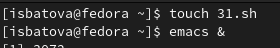{#fig:001 width=70%}

Нам необходимо, написать командный файл, реализующий упрощённый механизм семафоров.

Вводим скрипт в наш файл (рис. @fig:002). 

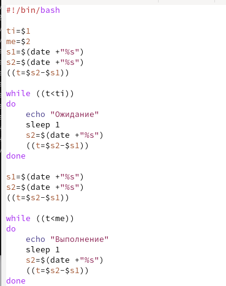{#fig:002 width=70%}

В данном скрипте мы вводим как переменные время ожидания и время выполнения (вводятся пользователем при запуске командного файла), а также два счетчика времени и еще изменяемые счетчик (разница двух предыдущих счетчиков). Далее мы пишем два цикла while - для ожидания и для выполнения. Внутри каждого из циклов мы выводим соответствующее сообщение и делаем паузу в 1 секунду для занесения изменений в счетчик. Между циклами мы обновляем все три счетчика для корректной работы второго цикла.

Далее добавляем право на выполнение файла командой 'chmod +x *.sh' и выполняем скрипт командой './file31.sh (аргументы)'. Программа работает корректно (рис. @fig:003).

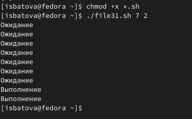{#fig:003 width=70%}

Далее нам необходимо доработать программу так, чтобы имелась возможность взаимодействия трёх и более процессов. Вновь открываем файл и вводим в него измененный скрипт (рис. @fig:004, @fig:005).

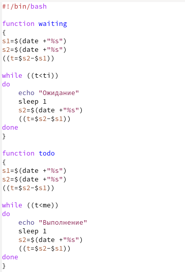{#fig:004 width=70%}

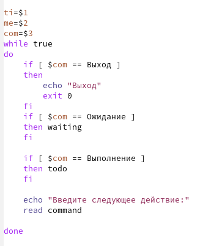{#fig:005 width=70%}

В измененном скрипте мы заносим обновление счетчиков и циклы while под функции, и вводим три переменных - время ожидания, время выполнения и переменную-указание к действию. Далее под циклом while true рассматриваем три варианта значения переменной-указания к действию с помощью if и обращаемся к соответствующей функции (или осуществляем выход). В конце выводим предложение ввести следующей действие и осуществляем аналогичные действия.

Далее выполняем скрипт командой './file31.sh (аргументы)'. Программа работает корректно (рис. @fig:006).

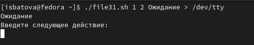{#fig:006 width=70%}

2. Для начала работы переходим в каталог со справками о командах '/usr/share/man/man1' и с помощью команды ls просматриваем, какие файлы в нем содержатся (рис. @fig:007).

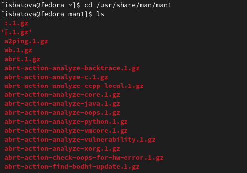{#fig:007 width=70%}

Из данного действия мы получили информацию, что все справки о командах хранятся под именем *.1.gz. Это пригодится нам при написании командного файла.

Далее создаем файл для написания скрипта и открываем его (рис. @fig:008).

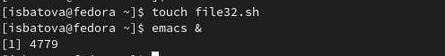{#fig:008 width=70%}

Нам необходимо, написать командный файл, реализующий команду man.

Вводим скрипт в наш файл (рис. @fig:009). 

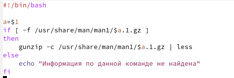{#fig:009 width=70%}

В данном скрипте мы вводим переменную, которая принимает значение, введенное пользователем при запуске командной файла (название команды). Далее мы проверяем, есть ли информация по данной команде и с помощью if выводим информацию по введенной пользователем команде или сообщение, что информация по данной команде отсутствует. 

Далее добавляем право на выполнение файла командой 'chmod +x *.sh' и выполняем скрипт командой './file32.sh (аргумент)'. Программа работает корректно как при введении названия существующей команды (рис. @fig:0010, @fig:0011), так и не существующей (рис. @fig:0012).

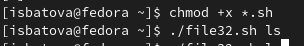{#fig:0010 width=70%}

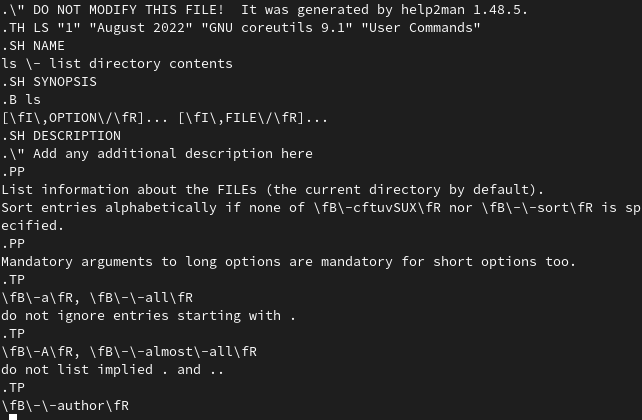{#fig:0011 width=70%}

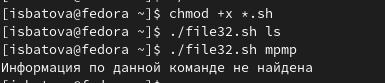{#fig:0012 width=70%}

3. Для начала работы создаем файл для написания скрипта и открываем его (рис. @fig:0013).

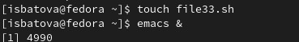{#fig:0013 width=70%}

Нам необходимо, используя встроенную переменную $RANDOM, написать командный файл, генерирующий случайную последовательность букв латинского алфавита. 

Вводим скрипт в наш файл (рис. @fig:0014). 

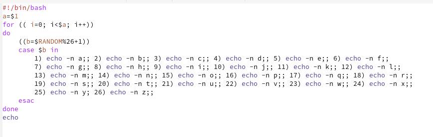{#fig:0014 width=70%}

В данном скрипте мы вводим переменную, которая принимает значение, введенное пользователем при запуске командной файла (количество символов). Далее с помощью цикла for мы выводим нужное количество символов. Внутри цикла используется встроенная переменная $RANDOM для определения случайного номера и команда case для непосредственного вывода символа (каждая команда вывода символа обозначается под своим порядковым номером, который и выбирает встроенная переменная $RANDOM).

Далее добавляем право на выполнение файла командой 'chmod +x *.sh' и выполняем скрипт командой './file33.sh (аргументы)'. Для проверки корректности выполнения вводим несколько чисел (рис. @fig:0015).

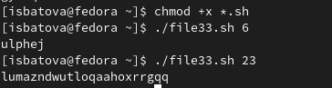{#fig:0015 width=70%}

# Выводы

В ходе данной лабораторной работы мной были изучены основы программирования в оболочке ОС UNIX. Помимо этого, я научилась писать более сложные командные файлы с использованием логических управляющих конструкций и циклов.

# Контрольные вопросы

1. В данной строке не хватает пробелов после первой скобки и перед второй, а также кавычек у первой переменной.

Правильный вариант:

while [ “$1” != "exit" ]

2. Есть два способа объединения несколько строк в одну.

  1. 
  а="hi "
  b="bye"
  c="$a$b"
  echo "$c"
  
  2. 
  а="hi "
  a+="bye"
  echo "$a"
  
3. Утилита seq используется для генерации чисел от первого до последнего шага INCREMENT. 

4. Результат даст вычисление выражения $((10/3)) равен 3.

5. Отличия zsh:

* более быстрое автодополнение для cd с помощью Тab
* есть калькулятор, способный выполнять вычисления внутри терминала
* поддерживается раскрытие полного пути на основе неполных данных
* поддерживается замена части пути

6. У конструкции for ((a=1; a <= LIMIT; a++)) верен синтаксис.

7. Преимущества bash:

* один из самых популярных языков программирования
* удобное перенаправление ввода/вывода
* большое количество команд для работы с файловыми системами

Недостатки bash:

* небольшая библиотека относительно других языков 
* достаточно медленный, так как утилиты, при выполнении скрипта, запускают свои процессы
* скрипты нельзя запустить на других операционных системах без дополнительных действий
