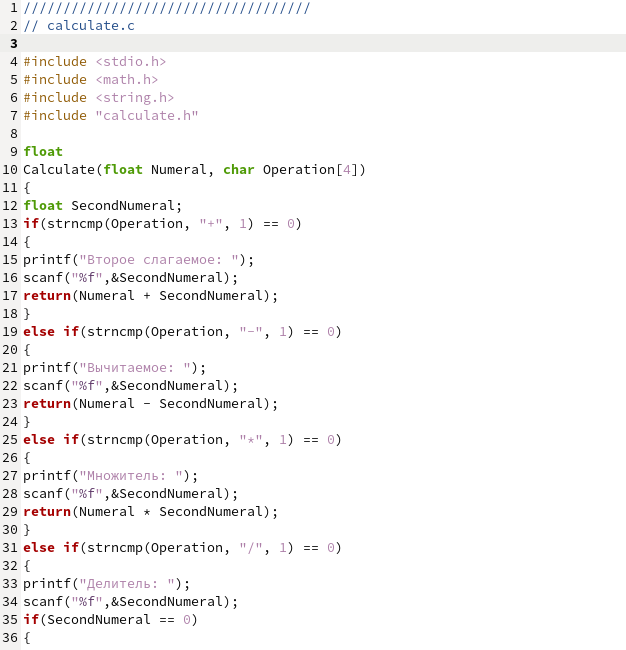

---
## Front matter
lang: ru-RU
title: Отчёт по лабораторной работе №13
subtitle: Дисциплина "Операционные системы"
author:
  - Батова Ирина Сергеевна, НММбд-01-22
institute:
  - Российский университет дружбы народов, Москва, Россия

date: 02 мая 2023

## i18n babel
babel-lang: russian
babel-otherlangs: english

## Formatting pdf
toc: false
toc-title: Содержание
slide_level: 2
aspectratio: 169
section-titles: true
theme: metropolis
header-includes:
 - \metroset{progressbar=frametitle,sectionpage=progressbar,numbering=fraction}
 - '\makeatletter'
 - '\beamer@ignorenonframefalse'
 - '\makeatother'
---

# Вводная часть

## Цель работы

Приобрести простейшие навыки разработки, анализа, тестирования и отладки приложений в ОС типа UNIX/Linux на примере создания на языке программирования С калькулятора с простейшими функциями.

# Основная часть

## Скрипт в calculate.c

- Вводим скрипт для реализации функций калькулятора в файле calculate.с 

## Скрипт в calculate.c

## Скрипт в calculate.h

- Вводим скрипт в интерфейсный файл calculate.h, описывающий формат вызова функции-калькулятора 

## Скрипт в main.c

- Вводим скрипт в основной файл main.c, реализующий интерфейс пользователя к калькулятору 

## Компиляция программы

## Makefile

- Файл используется для автоматической компиляции main.c, calculate.c и создание из них исполняемого файла calcul. Помимо этого, в файле также есть функция 'clean', используемая для удаления всех файлов. В начале скрипта также вводятся переменные: СС - команда для компиляции gcc, СFLAGS - опции к команде компиляции, LIBS - опции при создании исполняемого файла.

## Проверка работыMakefile

## Отладчик GDB

## Запуск программы внутри отладчика GDB

## Точки останова

## Запуск программы с точками останова

## Удаления точек останова

# Вывод

## Вывод

В ходе данной лабораторной работы мной были приобретены простейшие навыки разработки, анализа, тестирования и отладки приложений в ОС типа UNIX/Linux на примере создания на языке программирования С калькулятора с простейшими функциями.

