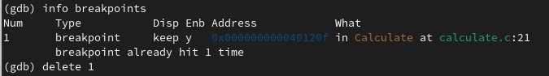

---
## Front matter
title: "Отчёт по лабораторной работе №13"
subtitle: "Дисциплина: Операционные системы"
author: "Батова Ирина Сергеевна, НММбд-01-22"

## Generic otions
lang: ru-RU
toc-title: "Содержание"

## Bibliography
bibliography: bib/cite.bib
csl: pandoc/csl/gost-r-7-0-5-2008-numeric.csl

## Pdf output format
toc: true # Table of contents
toc-depth: 2
lof: true # List of figures
lot: true # List of tables
fontsize: 12pt
linestretch: 1.5
papersize: a4
documentclass: scrreprt
## I18n polyglossia
polyglossia-lang:
  name: russian
  options:
	- spelling=modern
	- babelshorthands=true
polyglossia-otherlangs:
  name: english
## I18n babel
babel-lang: russian
babel-otherlangs: english
## Fonts
mainfont: PT Serif
romanfont: PT Serif
sansfont: PT Sans
monofont: PT Mono
mainfontoptions: Ligatures=TeX
romanfontoptions: Ligatures=TeX
sansfontoptions: Ligatures=TeX,Scale=MatchLowercase
monofontoptions: Scale=MatchLowercase,Scale=0.9
## Biblatex
biblatex: true
biblio-style: "gost-numeric"
biblatexoptions:
  - parentracker=true
  - backend=biber
  - hyperref=auto
  - language=auto
  - autolang=other*
  - citestyle=gost-numeric
## Pandoc-crossref LaTeX customization
figureTitle: "Рис."
tableTitle: "Таблица"
listingTitle: "Листинг"
lofTitle: "Список иллюстраций"
lotTitle: "Список таблиц"
lolTitle: "Листинги"
## Misc options
indent: true
header-includes:
  - \usepackage{indentfirst}
  - \usepackage{float} # keep figures where there are in the text
  - \floatplacement{figure}{H} # keep figures where there are in the text
---

# Цель работы

Приобрести простейшие навыки разработки, анализа, тестирования и отладки приложений в ОС типа UNIX/Linux на примере создания на языке программирования С калькулятора с простейшими функциями.

# Задание

1. В домашнем каталоге создайте подкаталог ~/work/os/lab_prog.
2. Создайте в нём файлы: calculate.h, calculate.c, main.c. В соответствие с лабораторной работы внести скрипт в файлы.

- Реализация функций калькулятора в файле calculate.h
- Интерфейсный файл calculate.h, описывающий формат вызова функции-калькулятора
- Основной файл main.c, реализующий интерфейс пользователя к калькулятору

3. Выполните компиляцию программы посредством gcc.
4. При необходимости исправьте синтаксические ошибки.
5. Создайте Makefile 
6. С помощью gdb выполните отладку программы calcul (перед использованием gdb исправьте Makefile):

- Запустите отладчик GDB, загрузив в него программу для отладки:
- Для запуска программы внутри отладчика введите команду run
- Для постраничного (по 9 строк) просмотра исходного код используйте команду list
- Для просмотра строк с 12 по 15 основного файла используйте list с параметрами
- Для просмотра определённых строк не основного файла используйте list с параметрами
– Установите точку останова в файле calculate.c на строке номер 21
– Выведите информацию об имеющихся в проекте точках останова
– Запустите программу внутри отладчика и убедитесь, что программа остановится в момент прохождения точки останова
– Посмотрите, чему равно на этом этапе значение переменной Numeral
– Сравните с результатом вывода на экран после использования другой команды
– Уберите точки останова

7. С помощью утилиты splint попробуйте проанализировать коды файлов calculate.c и main.c

# Выполнение лабораторной работы

1. В домашнем каталоге создаем подкаталог ~/work/os/lab_prog (рис. @fig:001).

{#fig:001 width=70%}

2. Создаем в нём файлы: calculate.h, calculate.c, main.c (рис. @fig:002).

{#fig:002 width=70%}

Далее вносим в файлы скрипты соответственно лабораторной работе для создания примитивного калькуляторы.

Вводим скрипт для реализации функций калькулятора в файле calculate.с (рис. @fig:003, @fig:004).

{#fig:003 width=70%}

{#fig:004 width=70%}

Вводим скрипт в интерфейсный файл calculate.h, описывающий формат вызова функции-калькулятора (рис. @fig:005).

{#fig:005 width=70%}

Вводим скрипт в основной файл main.c, реализующий интерфейс пользователя к калькулятору (рис. @fig:006).

{#fig:006 width=70%}

3. Выполните компиляцию программы посредством gcc (рис. @fig:007).

{#fig:007 width=70%}

4. Синтаксические ошибки не обнаружены.

5. Создаем файл с именем "makefile" и вводим в него скрипт соответственно лабораторной работе (рис. @fig:008).

{#fig:008 width=70%}

Файл используется для автоматической компиляции main.c, calculate.c и создание из них исполняемого файла calcul. Помимо этого, в файле также есть функция 'clean', используемая для удаления всех файлов. В начале скрипта также вводятся переменные: СС - команда для компиляции gcc, СFLAGS - опции к команде компиляции, LIBS - опции при создании исполняемого файла.

6. Немного редактируем makefile - заменяем в тексте скрипта команду gcc на соответствующую ей переменную CC, а также придаем переменной СFLAGS значение опции '-g', чтобы объектные файлы можно было использовать в отладчике.

{#fig:009 width=70%}

Проверяем работу makefile - удаляем файлы, затем вновь их компилируем (рис. @fig:0010).

{#fig:0010 width=70%}

Далее с помощью gdb выполняем отладку программы calcul.

Запускаем отладчик GDB, загрузив в него программу для отладки (рис. @fig:0011).

{#fig:0011 width=70%}

Для запуска программы внутри отладчика вводим команду run (рис. @fig:0012).

{#fig:0012 width=70%}

Для постраничного просмотра исходного код вводим команду list (рис. @fig:0013).

{#fig:0013 width=70%}

Для просмотра строк с 12 по 15 основного файла вводим команду list с параметрами - номерами строк (рис. @fig:0014).

{#fig:0014 width=70%}

Для просмотра определённых строк не основного файла вводим команду list с параметрами - номерами строк и указанием файла (рис. @fig:0015).

{#fig:0015 width=70%}

Устанавливаем точку останова в файле calculate.c на строке номер 21 командой break (рис. @fig:0016).

{#fig:0016 width=70%}

Выводим информацию об имеющихся в проекте точках останова командой info breakpoints (рис. @fig:0017).

{#fig:0017 width=70%}

Чтобы убедиться, что программа остановится в момент прохождения точки останова, запускаем программу внутри отладчика (рис. @fig:0018).

{#fig:0018 width=70%}

Проверяем, чему равно на этом этапе значение переменной Numeral командой print (рис. @fig:0019).

{#fig:0019 width=70%}

Проверяем, чему равно на этом этапе значение переменной Numeral командой display (рис. @fig:0020).

{#fig:0020 width=70%}

Убираем точки останова командой delete (рис. @fig:0021).

{#fig:0021 width=70%}

7. Вводим команды 'splint calculate.c' (рис. @fig:0022, @fig:0023) и 'splint main.c' (рис. @fig:0024) для анализа кодов файлов.

{#fig:0022 width=70%}

{#fig:0023 width=70%}

{#fig:0024 width=70%}

С помощью данной команды мы узнали, что значения типа double в функциях pow, sin, cos, tan, sqrt записываются в переменную float, а значит, есть потеря данных. Также в обоих файлах есть функция scanf, которая возвращает целое значение, нигде не сохраняющиеся и не использующееся дальше в скрипте.

# Выводы

В ходе данной лабораторной работы мной были приобретены простейшие навыки разработки, анализа, тестирования и отладки приложений в ОС типа UNIX/Linux на примере создания на языке программирования С калькулятора с простейшими функциями.

# Контрольные вопросы

1. Для получения информации о возможностях программ gcc, make, gdb и других можно воспользоваться командой 'man'.

2. Основные этапы разработки приложений в UNIX:

- Планирование: сбор и анализ требований к функционалу и другим характеристикам разрабатываемого приложения

- Проектирование: разработка базовых алгоритмов и спецификаций, определение языка программирования

- Кодирование: создание исходного текста программы

- Анализ разработанного кода

- Сборка, компиляция, разработка исполняемого модуля

- Тестирование и отладка, сохранение изменений

- Документирование

3. Суффикс определяет какая компиляция требуется для имени входного файла и указывают на тип объекта. Например, в команде 'gcc -c calculate.c' по суффиксу .с распознается тип файла как файл на языке Си и формируется объектный файл с суффиксом .o.

4. Компилятор языка Си в UNIX используется для компиляции всей программы и получения исполняемого файла.

5. Утилита make предназначена для автоматизирования процесса преобразования файлов программы из одного формата в другой.

6. 

Файл используется для автоматической компиляции main.c, calculate.c и создание из них исполняемого файла calcul. Помимо этого, в файле также есть функция 'clean', используемая для удаления всех файлов. В начале скрипта также вводятся переменные: СС - команда для компиляции gcc, СFLAGS - опции к команде компиляции, LIBS - опции при создании исполняемого файла.

7. Для того, чтобы можно было использовать программы отладки, необходимо скомпилировать анализируемый код программы так, чтобы отладочная информация содержалась в результирующим бинарном файле (реализуется опцией -g компилятора gcc).

8. Основные команды отладчика gdb:

- backtrace - вывод на экран пути к текущей точке останова 
- break - установить точку останова 
- clear - удалить все точки останова в функции
- continue - продолжить выполнение программы
- delete - удалить точку останова
- display - добавить выражение в список выражений, значения которых отображаются при достижении точки останова программы
- finish - выполнить программу до момента выхода из функции
- info breakpoints - вывести на экран список используемых точек останова
- info watchpoints - вывести на экран список используемых контрольных выражений
- list - вывести на экран исходный код 
- next - выполнить программу пошагово, но без выполнения вызываемых в программе функций
- print - вывести значение указываемого в качестве параметра выражения
- run - запуск программы на выполнение
- set - установить новое значение переменной
- step - пошаговое выполнение программы
- watch -  установить контрольное выражение, при изменении значения которого программа будет остановле

9. Схема отладки программы пошагово описана в шестом пункте лабораторной работы.

10. Синтаксических ошибок в программе при первом запуске обнаружено не было.

11. Основные средства, повышающие понимание исходного кода программы - cscope (исследование функций программы) и lint (проверка программ языка Си)

12. Программа splint анализирует программный код и выполняет проверку корректности всех аргументов, функций, значений, синтаксиса программы. Помимо этого, программа выдает комментарии с разбором кода программы. 

