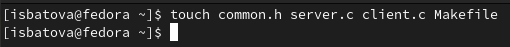
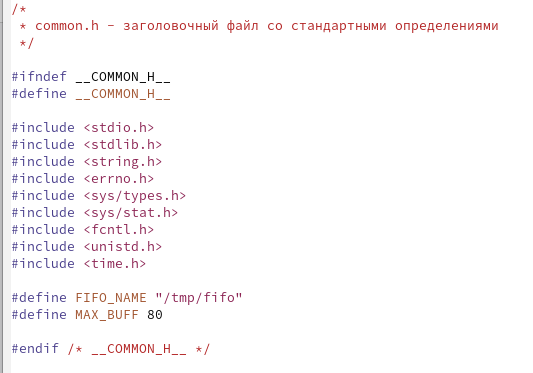
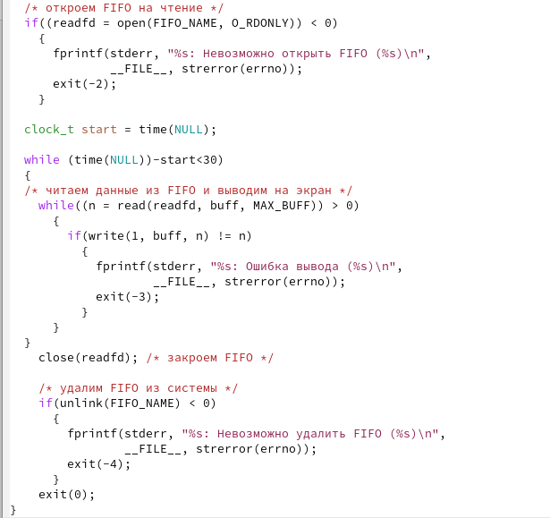
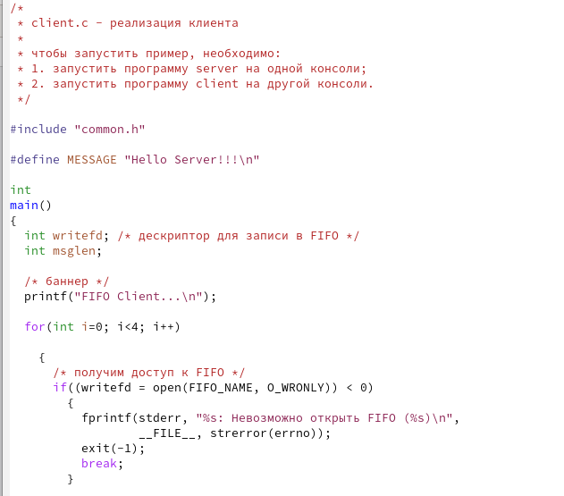
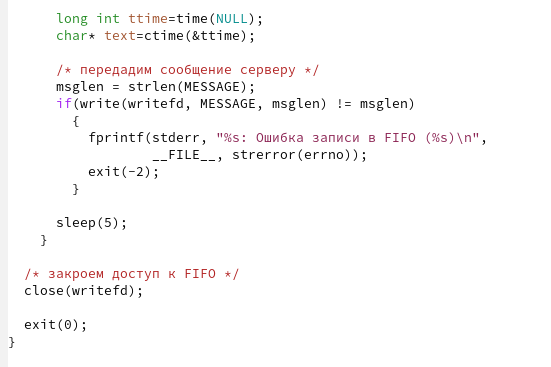
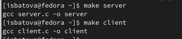
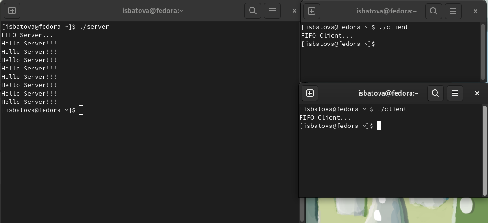

---
## Front matter
lang: ru-RU
title: Отчёт по лабораторной работе №14
subtitle: Дисциплина "Операционные системы"
author:
  - Батова Ирина Сергеевна, НММбд-01-22
institute:
  - Российский университет дружбы народов, Москва, Россия
  
date: 06 мая 2023

## i18n babel
babel-lang: russian
babel-otherlangs: english

## Formatting pdf
toc: false
toc-title: Содержание
slide_level: 2
aspectratio: 169
section-titles: true
theme: metropolis
header-includes:
 - \metroset{progressbar=frametitle,sectionpage=progressbar,numbering=fraction}
 - '\makeatletter'
 - '\beamer@ignorenonframefalse'
 - '\makeatother'
---

# Вводная часть

## Цель работы

Приобретение практических навыков работы с именованными каналами.

# Основная часть

## Создание файлов

- Для начала работы создаем командой 'touch' четыре файла

## Файл 'common.h'

- Для корректной работы других файлов добавляем к листингу из лабораторной работы два заголовочных файла - unistd.h и time.h

## Файл 'server.c'

- Нам нужно, чтобы сервер заканчивал работу через 30 секунд. Для реализации данного действия сначала обозначаем время начало работы (clock_t start=time(NULL)), а затем вносим прочтение данных из FIFO и вывод их на экран под цикл while, который работает только пока разница между текущим временем и временем начала работы меньше 30 секунд  

## Файл 'server.c'

## Файл 'client.c'

- Нам нужно, чтобы клиенты передавали текущее сообщение раз в пять секунд. Для этого добавляем цикл for, который анализирует количество и отправляет сообщения о текущем времени, добавляем команды для генерации этих сообщений (long int ttime=time(NULL) и char* text=ctime(&ttime)), а также команду sleep(5), которая останавливает работу клиента на 5 секунд

## Файл 'client.c'

## Файл 'client.c'

## Компиляция исполняемых файлов

- В Makefile вводим листинг, соответствующий лабораторной работе, и оставляем без изменений
- Вводим команды 'make server' и 'make client' для компиляции исполняемых файлов

## Запуск программы

- Открываем три окна терминала, в одном запускаем файл server, в двух других - файл client
- Каждый "клиент" вывел по четыре сообщения, а спустя тридцать секунд сервер завершил работу

# Вывод

## Вывод

В ходе данной лабораторной работы я приобрела практические навыки работы с именованными каналами.

