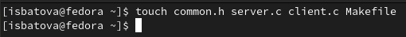
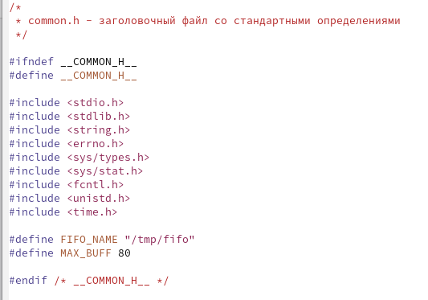
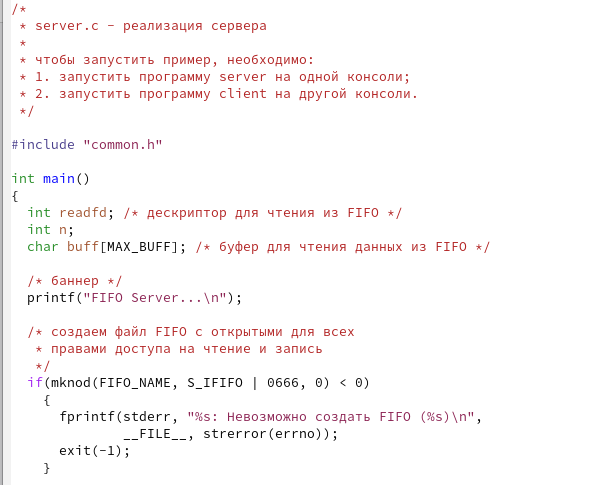
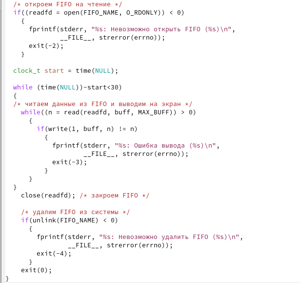
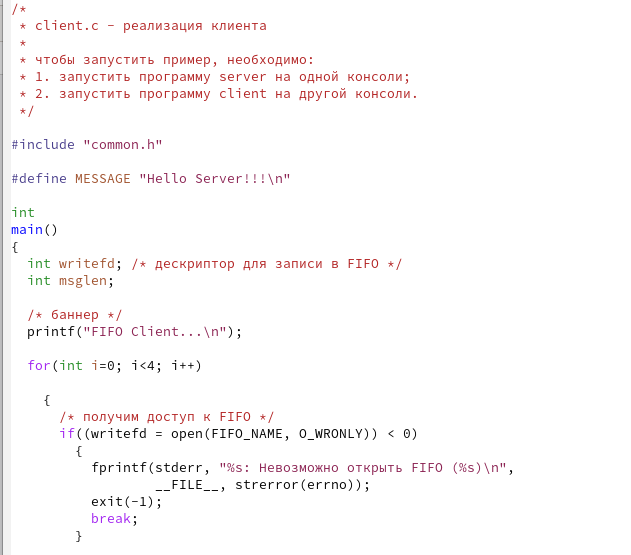
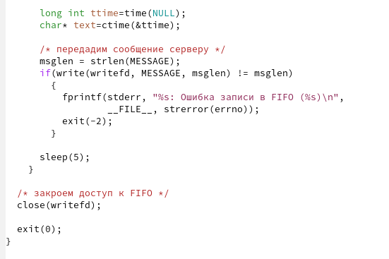
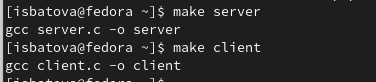
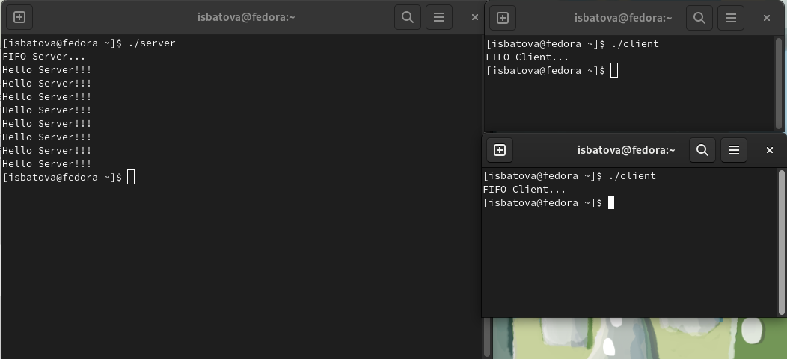
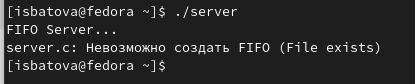

---
## Front matter
title: "Отчёт по лабораторной работе №14"
subtitle: "Дисциплина: Операционные системы"
author: "Батова Ирина Сергеевна, НММбд-01-22"

## Generic otions
lang: ru-RU
toc-title: "Содержание"

## Bibliography
bibliography: bib/cite.bib
csl: pandoc/csl/gost-r-7-0-5-2008-numeric.csl

## Pdf output format
toc: true # Table of contents
toc-depth: 2
lof: true # List of figures
lot: true # List of tables
fontsize: 12pt
linestretch: 1.5
papersize: a4
documentclass: scrreprt
## I18n polyglossia
polyglossia-lang:
  name: russian
  options:
	- spelling=modern
	- babelshorthands=true
polyglossia-otherlangs:
  name: english
## I18n babel
babel-lang: russian
babel-otherlangs: english
## Fonts
mainfont: PT Serif
romanfont: PT Serif
sansfont: PT Sans
monofont: PT Mono
mainfontoptions: Ligatures=TeX
romanfontoptions: Ligatures=TeX
sansfontoptions: Ligatures=TeX,Scale=MatchLowercase
monofontoptions: Scale=MatchLowercase,Scale=0.9
## Biblatex
biblatex: true
biblio-style: "gost-numeric"
biblatexoptions:
  - parentracker=true
  - backend=biber
  - hyperref=auto
  - language=auto
  - autolang=other*
  - citestyle=gost-numeric
## Pandoc-crossref LaTeX customization
figureTitle: "Рис."
tableTitle: "Таблица"
listingTitle: "Листинг"
lofTitle: "Список иллюстраций"
lotTitle: "Список таблиц"
lolTitle: "Листинги"
## Misc options
indent: true
header-includes:
  - \usepackage{indentfirst}
  - \usepackage{float} # keep figures where there are in the text
  - \floatplacement{figure}{H} # keep figures where there are in the text
---

# Цель работы

Приобретение практических навыков работы с именованными каналами.

# Задание

Изучите приведённые в тексте программы server.c и client.c. Взяв данные примеры за образец, напишите аналогичные программы, внеся следующие изменения:

* Работает не 1 клиент, а несколько (например, два).
* Клиенты передают текущее время с некоторой периодичностью (например, раз в пять секунд). Используйте функцию sleep() для приостановки работы клиента.
* Сервер работает не бесконечно, а прекращает работу через некоторое время (например, 30 сек). Используйте функцию clock() для определения времени работы сервера. Что будет в случае, если сервер завершит работу, не закрыв канал?

# Выполнение лабораторной работы

Для начала работы создаем командой 'touch' четыре файла - common.h, server.c, client.c и Makefile (рис. @fig:001).

{#fig:001 width=70%}

Для начала открываем в редакторе файл 'common.h'. Для корректной работы других файлов добавляем к листингу из лабораторной работы два заголовочных файла -unistd.h и time.h (рис. @fig:002).

{#fig:002 width=70%}

Далее открываем файл 'server.c'. Нам нужно, чтобы сервер заканчивал работу через 30 секунд. Для реализации данного действия сначала обозначаем время начало работы (clock_t start=time(NULL)), а затем вносим прочтение данных из FIFO и вывод их на экран под цикл while, который работает только пока разница между текущим временем и временем начала работы меньше 30 секунд (рис. @fig:003, @fig:004).

{#fig:003 width=70%}

{#fig:004 width=70%}

Далее открываем файл 'client.c'. Нам нужно, чтобы клиенты передавали текущее сообщение раз в пять секунд. Для этого добавляем цикл for, который анализирует количество и отправляет сообщения о текущем времени, добавляем команды для генерации этих сообщений (long int ttime=time(NULL) и char* text=ctime(&ttime)), а также команду sleep(5), которая останавливает работу клиента на 5 секунд (рис. @fig:005, @fig:006).

{#fig:005 width=70%}

{#fig:006 width=70%}

В Makefile вводим листинг, соответствующий лабораторной работе, и оставляем без изменений.

Далее вводим команды 'make server' и 'make client' для компиляции исполняемых файлов (рис. @fig:007).

{#fig:007 width=70%}

После этого проверяем работу наших скриптов: открываем три окна терминала, в одном запускаем файл server, в двух других - файл client. Каждый "клиент" вывел по четыре сообщения, а спустя тридцать секунд сервер завершил работу. Скрипты работают корректно (рис. @fig:008).

{#fig:008 width=70%}

Для проверки, что будет в случае, если сервер завершит работу, не закрыв канал, запускаем файл server и завершаем его раньше. При попытке снова запустить сервер, программа выдает ошибку о невозможности создания FIFO, так как уже создан один канал.

{#fig:009 width=70%}

# Выводы

В ходе данной лабораторной работы я приобрела практические навыки работы с именованными каналами.

# Контрольные вопросы

1. Именованные каналы отличаются от неименованных наличием идентификатора канала, который представлен как специальный файл (соответственно имя именованного канала — это имя файла). Поскольку файл находится на локальной файловой системе, данное IPC используется внутри одной системы.

2. Для создания неименованного канала из командной строки используется символ | для объединения нескольких процессов.

3. Для создания именованного канала из командной строки используется две команды - mkhod и mkfifo.

4. Функция языка С, создающая неименованный канал - "int pipe(int fd[2]);". При нормальном выполнении вызова массив, являющийся выходным параметром этого системного вызова, содержит два файловых дескриптора - fd[0], дескриптор для чтения из канала, и fd[1], дескриптор для записи в канал.

5. Функции языка С, создающие именованный канал:

* "int mkfifo(const char *pathname, mode_t mode);". Параметры последовательно отвечают за путь расположения FIFO и режим работы с FIFO.
* "int mkhod(const char *pathname, mode_t mode);". Параметры последовательно отвечают за путь расположения FIFO и режим работы с FIFO.
* "mkhod (namefile, IFIFO | 0666, 0". Параметр "namefile" отвечает за имя канала, цифры - за разрешения доступа на запись и на чтение любому запросившему процесс.

6. В случае прочтения меньшего числа байтов, чем находится в канале, возвращается требуемое число, а остаток сохраняется для следующих прочтений. В случае прочтения большего числа байтов возвращается только доступное число.

7. В случае записи в FIFO меньшего числа байтов, чем позволяет буфер, несколько процессов одновременно записываются в канал и порции данных от этих процессов не перемешиваются. В случае записи в FIFO большего числа байтов, чем позволяет буфер, не гарантируется не перемешивание порции данных от нескольких процессов, а вызов write блокируется до освобождения нужного количества байтов.

8. Количество процессов, которые читают или записывают в канал, не ограничено.

9. Функция write записывает байты count из буфера buffer в файл, связанный с handle. Операции write начинаются с текущей позиции указателя на файл (указатель ассоциирован с заданным файлом). Если файл открыт для добавления, операции выполняются в конец файла. После осуществления операций записи указатель на файл (если он есть) увеличивается на количество действительно записанных байтов. Функция write возвращает число действительно записанных байтов, при этом возвращаемое значение должно быть положительным, но меньше числа count. Единица в вызове это функции в server.c означает идентификатор стандартного потока вывода.

10. Функция strerror интерпретирует номер ошибки, передаваемой в функцию в качестве аргумента errornum, в текстовое сообщение (строку). Ошибки возникают при вызове функций стандартных Си-библиотек. Возвращенный указатель ссылается на статическую строку с ошибкой, которая не должна быть изменена программой. Дальнейшие вызовы функции strerror перезапишут содержание этой строки. Интерпретированные сообщения об ошибках могут различаться в зависимости от платформы и компилятора.

