---
## Front matter
lang: ru-RU
title: Отчёт по индивидуальному проекту. Этап 1
subtitle: Дисциплина "Операционные системы"
author:
  - Батова Ирина Сергеевна, НММбд-01-22
institute:
  - Российский университет дружбы народов, Москва, Россия
date: 23 февраля 2023

## i18n babel
babel-lang: russian
babel-otherlangs: english

## Formatting pdf
toc: false
toc-title: Содержание
slide_level: 2
aspectratio: 169
section-titles: true
theme: metropolis
header-includes:
 - \metroset{progressbar=frametitle,sectionpage=progressbar,numbering=fraction}
 - '\makeatletter'
 - '\beamer@ignorenonframefalse'
 - '\makeatother'
---

# Вводная часть

## Цель работы

Целью первого этапа индивидуального проекта является размещение на Github pages заготовки для персонального сайта.

## Задание

- Установить необходимое программное обеспечение.
- Скачать шаблон темы сайта.
- Разместить его на хостинге git.
- Установить параметр для URLs сайта.
- Разместить заготовку сайта на Github pages.

# Основная часть

## Скачивание hugo go

- Для начала работы устанавливаем go hugo

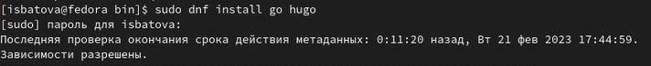

## Создание репозитория blog

- В ТУИС берем ссылку на шаблон репозитория, открываем эту ссылку в браузере и генерируем репозиторий по этому шаблону

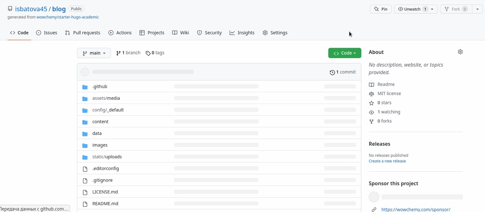

## Клонирование репозитория blog 

- Открываем терминал, переходим в каталог 'work' и клонируем туда данный репозиторий 

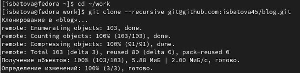

## Удаление каталога public

- После команды 'hugo' удаляем каталог 'public' через mc

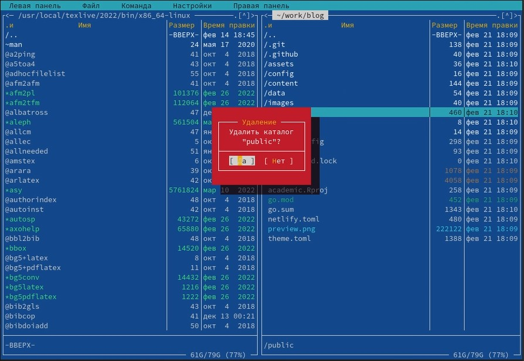

## Генерирование ссылки на сайт

- В результате выполнения команды 'hugo server' получаем ссылку на наш сайт, которая работает только на локальном устройстве

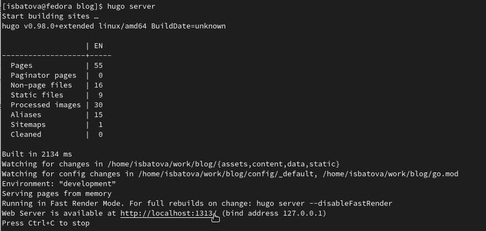

## Сайт на локальном устройстве

- Удаляем в файле '_index.md' первый блок и получаем сайт без синего поля

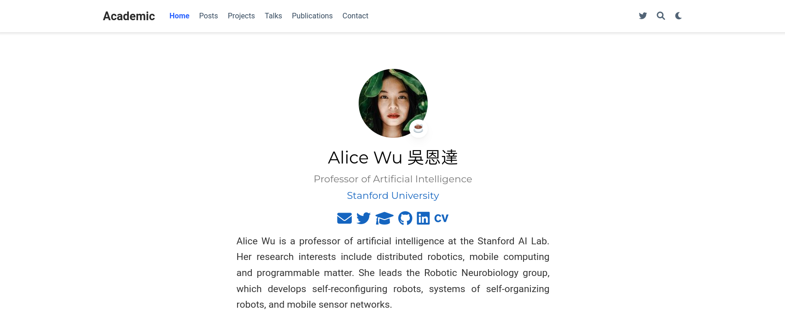

## Создание нового репозитория

- Создаем новый репозиторий на Github

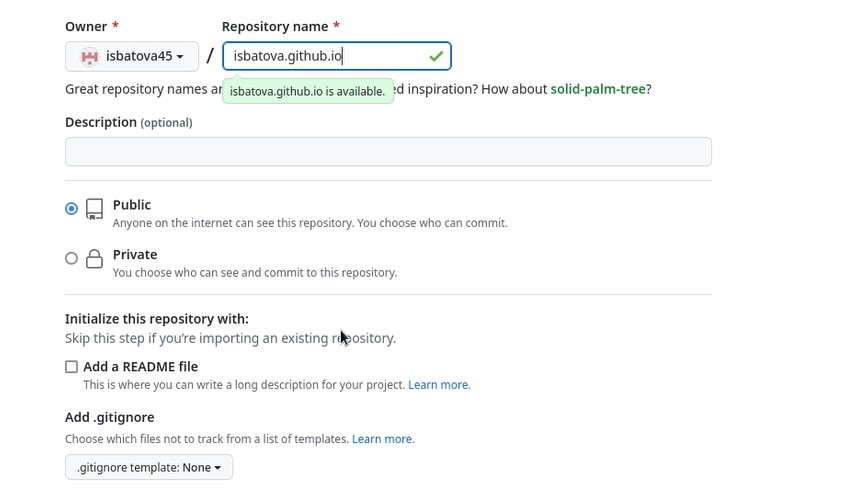

## Клонирование нового репозитория

- Открываем терминал, переходим в каталог 'work' и клонируем туда новый репозиторий 

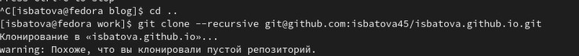

## Создание главной ветки

- Так как репозиторий пустой, создаем в нем главную ветку 

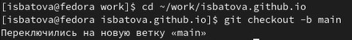

## Выполнение команды 'git submodule add'

- Вводим команду 'git submodule add -b main (ссылка на репозиторий) public'. Команда нам показывает, что 'public' находится в файле .gitignore, то есть игнорируется при выполнении команды

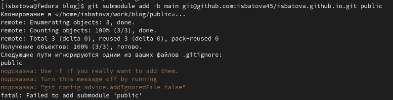

## Выполнение команды 'git submodule add'

- Для исправления ошибки комментируем 'public' в файле '.gitignore' и вновь вводим команду

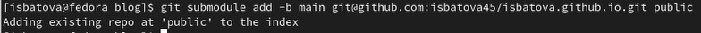

## Команда 'hugo'

- Вводим команду 'hugo'

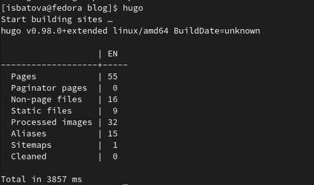

## Отправление изменений в репозиторий

- Далее отправляем изменения в репозиторий, заходим в браузер и проверяем, что все выполнено корректно 

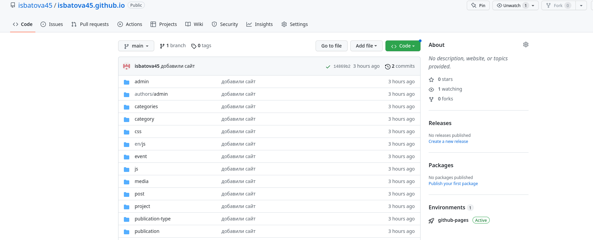

## Сайт создан

- Копируем ссылку на наш сайт и проверяем корректность работы

# Вывод

## Вывод

В ходе выполнения данного этапа индивидуального проекта я разместила на Github pages заготовки для персонального сайта.
