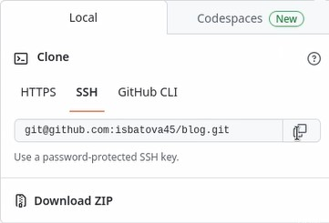

---
## Front matter
title: "Отчёт по индивидуальному проекту. Этап 1"
subtitle: "Дисциплина: Операционные системы"
author: "Батова Ирина Сергеевна, НММбд-01-22"

## Generic otions
lang: ru-RU
toc-title: "Содержание"

## Bibliography
bibliography: bib/cite.bib
csl: pandoc/csl/gost-r-7-0-5-2008-numeric.csl

## Pdf output format
toc: true # Table of contents
toc-depth: 2
lof: true # List of figures
lot: true # List of tables
fontsize: 12pt
linestretch: 1.5
papersize: a4
documentclass: scrreprt
## I18n polyglossia
polyglossia-lang:
  name: russian
  options:
	- spelling=modern
	- babelshorthands=true
polyglossia-otherlangs:
  name: english
## I18n babel
babel-lang: russian
babel-otherlangs: english
## Fonts
mainfont: PT Serif
romanfont: PT Serif
sansfont: PT Sans
monofont: PT Mono
mainfontoptions: Ligatures=TeX
romanfontoptions: Ligatures=TeX
sansfontoptions: Ligatures=TeX,Scale=MatchLowercase
monofontoptions: Scale=MatchLowercase,Scale=0.9
## Biblatex
biblatex: true
biblio-style: "gost-numeric"
biblatexoptions:
  - parentracker=true
  - backend=biber
  - hyperref=auto
  - language=auto
  - autolang=other*
  - citestyle=gost-numeric
## Pandoc-crossref LaTeX customization
figureTitle: "Рис."
tableTitle: "Таблица"
listingTitle: "Листинг"
lofTitle: "Список иллюстраций"
lotTitle: "Список таблиц"
lolTitle: "Листинги"
## Misc options
indent: true
header-includes:
  - \usepackage{indentfirst}
  - \usepackage{float} # keep figures where there are in the text
  - \floatplacement{figure}{H} # keep figures where there are in the text
---

# Цель работы

Целью первого этапа индивидуального проекта является размещение на Github pages заготовки для персонального сайта.

# Задание

* Установить необходимое программное обеспечение.
* Скачать шаблон темы сайта.
* Разместить его на хостинге git.
* Установить параметр для URLs сайта.
* Разместить заготовку сайта на Github pages.

# Выполнение работы

Для начала работы устанавливаем go hugo (рис. @fig:001).

{#fig:001 width=70%}

Далее в ТУИС берем ссылку на шаблон репозитория, открываем эту ссылку в браузере и генерируем репозиторий по этому шаблону (рис. @fig:002).

{#fig:002 width=70%}

Назовем этот репозиторий 'blog' (рис. @fig:003). Создаем репозиторий (рис. @fig:004).

{#fig:003 width=70%}

{#fig:004 width=70%}

Далее копируем SSH-ключ созданного репозитория (рис. @fig:005).

{#fig:005 width=70%}

Открываем терминал, переходим в каталог 'work' и клонируем туда данный репозиторий (рис. @fig:006).

{#fig:006 width=70%}

Далее переходим в создавшийся каталог 'blog' вводим команду 'hugo' (рис. @fig:007).

{#fig:007 width=70%}

При проверке содержимого каталога командой 'ls -l' видим, что у нас появился каталог 'public' (рис. @fig:008).

{#fig:008 width=70%}

Нам необходимо удалить данный каталог для дальнейшей работы. Для этого переходим в mc и удаляем там каталог 'public' (рис. @fig:009).

{#fig:009 width=70%}

Далее возвращаемся в терминал и вводим команду 'hugo server' (рис. @fig:0010). В результате выполнения данной команды мы получаем ссылку на наш сайт, которая работает только на локальном устройстве.

{#fig:0010 width=70%}

Копируем ссылку и вставляем ее в браузер (рис. @fig:0011). 

{#fig:0011 width=70%}

Следующим шагом нам необходимо удалить синее поле наверху сайта. Для этого переходим в каталог work -> blog -> content, открываем файл с названием '_index.md' и удаляем первый блок, располагающийся после слова 'sections' (рис. @fig:0012). 

{#fig:0012 width=70%}

Далее возвращаемся на сайт и проверяем - синее поле исчезло (рис. @fig:0013).

{#fig:0013 width=70%}

Остаемся в браузере и заходим на github. Создаем новый репозиторий (рис. @fig:0014).

{#fig:0014 width=70%}

После этого возвращаемся в терминал, переходим на ступень выше (в каталог 'work') и клонируем туда только что созданный репозиторий (рис. @fig:0015).

{#fig:0015 width=70%}

Переходим в создавшийся после клонирования каталог. Так как репозиторий пустой, создаем в нем главную ветку (рис. @fig:0016).

{#fig:0016 width=70%}

Следующим шагом создаем пустой файл README.md, проверяем, что он создался командой 'ls -l' (рис. @fig:0017).

{#fig:0017 width=70%}

Следующим шагом отправляем изменения в репозиторий, используя команды 'git add .', 'git commit -am' и 'git push origin main' (рис. @fig:0018).

{#fig:0018 width=70%}

Через браузер проверяем, что наш файл был опубликован.

Далее возвращаемся в терминал и вводим команду 'git submodule add -b main (ссылка на репозиторий) public'. Команда нам показывает, что 'public' находится в файле .gitignore, то есть игнорируется при выполнении команды (рис. @fig:0019).

{#fig:0019 width=70%}

Для дальнейшей корректной работы открываем с помощью mc файл .gitignore и символом '#' комментируем 'public' (рис. @fig:0020).

{#fig:0020 width=70%}

Вновь вводим команду 'git submodule add -b main (ссылка на репозиторий) public'. В этот раз она выполнена успешно (рис. @fig:0021).

{#fig:0021 width=70%}

Следующим шагом вводим команду 'hugo' (рис. @fig:0022).

{#fig:0022 width=70%}

Переходим в каталог 'public' и вводим команду 'git remote -v'. Видим, что каталог подключен к правильному репозиторию, то есть все предыдущие действия были выполнены корректно (рис. @fig:0023).

{#fig:0023 width=70%}

Далее отправляем изменения в репозиторий, используя команды 'git add .', 'git commit -am' и 'git push origin main'. Заходим в браузер и проверяем, что все выполнено корректно (рис. @fig:0024).

{#fig:0024 width=70%}

Последним шагом копируем ссылку на наш сайт и вставляем в новую вкладку. Сайт создан (рис. @fig:0025).

{#fig:0025 width=70%}

# Выводы

В ходе выполнения данного этапа индивидуального проекта я разместила на Github pages заготовки для персонального сайта.

