---
## Front matter
lang: ru-RU
title: Отчёт по индивидуальному проекту. Этап 2
subtitle: Дисциплина "Операционные системы"
author:
   - Батова Ирина Сергеевна, НММбд-01-22
institute:
  - Российский университет дружбы народов, Москва, Россия
date: 17 марта 2023

## i18n babel
babel-lang: russian
babel-otherlangs: english

## Formatting pdf
toc: false
toc-title: Содержание
slide_level: 2
aspectratio: 169
section-titles: true
theme: metropolis
header-includes:
 - \metroset{progressbar=frametitle,sectionpage=progressbar,numbering=fraction}
 - '\makeatletter'
 - '\beamer@ignorenonframefalse'
 - '\makeatother'
---

# Вводная часть

## Цель работы

Целью второго этапа индивидуального проекта является добавление к сайту данных о себе.

## Задание

- Разместить фотографию владельца сайта.
- Разместить краткое описание владельца сайта (Biography).
- Добавить информацию об интересах (Interests).
- Добавить информацию от образовании (Education).
- Сделать пост по прошедшей неделе.
- Добавить пост на тему по выбору: управление версиями Git или непрерывная интеграция и непрерывное развертывание (CI/CD).

# Основная часть

## Размещение фотографии

- Сохраняем свое фото с именем 'avatar' и помещаем его в папку ~/work/blog/content/authors/admin

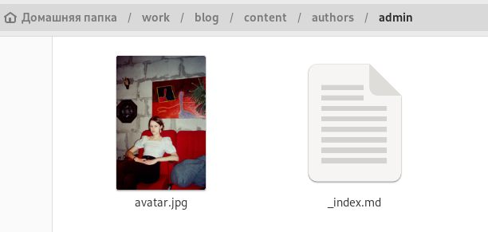

## Размещение имени

- Открываем в этой папке файл '_index.md' и вводим наши имя и фамилию

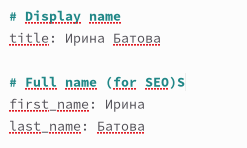

## Размещение должности и названия университета

- Редактируем свою должность и название университета 

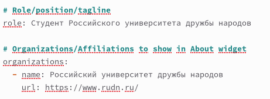

## Размещение информации об интересах

- Вводим свои интересы и короткое био 

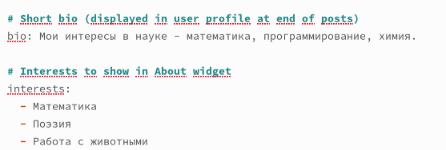

## Размещение информации об образовании

- Указываем образование 

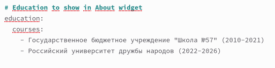

## Размещение информации о владельце сайта 

- В конце файла вводим более подробное описание владельца сайта 

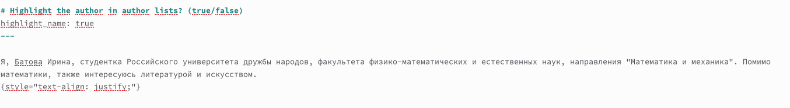

## Создание каталогов для размещения постов

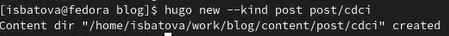

## Размещение поста о прошедшей неделе

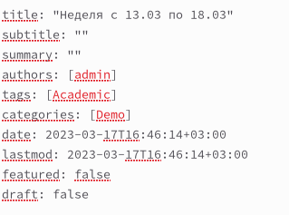

## Размещение поста о прошедшей неделе

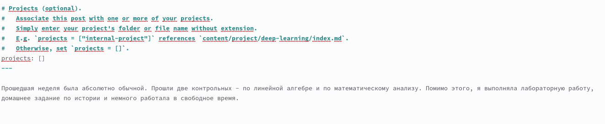

## Размещение поста о непрерывной интеграция и непрерывное развертывание (CI/CD)

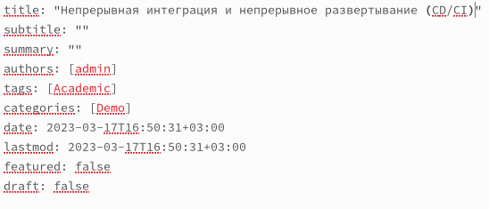

## Размещение поста о непрерывной интеграция и непрерывное развертывание (CI/CD)

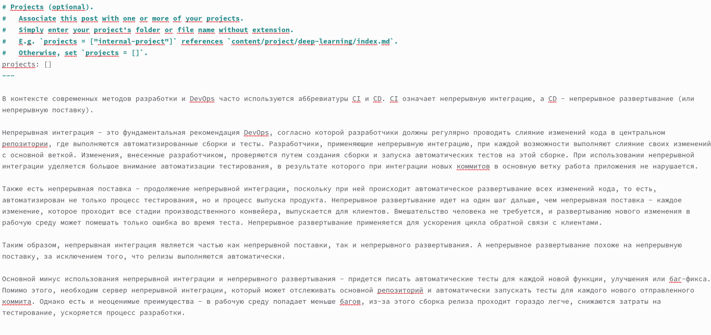

# Вывод

## Вывод

В ходе выполнения второго этапа индивидуального проекта я добавила к сайту данные о себе.

