---
## Front matter
title: "Отчёт по индивидуальному проекту. Этап 2"
subtitle: "Дисциплина: Операционные системы"
author: "Батова Ирина Сергеевна, НММбд-01-22"

## Generic otions
lang: ru-RU
toc-title: "Содержание"

## Bibliography
bibliography: bib/cite.bib
csl: pandoc/csl/gost-r-7-0-5-2008-numeric.csl

## Pdf output format
toc: true # Table of contents
toc-depth: 2
lof: true # List of figures
lot: true # List of tables
fontsize: 12pt
linestretch: 1.5
papersize: a4
documentclass: scrreprt
## I18n polyglossia
polyglossia-lang:
  name: russian
  options:
	- spelling=modern
	- babelshorthands=true
polyglossia-otherlangs:
  name: english
## I18n babel
babel-lang: russian
babel-otherlangs: english
## Fonts
mainfont: PT Serif
romanfont: PT Serif
sansfont: PT Sans
monofont: PT Mono
mainfontoptions: Ligatures=TeX
romanfontoptions: Ligatures=TeX
sansfontoptions: Ligatures=TeX,Scale=MatchLowercase
monofontoptions: Scale=MatchLowercase,Scale=0.9
## Biblatex
biblatex: true
biblio-style: "gost-numeric"
biblatexoptions:
  - parentracker=true
  - backend=biber
  - hyperref=auto
  - language=auto
  - autolang=other*
  - citestyle=gost-numeric
## Pandoc-crossref LaTeX customization
figureTitle: "Рис."
tableTitle: "Таблица"
listingTitle: "Листинг"
lofTitle: "Список иллюстраций"
lotTitle: "Список таблиц"
lolTitle: "Листинги"
## Misc options
indent: true
header-includes:
  - \usepackage{indentfirst}
  - \usepackage{float} # keep figures where there are in the text
  - \floatplacement{figure}{H} # keep figures where there are in the text
---

# Цель работы

Целью второго этапа индивидуального проекта является добавление к сайту данных о себе.

# Задание

1. Список добавляемых данных:
* Разместить фотографию владельца сайта.
* Разместить краткое описание владельца сайта (Biography).
* Добавить информацию об интересах (Interests).
* Добавить информацию от образовании (Education).
2. Сделать пост по прошедшей неделе.
3. Добавить пост на тему по выбору:
* Управление версиями. Git.
* Непрерывная интеграция и непрерывное развертывание (CI/CD).

# Выполнение  работы

1. Сначала нам нужно разместить свою фотографию на сайте. Для этого сохраняем свое фото с именем 'avatar' и помещаем его в папку ~/work/blog/content/authors/admin (рис. @fig:001).

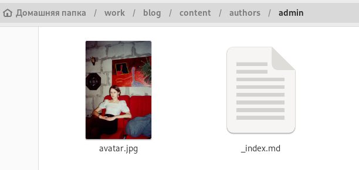{#fig:001 width=70%}

Далее открываем в этой папке файл '_index.md' и вводим наши имя и фамилию (рис. @fig:002).

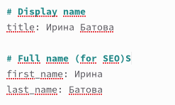{#fig:002 width=70%}

Редактируем свою должность и название университета (рис. @fig:003).

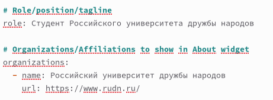{#fig:003 width=70%}

Вводим свои интересы и короткое био (рис. @fig:004).

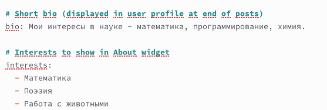{#fig:004 width=70%}

Указываем образование (рис. @fig:005).

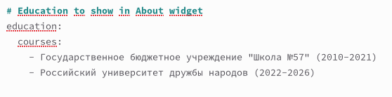{#fig:005 width=70%}

В конце файла вводим более подробное описание владельца сайта (рис. @fig:006).

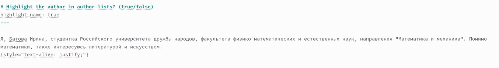{#fig:006 width=70%}

2. Далее нам нужно сделать пост. Вводим в терминал команду 'hugo new --kind post post/lastweek' для создания поста о прошедшей недели (рис. @fig:007) и 'hugo new --kind post post/cdci' для создания поста о непрерывной интеграции и непрерывном развертывании (рис. @fig:008).

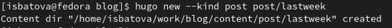{#fig:007 width=70%}

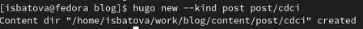{#fig:008 width=70%}

Переходим в каталог ~/work/blog/content/post и видим, что были созданы соответствующие каталоги (рис. @fig:009).

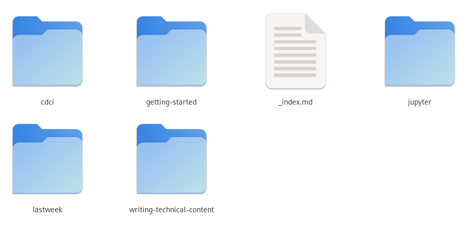{#fig:009 width=70%}

Для начала заходим в каталог 'lastweek' и открываем файл 'index.md'. Редактируем название, а также автора (admin), тэги (Academic) и категории (Demo) (рис. @fig:0010).

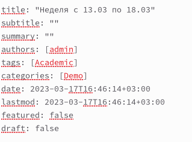{#fig:0010 width=70%}

Далее в конец файла вводим текст поста (рис. @fig:0011).

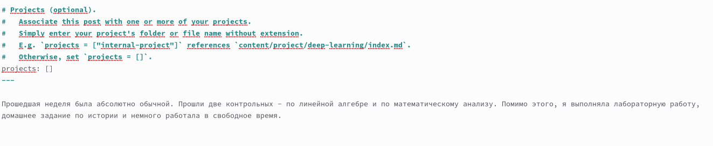{#fig:0011 width=70%}

3. Так как нужный каталог 'cdci' был создан (в предыдущем пункте), заходим в каталог 'cdci' и открываем файл 'index.md'. Аналогично редактируем название, а также автора (admin), тэги (Academic) и категории (Demo) (рис. @fig:0012).

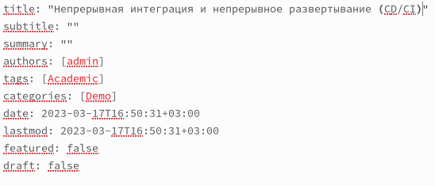{#fig:0012 width=70%}

Далее также в конец файла вводим текст поста (рис. @fig:0013).

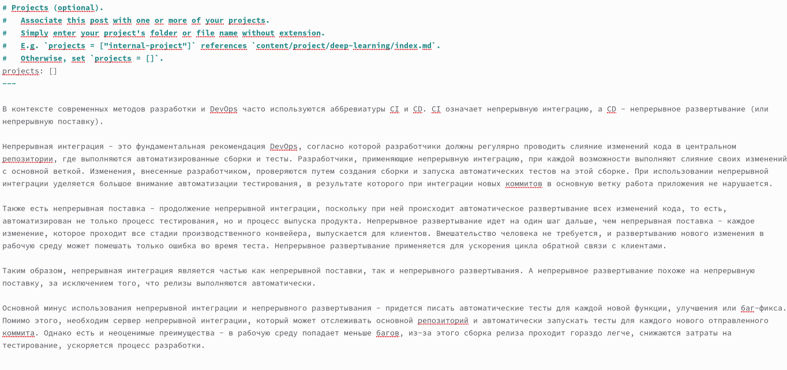{#fig:0013 width=70%}

После всех изменений вводим в каталоге blog 'hugo', после этого вводим последовательность команд 'git add .', 'git commit -am', 'git push' сначала в каталоге ~/work/blog, а потом в каталоге ~/work/blog/public. Заходим на наш сайт и проверяем, что все изменения были сохранены (рис. @fig:0014, @fig:0015).

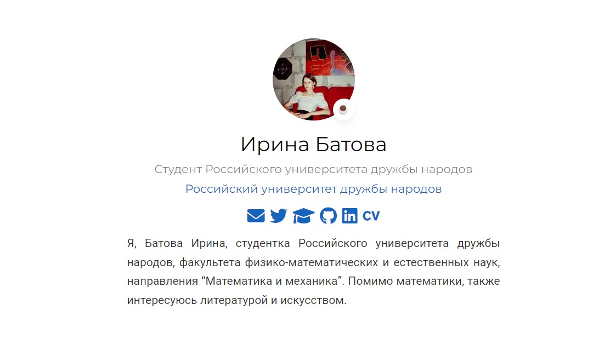{#fig:0014 width=70%}

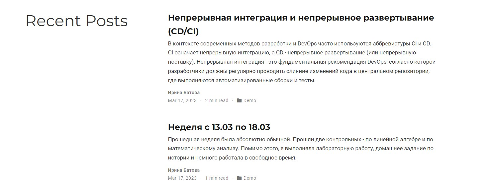{#fig:0015 width=70%}

# Выводы

В ходе выполнения второго этапа индивидуального проекта я добавила к сайту данные о себе.

