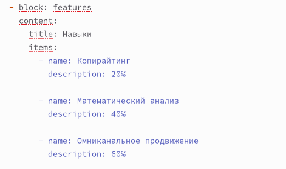
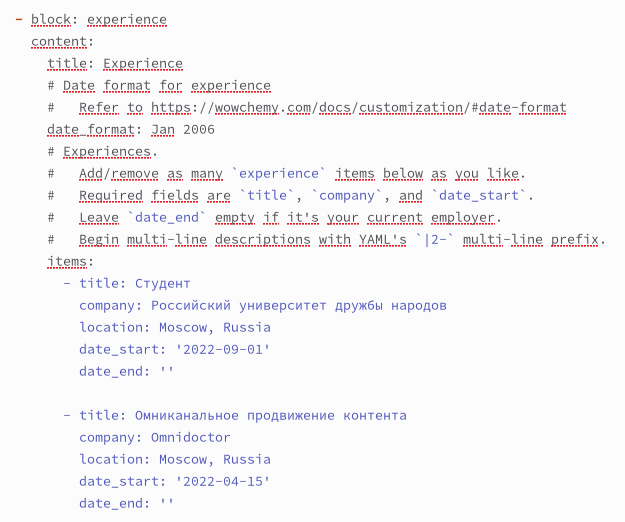
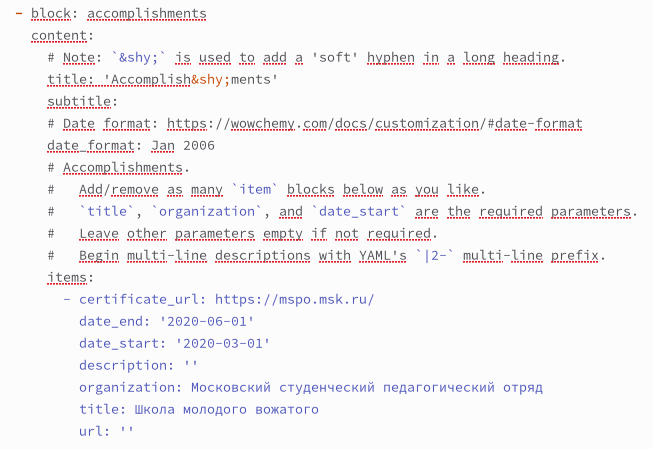
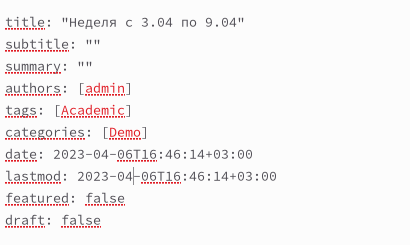
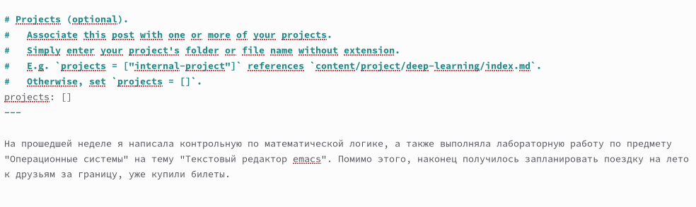
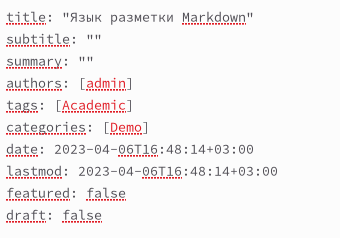
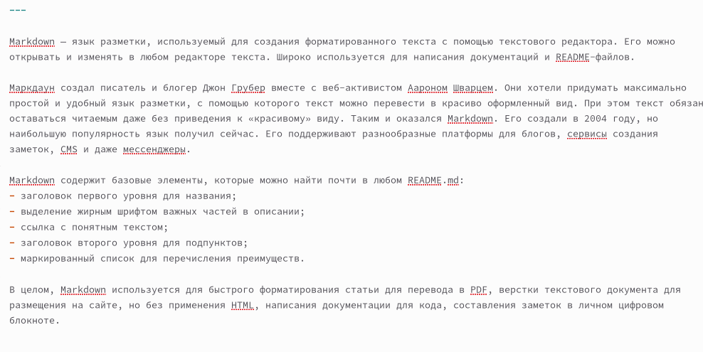

---
## Front matter
lang: ru-RU
title: Отчёт по индивидуальному проекту. Этап 3
subtitle: Дисциплина "Операционные системы"
author:
  - Батова Ирина Сергеевна, НММбд-01-22
institute:
  - Российский университет дружбы народов, Москва, Россия
date: 06 апреля 2023

## i18n babel
babel-lang: russian
babel-otherlangs: english

## Formatting pdf
toc: false
toc-title: Содержание
slide_level: 2
aspectratio: 169
section-titles: true
theme: metropolis
header-includes:
 - \metroset{progressbar=frametitle,sectionpage=progressbar,numbering=fraction}
 - '\makeatletter'
 - '\beamer@ignorenonframefalse'
 - '\makeatother'
---

# Вводная часть

## Цель работы

Целью третьего этапа индивидуального проекта является добавление к сайту навыков, опыта и достижений. 

## Задание

- Добавить информацию о навыках (Skills).
- Добавить информацию об опыте (Experience).
- Добавить информацию о достижениях (Accomplishments).
- Сделать пост по прошедшей неделе.
- Добавить пост на тему по выбору: легковесные языки разметки или языки разметки (LaTeX) или язык разметки Markdown.

# Основная часть

## Размещение навыков

- Переходим в каталог '~/work/blog/content' и открываем файл '_index.md'
- Добавляем информацию о навыках в блоке 'features'

## Размещение опыта

- Добавляем информацию об опыте в блоке 'experience'

## Размещение достижений

- Добавляем информацию о достижениях в блоке 'accomplishments' 

## Размещение поста о прошедшей неделе

- Редактируем название, автора (admin), тэги (Academic) и категории (Demo) 

## Размещение поста о прошедшей неделе

- В конец файла вводим текст поста

## Размещение поста о языке разметки Markdown

- Редактируем название, автора (admin), тэги (Academic) и категории (Demo) 

## Размещение поста о языке разметки Markdown

- В конец файла вводим текст поста

# Вывод

## Вывод

В ходе третьего этапа индивидуального проекта я добавила к сайту навыки, опыт и достижения. 

