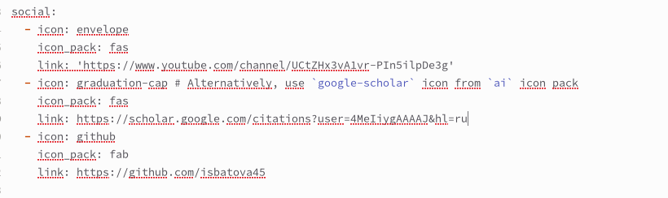
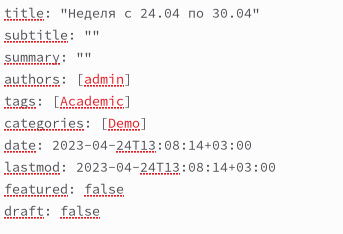
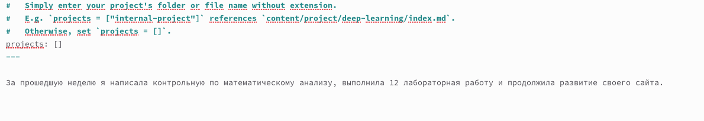
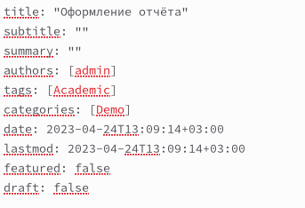
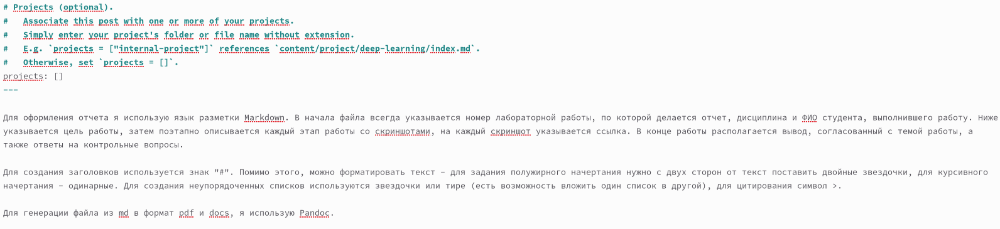

---
## Front matter
lang: ru-RU
title: Отчёт по индивидуальному проекту. Этап 4
subtitle: Дисциплина "Операционные системы"
author:
  - Батова Ирина Сергеевна, НММбд-01-22
institute:
  - Российский университет дружбы народов, Москва, Россия
  
date: 24 апреля 2023

## i18n babel
babel-lang: russian
babel-otherlangs: english

## Formatting pdf
toc: false
toc-title: Содержание
slide_level: 2
aspectratio: 169
section-titles: true
theme: metropolis
header-includes:
 - \metroset{progressbar=frametitle,sectionpage=progressbar,numbering=fraction}
 - '\makeatletter'
 - '\beamer@ignorenonframefalse'
 - '\makeatother'
---

# Вводная часть

## Цель работы

Целью четвертого этапа индивидуального проекта является добавление к сайту ссылок на научные и библиометрические ресурсы, а также публикация новых постов.

## Задание

- Добавить к сайту ссылки на научные и библиометрические ресурсы.

- Сделать пост по прошедшей неделе.
    
- Добавить пост на тему по выбору:

  * Оформление отчёта.
  * Создание презентаций.
  * Работа с библиографией.

# Основная часть

## Размещение ссылок на ресурсы

- Переходим в каталог '~/work/blog/content/authors/admin' и открываем файл '_index.md'
- Переходим к блоку 'social' и размещаем там ссылки на свои ресурсы

## Размещение поста о прошедшей неделе

- Редактируем название, автора (admin), тэги (Academic) и категории (Demo) 

## Размещение поста о прошедшей неделе

- В конец файла вводим текст поста

## Размещение поста об оформлении отчета

- Редактируем название, автора (admin), тэги (Academic) и категории (Demo) 

## Размещение поста об оформлении отчета

- В конец файла вводим текст поста

# Вывод

## Вывод

В ходе четвертого этапа индивидуального проекта я добавила к сайту ссылки на научные и библиометрические ресурсы, а также опубликовала новые посты.
