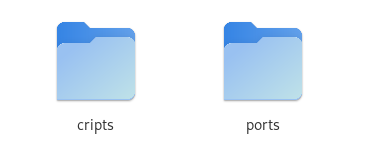
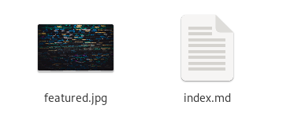
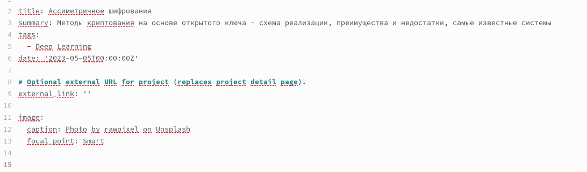
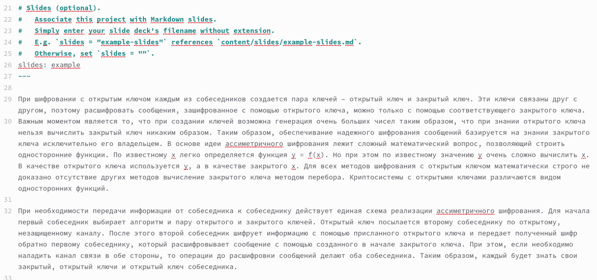
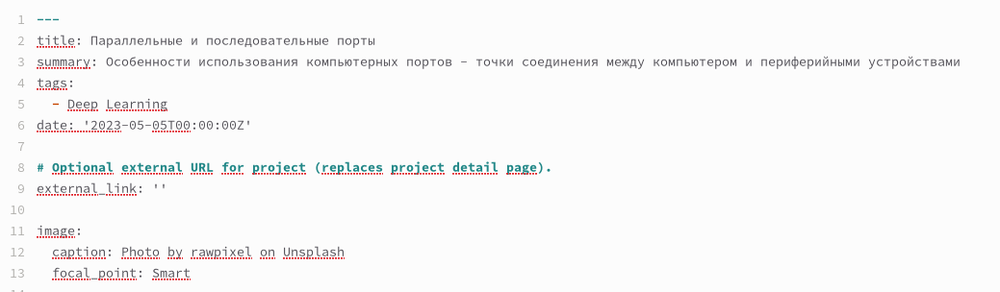
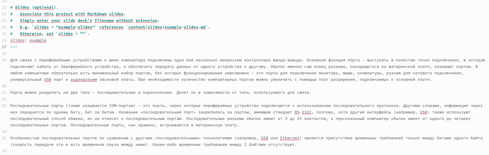
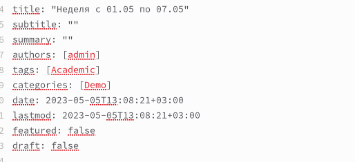
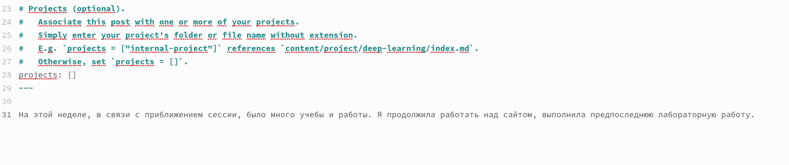
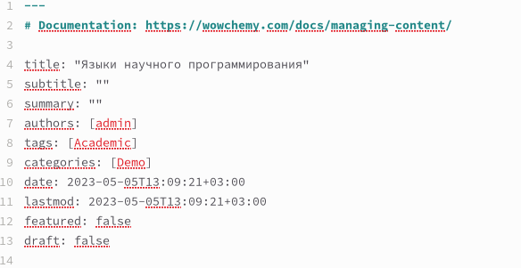
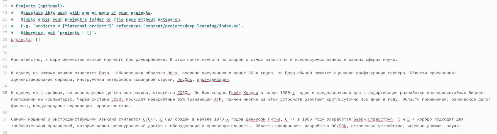

---
## Front matter
lang: ru-RU
title: Отчёт по индивидуальному проекту. Этап 5
subtitle: Дисциплина "Операционные системы"
author:
  - Батова Ирина Сергеевна, НММбд-01-22
institute:
  - Российский университет дружбы народов, Москва, Россия

date: 06 мая 2023

## i18n babel
babel-lang: russian
babel-otherlangs: english

## Formatting pdf
toc: false
toc-title: Содержание
slide_level: 2
aspectratio: 169
section-titles: true
theme: metropolis
header-includes:
 - \metroset{progressbar=frametitle,sectionpage=progressbar,numbering=fraction}
 - '\makeatletter'
 - '\beamer@ignorenonframefalse'
 - '\makeatother'
---

# Вводная часть

## Цель работы

Целью пятого этапа индивидуального проекта является добавление к сайту всех остальных элементов, а также публикация новых постов.

## Задание

- Сделать записи для персональных проектов

- Сделать пост по прошедшей неделе

- Добавить пост на тему "Языки научного программирования"

# Основная часть

## Создание каталогов для проектов

- Переходим в каталог '~/work/blog/content/project'
- Создаем по каталогу для каждого из проектов

## Первый проект

- Переходим в каталог 'cripts'
- Заменяем в этом каталоге картинку на подходящую по тематике

## Первый проект

- В начале файла редактируем название проекта, краткое содержание и дату

## Первый проект

- В конец файла вводим текст проекта

## Второй проект

- Переходим в каталог 'ports'
- Заменяем в этом каталоге картинку на подходящую по тематике

## Второй проект

- В начале файла редактируем название проекта, краткое содержание и дату

## Второй проект

- В конец файла вводим текст проекта

## Размещение поста о прошедшей неделе

- Редактируем название и дату 

## Размещение поста о прошедшей неделе

- В конец файла вводим текст поста

## Размещение поста о языках научного программирования

- Редактируем название и дату 

## Размещение поста о языках научного программирования

- В конец файла вводим текст поста

# Вывод

## Вывод

В ходе пятого этапа индивидуального проекта я добавила к сайту все остальные элементы, а также опубликовала новые посты.

