---
## Front matter
title: "Отчёт по индивидуальному проекту. Этап 5" 
subtitle: "Дисциплина: Операционные системы"
author: "Батова Ирина Сергеевна, НММбд-01-22"

## Generic otions
lang: ru-RU
toc-title: "Содержание"

## Bibliography
bibliography: bib/cite.bib
csl: pandoc/csl/gost-r-7-0-5-2008-numeric.csl

## Pdf output format
toc: true # Table of contents
toc-depth: 2
lof: true # List of figures
lot: true # List of tables
fontsize: 12pt
linestretch: 1.5
papersize: a4
documentclass: scrreprt
## I18n polyglossia
polyglossia-lang:
  name: russian
  options:
	- spelling=modern
	- babelshorthands=true
polyglossia-otherlangs:
  name: english
## I18n babel
babel-lang: russian
babel-otherlangs: english
## Fonts
mainfont: PT Serif
romanfont: PT Serif
sansfont: PT Sans
monofont: PT Mono
mainfontoptions: Ligatures=TeX
romanfontoptions: Ligatures=TeX
sansfontoptions: Ligatures=TeX,Scale=MatchLowercase
monofontoptions: Scale=MatchLowercase,Scale=0.9
## Biblatex
biblatex: true
biblio-style: "gost-numeric"
biblatexoptions:
  - parentracker=true
  - backend=biber
  - hyperref=auto
  - language=auto
  - autolang=other*
  - citestyle=gost-numeric
## Pandoc-crossref LaTeX customization
figureTitle: "Рис."
tableTitle: "Таблица"
listingTitle: "Листинг"
lofTitle: "Список иллюстраций"
lotTitle: "Список таблиц"
lolTitle: "Листинги"
## Misc options
indent: true
header-includes:
  - \usepackage{indentfirst}
  - \usepackage{float} # keep figures where there are in the text
  - \floatplacement{figure}{H} # keep figures where there are in the text
---

# Цель работы

Целью пятого этапа индивидуального проекта является добавление к сайту всех остальных элементов, а также публикация новых постов.

# Задание

1. Сделать записи для персональных проектов
2. Сделать пост по прошедшей неделе
3. Добавить пост на тему "Языки научного программирования"

# Выполнение лабораторной работы

1. Для отслеживания изменений на сайте на локальном компьютере переходим в каталог '~/work/blog' и вводим командой 'hugo server' для получения ссылки на локальный сайт, которая позволит нам отслеживать изменения на сайте. 

После этого переходим в каталог '~/work/blog/content/project'. Я собираюсь разместить в качестве проектов два реферата, которые я писала в первом и втором семестре для предмета "Компьютерные науки и технологии программирования", поэтому создаю два каталога (рис. @fig:001).

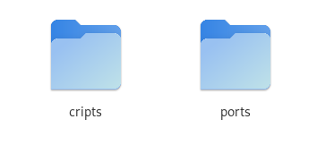{#fig:001 width=70%}

Для начала переходим в каталог 'cripts'. Заменяем в этом каталоге картинку на подходящую по тематике (рис. @fig:002), после чего открываем файл 'index.md'.

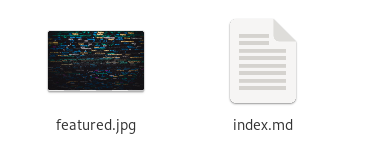{#fig:002 width=70%}

В начале файла редактируем название проекта, краткое содержание и дату (рис. @fig:003).

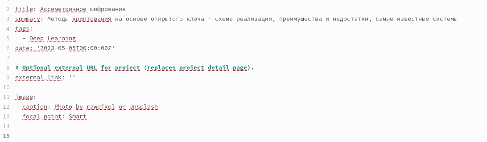{#fig:003 width=70%}

В конец файла вводим текст проекта (рис. @fig:004).

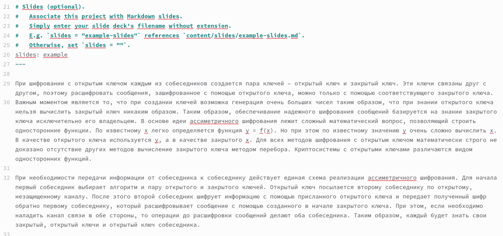{#fig:004 width=70%}

Далее переходим в каталог 'ports'. Заменяем в этом каталоге картинку на подходящую по тематике (рис. @fig:005), после чего открываем файл 'index.md'.

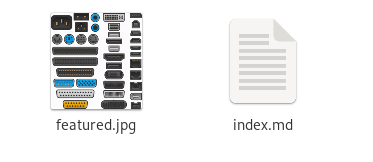{#fig:005 width=70%}

В начале файла редактируем название проекта, краткое содержание и дату (рис. @fig:006).

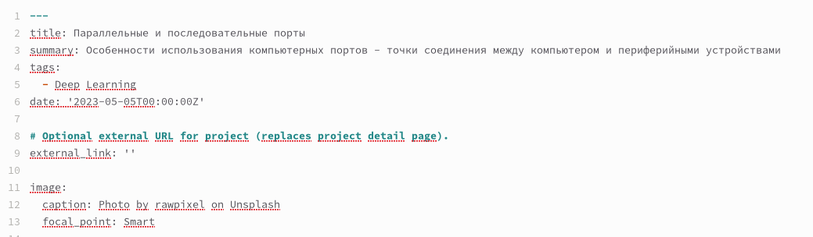{#fig:006 width=70%}

В конец файла вводим текст проекта (рис. @fig:007).

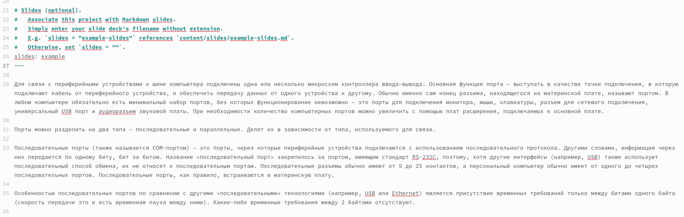{#fig:007 width=70%}

2. Для создания поста о прошедшей неделе переходим в каталог '~/work/blog/content/post' и создаем в нем каталог 'lastweek4'. Открываем каталог и в нем открываем файл 'index.md'.

Редактируем название и дату (рис. @fig:008).

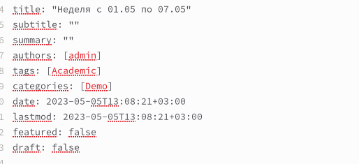{#fig:008 width=70%}

В конец файла вводим текст поста (рис. @fig:009).

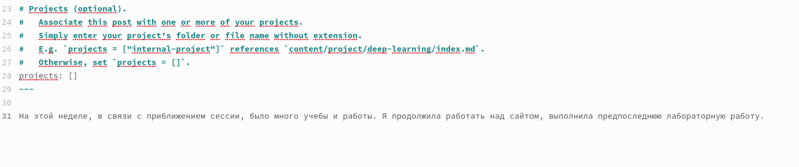{#fig:009 width=70%}

3. Для создания поста о языках научного программирования переходим в каталог '~/work/blog/content/post' и создаем в нем каталог 'languages'. Открываем каталог и в нем открываем файл 'index.md'.

Редактируем название и дату (рис. @fig:0010).

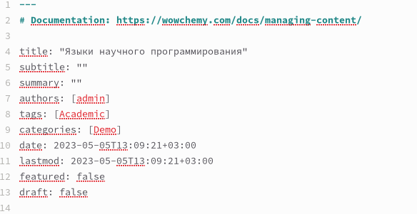{#fig:0010 width=70%}

В конец файла вводим текст поста (рис. @fig:0011).

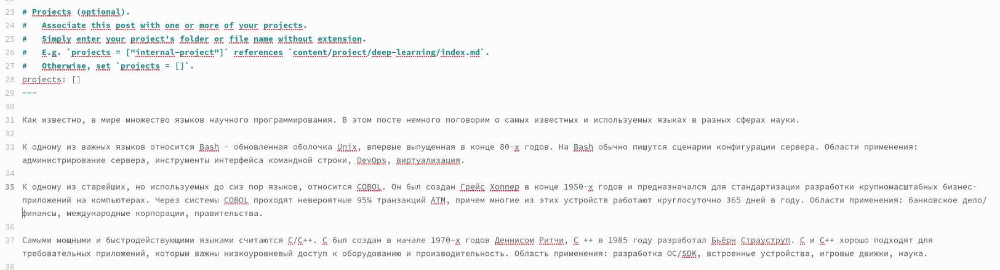{#fig:0011 width=70%}

После всех изменений вводим в каталоге blog 'hugo', после этого вводим последовательность команд 'git add .', 'git commit -am', 'git push' сначала в каталоге ~/work/blog, а потом в каталоге ~/work/blog/public. 

# Выводы

В ходе пятого этапа индивидуального проекта я добавила к сайту все остальные элементы, а также опубликовала новые посты.
