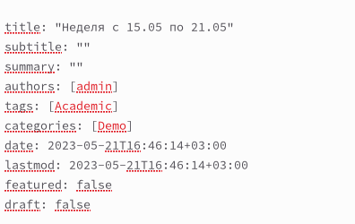

---
## Front matter
lang: ru-RU
title: Отчёт по индивидуальному проекту. Этап 6
subtitle: Дисциплина "Операционные системы"
author:
  - Батова Ирина Сергеевна, НММбд-01-22
institute:
  - Российский университет дружбы народов, Москва, Россия

date: 24 мая 2023

## i18n babel
babel-lang: russian
babel-otherlangs: english

## Formatting pdf
toc: false
toc-title: Содержание
slide_level: 2
aspectratio: 169
section-titles: true
theme: metropolis
header-includes:
 - \metroset{progressbar=frametitle,sectionpage=progressbar,numbering=fraction}
 - '\makeatletter'
 - '\beamer@ignorenonframefalse'
 - '\makeatother'
---

# Вводная часть

## Цель работы

Целью шестого этапа индивидуального проекта является размещение двуязычного сайта на Github.

## Задание

- Сделать поддержку английского и русского языков.

- Разместить элементы сайта на обоих языках.

- Разместить контент на обоих языках.

- Сделать пост по прошедшей неделе.

- Добавить пост на тему по выбору (на двух языках).

# Основная часть

## Поддержка сайта на двух языках

- В каталоге ~/work/blog/content создаем два каталога: 'en' будет содержать все элементы сайта на английском языке, а 'ru' на русском 

## Поддержка сайта на двух языках

- В каталоге ~/work/blog/config/_default открываем файл 'languages.yaml' и раскомментируем там необходимые строки так, чтобы у нас выполнялось поддержка двух языков на сайте

## Перевод основных элементов сайта

- Вводим на английском имя, фамилию, должность и название университета 

## Перевод основных элементов сайта

- Вводим на английском свои интересы, короткое био и указываем образование

## Перевод основных элементов сайта

- Вводим на английском более подробное описание владельца сайта 

## Перевод основных элементов сайта

- Переводим информацию о навыках в блоке 'features', а также переводим название блока 

## Перевод основных элементов сайта

- Переводим информацию об опыте в блоке 'experience', а также переводим название блока 

## Перевод основных элементов сайта

- Переводим информацию о достижениях в блоке 'accomplishments', а также переводим название блока 

## Перевод постов и проектов

- В каталоге ~/work/content/post/en заходим в каталог 'lastweek2' и открываем файл 'index.md'
- Редактируем название, а в конец файла вводим текст поста на английском
- Аналогично со всеми остальными постами и проектами

## Размещение поста о прошедшей неделе

- Редактируем название и дату 

## Размещение поста о прошедшей неделе

- В конец файла вводим текст поста
- Совершаем аналогичные действия для публикации на английском

## Размещение поста о шифровании

- Редактируем название и дату 

## Размещение поста о шифровании

- В конец файла вводим текст поста
- Совершаем аналогичные действия для публикации на английском

# Вывод

## Вывод

В ходе шестого этапа индивидуального проекта я разместила двуязычный сайт на Github.

