---
## Front matter
title: "Отчёт по индивидуальному проекту. Этап 6"
subtitle: "Дисциплина: Операционные системы"
author: "Батова Ирина Сергеевна, НММбд-01-22"

## Generic otions
lang: ru-RU
toc-title: "Содержание"

## Bibliography
bibliography: bib/cite.bib
csl: pandoc/csl/gost-r-7-0-5-2008-numeric.csl

## Pdf output format
toc: true # Table of contents
toc-depth: 2
lof: true # List of figures
lot: true # List of tables
fontsize: 12pt
linestretch: 1.5
papersize: a4
documentclass: scrreprt
## I18n polyglossia
polyglossia-lang:
  name: russian
  options:
	- spelling=modern
	- babelshorthands=true
polyglossia-otherlangs:
  name: english
## I18n babel
babel-lang: russian
babel-otherlangs: english
## Fonts
mainfont: PT Serif
romanfont: PT Serif
sansfont: PT Sans
monofont: PT Mono
mainfontoptions: Ligatures=TeX
romanfontoptions: Ligatures=TeX
sansfontoptions: Ligatures=TeX,Scale=MatchLowercase
monofontoptions: Scale=MatchLowercase,Scale=0.9
## Biblatex
biblatex: true
biblio-style: "gost-numeric"
biblatexoptions:
  - parentracker=true
  - backend=biber
  - hyperref=auto
  - language=auto
  - autolang=other*
  - citestyle=gost-numeric
## Pandoc-crossref LaTeX customization
figureTitle: "Рис."
tableTitle: "Таблица"
listingTitle: "Листинг"
lofTitle: "Список иллюстраций"
lotTitle: "Список таблиц"
lolTitle: "Листинги"
## Misc options
indent: true
header-includes:
  - \usepackage{indentfirst}
  - \usepackage{float} # keep figures where there are in the text
  - \floatplacement{figure}{H} # keep figures where there are in the text
---

# Цель работы

Целью шестого этапа индивидуального проекта является размещение двуязычного сайта на Github.

# Задание

- Сделать поддержку английского и русского языков.
- Разместить элементы сайта на обоих языках.
- Разместить контент на обоих языках.
- Сделать пост по прошедшей неделе.
- Добавить пост на тему по выбору (на двух языках).

# Выполнение лабораторной работы

1. Нам необходимо сделать на сайте поддержку английского и русского языков. Для этого в каталоге ~/work/blog/content создаем два каталога: 'en' будет содержать все элементы сайта на английском языке, а 'ru' на русском (рис. @fig:001).

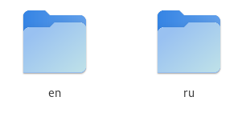{#fig:001 width=70%}

Далее в каталоге ~/work/blog/config/_default открываем файл 'languages.yaml' и раскомментируем там необходимые строки так, чтобы у нас выполнялось поддержка двух языков на сайте (рис. @fig:002).

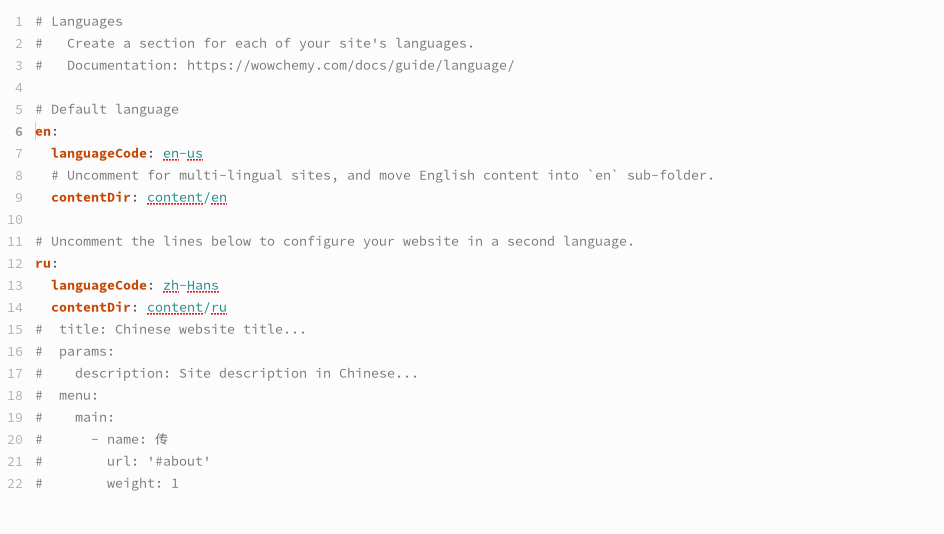{#fig:002 width=70%}

2. Далее нам необходимо перевести на английский язык все элементы сайта, а также посты и проекты, и внести соответствующие изменения во все необходимые места в каталоге 'en'. Я делала это соответственно каждому этапу индивидуального проекта.

Для начала открываем в каталоге ~/work/blog/content/en/authors/admin файл '_index.md'. Вводим на английском имя, фамилию, должность и название университета (рис. @fig:003).

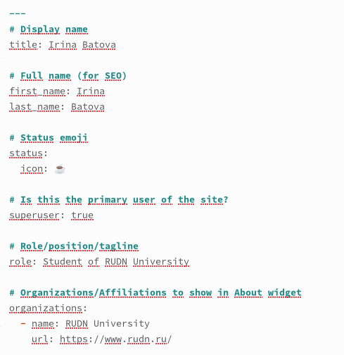{#fig:003 width=70%}

Вводим на английском свои интересы, короткое био и указываем образование (рис. @fig:004).

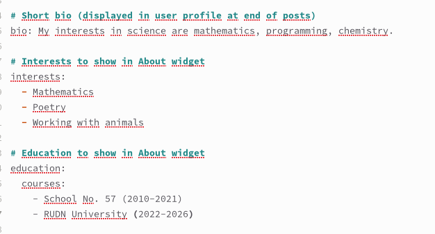{#fig:004 width=70%}

В конце файла вводим на английском более подробное описание владельца сайта (рис. @fig:005).

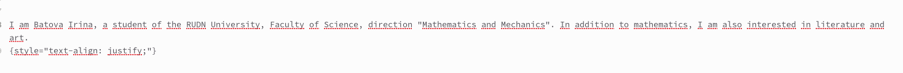{#fig:005 width=70%}

Далее переведем посты, которые мы делали на втором этапе индивидуального проекта. Для этого в каталоге ~/work/content/en/post заходим в каталог 'lastweek' и открываем файл 'index.md'. Редактируем название, а в конец файла вводим текст поста на английском (рис. @fig:006).

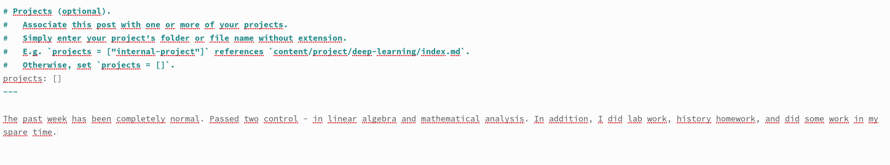{#fig:006 width=70%}

Далее в каталоге 'cdci' открываем файл 'index.md'. Аналогично редактируем название (рис. @fig:007), в конец файла вводим текст поста (рис. @fig:008).

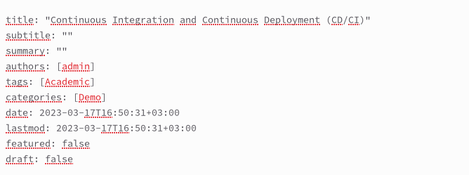{#fig:007 width=70%}

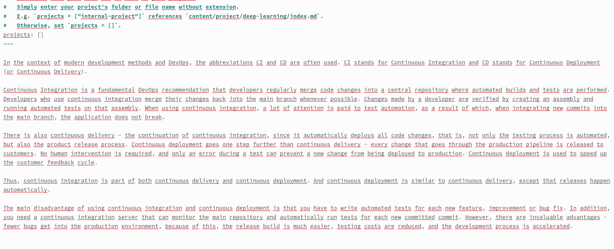{#fig:008 width=70%}

3. Переходим в каталог '~/work/blog/content/en' и открываем файл '_index.md'.

Переводим информацию о навыках в блоке 'features', а также переводим название блока (рис. @fig:009).

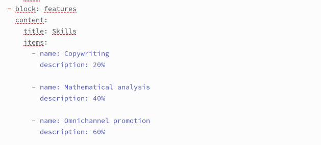{#fig:009 width=70%}

Переводим информацию об опыте в блоке 'experience', а также переводим название блока (рис. @fig:0010).

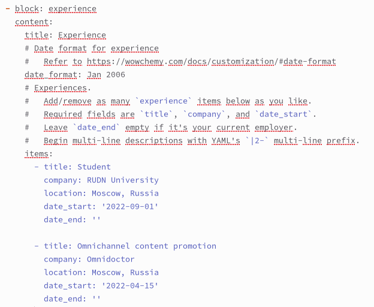{#fig:0010 width=70%}

Переводим информацию о достижениях в блоке 'accomplishments', а также переводим название блока (рис. @fig:0011).

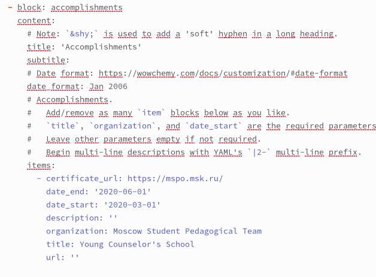{#fig:0011 width=70%}

Далее переведем посты, которые мы делали на третьем этапе индивидуального проекта. Для этого в каталоге ~/work/content/post/en заходим в каталог 'lastweek2' и открываем файл 'index.md'. Редактируем название, а в конец файла вводим текст поста на английском (рис. @fig:0012).

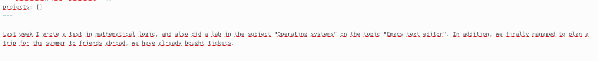{#fig:0012 width=70%}

Далее в каталоге 'markdown' открываем файл 'index.md'. Аналогично редактируем название (рис. @fig:0013), в конец файла вводим текст поста (рис. @fig:0014).

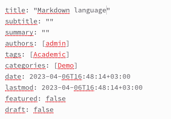{#fig:0013 width=70%}

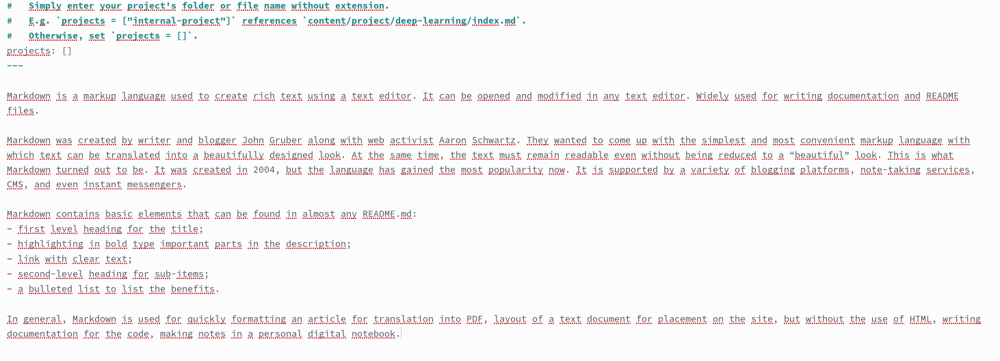{#fig:0014 width=70%}

4. На четвертом этапе мы добавляли к сайту ссылки на научные и библиометрические ресурсы, что не нуждается в переводе, поэтому сразу перейдем к переводу постов.

Для этого в каталоге ~/work/content/post/en заходим в каталог 'lastweek3' и открываем файл 'index.md'. Редактируем название, а в конец файла вводим текст поста на английском (рис. @fig:0015).

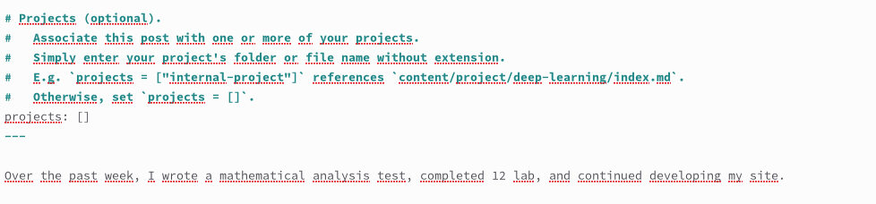{#fig:0015 width=70%}

Далее в каталоге 'reportcreate' открываем файл 'index.md'. Аналогично редактируем название (рис. @fig:0016), в конец файла вводим текст поста (рис. @fig:0017).

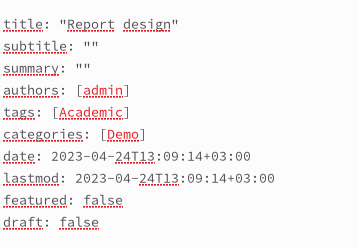{#fig:0016 width=70%}

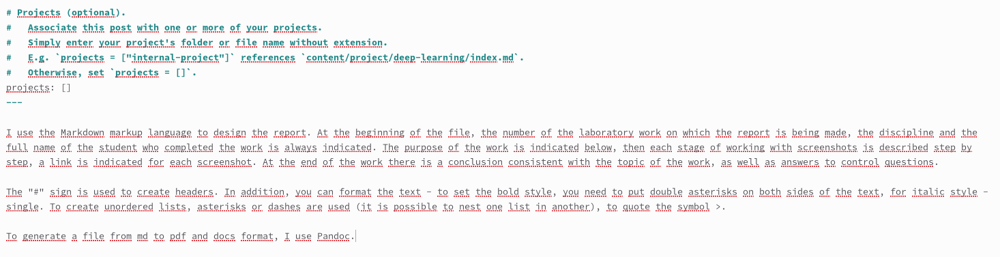{#fig:0017 width=70%}

5. Переходим в каталог '~/work/blog/content/en/project/cripts' и открываем файл 'index.md'. В начале файла переводим название проекта и краткое содержание (рис. @fig:0018).

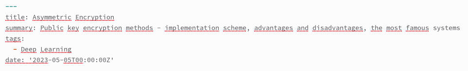{#fig:0018 width=70%}

В конец файла вводим переведенный текст проекта (рис. @fig:0019).

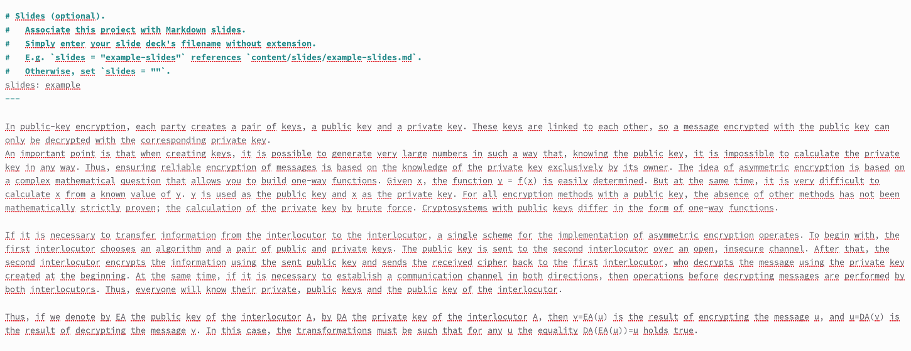{#fig:0019 width=70%}

Далее переходим в каталог 'ports'. В начале файла переводим название проекта и краткое содержание (рис. @fig:0020).

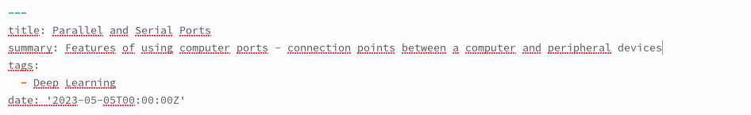{#fig:0020 width=70%}

В конец файла вводим переведенный текст проекта (рис. @fig:0021).

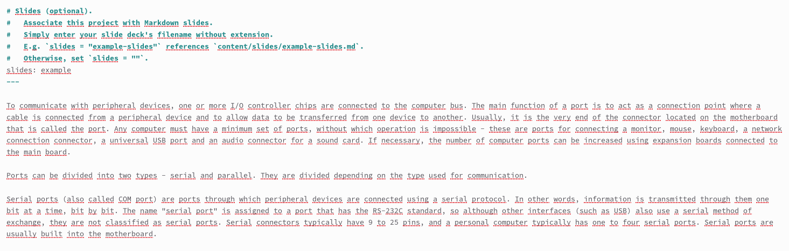{#fig:0021 width=70%}

Далее переведем посты, которые мы делали на пятом этапе индивидуального проекта. Для этого в каталоге ~/work/content/en/post заходим в каталог 'lastweek4' и открываем файл 'index.md'. Редактируем название, а в конец файла вводим текст поста на английском (рис. @fig:0022).

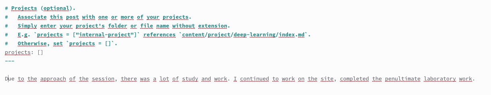{#fig:0022 width=70%}

Далее в каталоге 'languages' открываем файл 'index.md'. Аналогично редактируем название (рис. @fig:0023), в конец файла вводим текст поста (рис. @fig:0024).

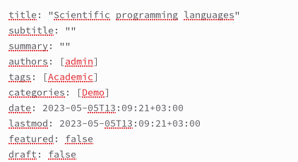{#fig:0023 width=70%}

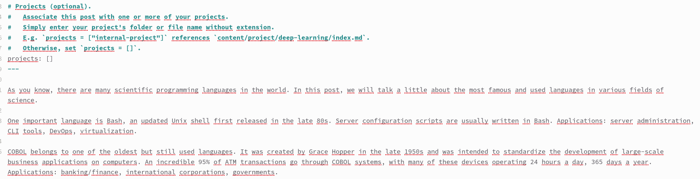{#fig:0024 width=70%}

6. Далее нам нужно написать пост о прошедшей недели на двух языках. Для создания поста о прошедшей неделе сначала переходим в каталог '~/work/blog/content/ru/post' и создаем в нем каталог 'lastweek5'. Открываем каталог и в нем открываем файл 'index.md'.

Редактируем название и дату (рис. @fig:0025).

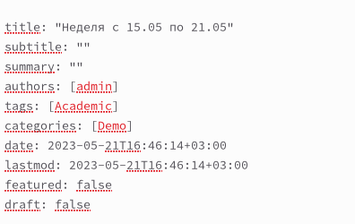{#fig:0025 width=70%}

В конец файла вводим текст поста (рис. @fig:0026).

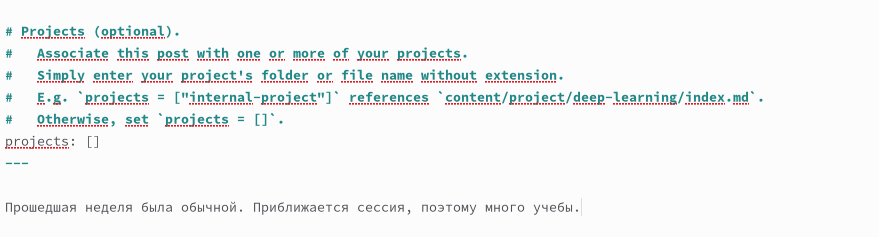{#fig:0026 width=70%}

Нам также нужно опубликовать пост на тему по выбору на двух языках. Я выбрала тему "Шифрование". Для создания поста о шифровании сначала переходим в каталог '~/work/blog/content/ru/post' и создаем в нем каталог 'shifr'. Открываем каталог и в нем открываем файл 'index.md'.

Редактируем название и дату (рис. @fig:0027).

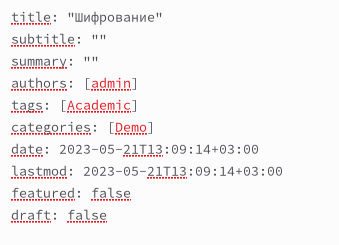{#fig:0027 width=70%}

В конец файла вводим текст поста (рис. @fig:0028).

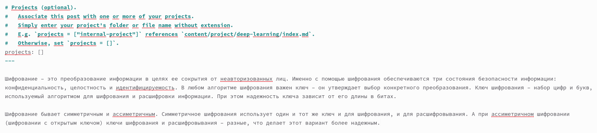{#fig:0028 width=70%}

Теперь, аналогично предыдущим постам, нам нужно их перевести. Для этого в каталоге ~/work/content/en/post создаем в каталог 'lastweek4' и открываем файл 'index.md'. Редактируем название (рис. @fig:0029), а в конец файла вводим текст поста на английском (рис. @fig:0030).

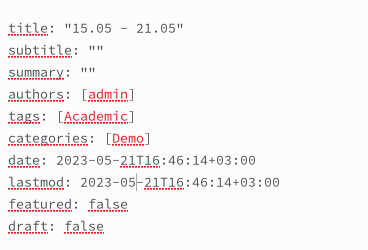{#fig:0029 width=70%}

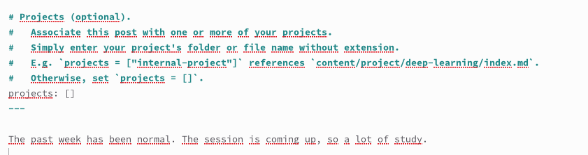{#fig:0030 width=70%}

Далее создаем каталог 'shifr' и открываем в нем файл 'index.md'. Аналогично редактируем название (рис. @fig:0031), в конец файла вводим текст поста (рис. @fig:0032).

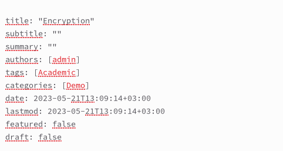{#fig:0031 width=70%}

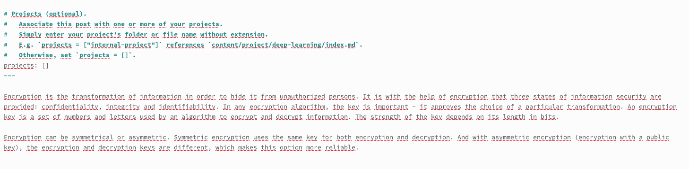{#fig:0032 width=70%}

# Выводы

В ходе шестого этапа индивидуального проекта я разместила двуязычный сайт на Github.

